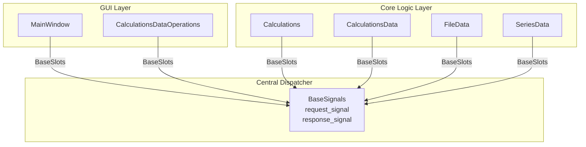

# Архитектура приложения для анализа кинетики твердофазных реакций

## Архитектурные принципы

### Основополагающие принципы (АРХИТЕКТУРНЫЙ МАНИФЕСТ)
- **Слабое связывание**: Модули коммуницируют только через стандартизированный API
- **Асинхронная коммуникация**: Qt сигналы для неблокирующих операций, event loop для синхронных запросов
- **Централизованная маршрутизация**: Единая точка управления коммуникацией с логированием
- **Расширяемость**: Новые модули интегрируются через BaseSlots без изменения существующего кода

---

## Общая архитектура системы

Приложение построено на **модульной сигнально-управляемой архитектуре** с PyQt6, реализующей паттерны **Publisher-Subscriber** и **Request-Response**.

### Центральная система коммуникации

**BaseSignals** (`src/core/base_signals.py:9-48`) - диспетчер запросов между компонентами:
- `request_signal/response_signal` - Qt сигналы для межмодульной коммуникации
- `register_component()` - регистрация модулей в системе диспетчеризации
- `dispatch_request()/dispatch_response()` - маршрутизация сообщений

**BaseSlots** (`src/core/base_signals.py:69-196`) - базовый класс для всех модулей:
- `handle_request_cycle()` - создание запроса и ожидание ответа
- `wait_for_response()` - блокировка через QEventLoop до получения ответа
- Автоматическая регистрация компонентов при инициализации

### Архитектура модульной коммуникации



### Паттерны коммуникации

**Request-Response Pattern**:
1. Клиент создает запрос через `handle_request_cycle(target, operation, **kwargs)`
2. BaseSignals маршрутизирует запрос к целевому модулю
3. Сервер обрабатывает запрос в `process_request()` 
4. Ответ возвращается через `response_signal`
5. QEventLoop синхронизирует асинхронный обмен

**Управление операциями**: Централизованная система типов через `OperationType` enum (`src/core/app_settings.py:6-41`)

---

## Архитектура данных

### Иерархическая структура данных

Система организована в **четыре уровня данных** от исходных экспериментальных измерений до результатов расчетов:

**1. Экспериментальные данные** - `FileData` (`src/core/file_data.py:47-276`):
- `original_data` - неизменяемые исходные данные
- `dataframe_copies` - рабочие копии для трансформаций
- `operations_history` - трассируемость всех операций

**2. Расчетные конфигурации** - `CalculationsData` (`src/core/calculation_data.py:20-170`):
- Иерархическая структура: `file_name → reaction_name → {function, coeffs, bounds}`
- path_keys система для доступа к вложенным данным
- Автосохранение изменений в JSON

**Структура данных реакций**:
```python
# Деконволюция файла на множественные реакции
{
    'reaction_0': {
        'function': 'ads',  # Тип функции (ads, gauss, fraser)
        'x': array([32.18783, 33.14274, ...]),  # Температурный массив
        'coeffs': {
            'h': 0.005392786487485471,     # Высота пика
            'z': 296.1846660127549,        # Позиция пика
            'w': 47.058071904740814,       # Ширина пика
            'ads1': 26.12901788390612,     # ADS параметр 1
            'ads2': 1.916749283812285      # ADS параметр 2
        },
        'upper_bound_coeffs': {...},  # Верхние границы оптимизации
        'lower_bound_coeffs': {...}   # Нижние границы оптимизации
    },
    'reaction_1': {...},  # Аналогичная структура для других реакций
    'reaction_N': {...}
}
```

**3. Серийные данные** - `SeriesData` (`src/core/series_data.py:30-266`):
- Серии экспериментов с разными скоростями нагрева
- Схемы многостадийных реакций
- Результаты model-fit и model-free анализа

**Полная структура серийных данных**:
```python
# Реальная структура серии экспериментов
{
    "test_series": {
        "experimental_data": DataFrame(489x4),  # temperature + скорости нагрева (3, 5, 10 K/min)
        "experimental_masses": [1, 1, 1],       # Массовые коэффициенты для каждой скорости
        
        "reaction_scheme": {
            "components": [{"id": "A"}, {"id": "B"}, {"id": "C"}, {"id": "D"}, {"id": "E"}],
            "reactions": [
                {
                    "from": "A", "to": "B",
                    "reaction_type": "F2", "allowed_models": ["F1/3", "F3/4", "F3/2", "F2", "F3"],
                    "Ea": 120, "log_A": 8, "contribution": 0.5,
                    "Ea_min": 1.0, "Ea_max": 2000.0,
                    "log_A_min": -100.0, "log_A_max": 100.0,
                    "contribution_min": 0.01, "contribution_max": 1.0
                },
                {"from": "B", "to": "C", ...},  # Последовательная схема
                {"from": "C", "to": "D", ...},  # A→B→C→(D,E) с ветвлением
                {"from": "C", "to": "E", ...}
            ]
        },
        
        "calculation_settings": {
            "method": "differential_evolution",
            "method_parameters": {
                "strategy": "best1bin", "maxiter": 200, "popsize": 2,
                "workers": 4, "polish": False, ...
            }
        },
        
        "deconvolution_results": {
            3: {...},   # Результаты для скорости 3 K/min
            5: {...},   # Результаты для скорости 5 K/min
            10: {...}   # Результаты для скорости 10 K/min
        },
        
        "model_fit_results": {
            "direct-diff": {
                "reaction_0": {...}, "reaction_1": {...},
                "reaction_2": {...}, "reaction_3": {...}
            },
            "Coats-Redfern": {
                "reaction_0": {...}, "reaction_1": {...},
                "reaction_2": {...}, "reaction_3": {...}
            }
        },
        
        "model_free_results": {
            "linear approximation": {
                "reaction_0": DataFrame(100x4),  # conversion + Friedman + KAS + Starink
                "reaction_1": DataFrame(100x4),
                "reaction_2": DataFrame(100x4),
                "reaction_3": DataFrame(100x4)
            },
            "Friedman": {
                "reaction_0": DataFrame(100x2),  # conversion + Friedman
                "reaction_1": DataFrame(100x2),
                "reaction_2": DataFrame(100x2),
                "reaction_3": DataFrame(100x2)
            }
        }
    }
}
```

**4. Результирующие данные**:
- **Deconvolution Results**: Результаты деконволюции пиков для каждой скорости нагрева
- **Model-Fit Results**: 
  - `direct-diff` - прямая дифференциальная обработка
  - `Coats-Redfern` - метод Коутса-Редферна для определения кинетических параметров
- **Model-Free Results**:
  - `linear approximation` - изоконверсионные методы (Friedman, KAS, Starink)
  - `Friedman` - дифференциальный изоконверсионный метод
  - DataFrames с зависимостью энергии активации от степени конверсии (100 точек)
- Кинетические параметры (A, E, n)
- Статистические метрики (R², RMSE, MSE)
- Результаты деконволюции и оптимизации

### Операции с данными

**Основные категории операций** (`src/core/app_settings.py`):

**Данные и файлы**:
- `LOAD_FILE`, `GET_DF_DATA`, `RESET_FILE_DATA` - управление экспериментальными данными
- `GET_VALUE`, `SET_VALUE`, `UPDATE_VALUE` - CRUD операции через path_keys
- `IMPORT_REACTIONS`, `EXPORT_REACTIONS` - импорт/экспорт конфигураций

**Примеры path_keys для доступа к данным реакций**:
- `["file_name.csv", "reaction_0", "function"]` → `"ads"`
- `["file_name.csv", "reaction_0", "coeffs", "h"]` → `0.005392786487485471`
- `["file_name.csv", "reaction_0", "upper_bound_coeffs", "z"]` → `296.1846660127549`
- `["file_name.csv", "reaction_0", "x"]` → `array([32.18783, 33.14274, ...])`

**Реакции и расчеты**:
- `ADD_REACTION`, `REMOVE_REACTION` - управление реакциями  
- `DECONVOLUTION`, `MODEL_BASED_CALCULATION` - вычислительные методы
- `MODEL_FIT_CALCULATION`, `MODEL_FREE_CALCULATION` - кинетический анализ

**Серии экспериментов**:
- `ADD_NEW_SERIES`, `DELETE_SERIES`, `UPDATE_SERIES` - управление сериями
- `SCHEME_CHANGE`, `MODEL_PARAMS_CHANGE` - конфигурация реакционных схем
- `GET_SERIES_VALUE` - доступ к данным через path_keys структуру

**Примеры path_keys для доступа к серийным данным**:
- `["test_series", "reaction_scheme", "components"]` → компоненты схемы
- `["test_series", "model_free_results", "Friedman", "reaction_0"]` → DataFrame с результатами Фридмана
- `["test_series", "calculation_settings", "method_parameters", "maxiter"]` → 200

### Потоки обработки данных

**Расширенный жизненный цикл данных с результатами анализа**:
1. **Загрузка экспериментов** - CSV файлы с температурными профилями для разных скоростей нагрева
2. **Деконволюция** - разделение сложных пиков на отдельные реакции (results для 3, 5, 10 K/min)
3. **Создание серии** - объединение экспериментов в series с экспериментальными массами
4. **Конфигурация схемы** - построение реакционных схем (A→B→C→D/E) с кинетическими параметрами
5. **Model-based анализ** - оптимизация параметров через differential_evolution
6. **Model-free анализ** - получение энергий активации методами:
   - **Friedman** - дифференциальный изоконверсионный метод
   - **Linear approximation** - KAS, Starink методы
   - Результат: DataFrames с зависимостью Ea от степени конверсии (0.005-0.995)
7. **Model-fit анализ** - определение кинетических параметров методами:
   - **direct-diff** - прямая дифференциальная обработка
   - **Coats-Redfern** - интегральный метод для каждой реакции
6. **Создание серий** (`ADD_NEW_SERIES`) - объединение экспериментов с разными скоростями нагрева
7. **Model-based анализ** - определение кинетических параметров (Ea, log_A, contribution)

**Схемы многостадийных реакций**:
- **Последовательные**: A→B→C→D (каждый компонент превращается в следующий)
- **С ветвлением**: A→B→C→(D,E) (один компонент может превращаться в несколько)
- **Кинетические модели**: F1/3, F3/4, F3/2, F2, F3 для каждой реакции
- **Параметры**: Ea (1-2000 кДж/моль), log_A (-100 до 100), contribution (0.01-1.0)

**Результаты анализа серий**:
- **experimental_data**: DataFrame 489×4 с температурой и данными для 3 скоростей нагрева
- **deconvolution_results**: Результаты по скоростям {3: {...}, 5: {...}, 10: {...}}
- **model_free_results**: Энергии активации vs. степень конверсии (100 точек от 0.005 до 0.995)
- **model_fit_results**: Кинетические параметры для каждой реакции отдельно

---

## Model-Based архитектура

### Компоненты системы

**Визуальные компоненты**:
- `ModelsScheme` (`src/gui/components/models_scheme.py`) - графический редактор реакционных схем
- `ReactionTable` (`src/gui/components/reaction_table.py`) - управление кинетическими параметрами
- `ModelBasedTab` (`src/gui/tabs/model_based_tab.py`) - интерфейс model-based анализа

**Вычислительные компоненты**:
- `ModelBasedScenario` (`src/core/calculations.py`) - оптимизация многостадийных реакций
- `NUC_MODELS_TABLE` (`src/core/app_settings.py`) - кинетические модели (F1/3, F2, A2, R3, D1)
- Differential evolution алгоритм для глобальной оптимизации

### Model-Based операции

**Схемы реакций**:
- `SCHEME_CHANGE` - изменение топологии (параллельные/последовательные схемы)
- `MODEL_PARAMS_CHANGE` - параметры модели (Ea, log_A, contribution, reaction_type)

**Вычислительные методы**:
- `MODEL_BASED_CALCULATION` - оптимизация параметров через дифференциальные уравнения
- `GET_MODEL_FIT_REACTION_DF`, `PLOT_MODEL_FIT_RESULT` - обработка результатов

**Структуры данных**:
- **Reaction Scheme**: компоненты (A,B,C,D), связи, допустимые модели
- **Optimization Results**: оптимизированные параметры, MSE метрики, симуляционные данные

### Потоки Model-Based операций

1. **Создание схемы** - пользователь строит реакционную схему в `ModelsScheme`
2. **Настройка параметров** - установка кинетических моделей и границ оптимизации
3. **Оптимизация** - решение системы ОДУ с differential evolution
4. **Результаты** - извлечение кинетических параметров и статистических метрик

---

## Ключевые реализационные решения

### Синхронизация через Event Loop

**QEventLoop блокировка** (`src/core/base_signals.py:181-196`):
- Преобразование асинхронных Qt сигналов в синхронные запросы
- Timeout механизм для предотвращения зависания
- Управление жизненным циклом event loops

### path_keys система доступа к данным

**Иерархическая адресация** (`src/core/calculation_data.py`):
- `[file_name, reaction_name, "function"]` - тип функции
- `[file_name, reaction_name, "coeffs", coeff_name]` - коэффициенты
- `[file_name, reaction_name, "upper_bound_coeffs", param]` - границы оптимизации

### Трассируемость операций

**Логирование трансформаций** (`src/core/file_data.py:66-78`):
- Полная история операций с данными
- Проверка выполненных операций через `check_operation_executed()`
- Возможность отката изменений

### Персистентность данных

**Автосохранение**: 
- JSON файлы для конфигураций и результатов (`CalculationsData.save_data()`)
- Неизменяемость исходных экспериментальных данных
- Кэшированные результаты вычислений в `SeriesData`

---

## Преимущества архитектуры

1. **Модульность**: Четкое разделение ответственности между компонентами
2. **Масштабируемость**: Легкое добавление новых модулей через BaseSlots
3. **Надежность**: Централизованное логирование и обработка ошибок
4. **Гибкость**: Поддержка различных вычислительных методов и типов данных
5. **Трассируемость**: Полная история операций и возможность отката
6. **Типобезопасность**: Централизованная система типов операций через OperationType

Архитектура обеспечивает полный жизненный цикл анализа кинетики твердофазных реакций от загрузки экспериментальных данных до получения кинетических параметров с высокой степью автоматизации и контроля качества.
