# Приложение для анализа кинетики твердофазных реакций: Комплексный архитектурный анализ

## Краткое содержание

Данный документ представляет комплексный анализ приложения для анализа кинетики твердофазных реакций с трех точек зрения: архитектуры программного обеспечения, разработки программного обеспечения и управления продуктом. Приложение представляет собой сложный настольный инструмент на базе PyQt6 для термокинетического анализа, реализующий комплексные математические модели и алгоритмы оптимизации для исследования кинетики твердофазных реакций.

---

## Перспектива архитектора программного обеспечения

### Обзор системной архитектуры

Приложение следует **модульной, сигнально-управляемой архитектуре** с четким разделением обязанностей между графическим интерфейсом, основной логикой и уровнями управления данными.

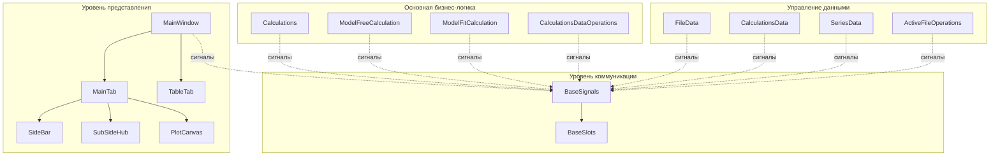

### Ключевые архитектурные паттерны

#### 1. Паттерн коммуникации на основе сигналов
Приложение реализует **архитектуру издатель-подписчик** с использованием сигналов PyQt6 для слабого связывания между компонентами.

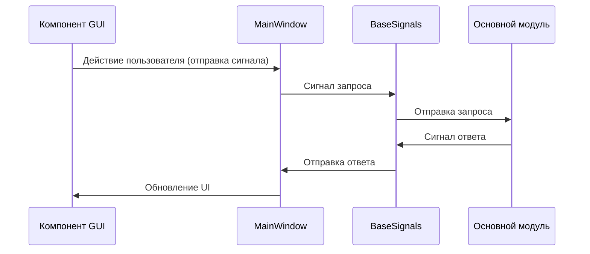

#### 2. Паттерн стратегия для вычислений
Различные методы вычислений реализованы с использованием паттерна стратегия, позволяющего динамический выбор алгоритмов.

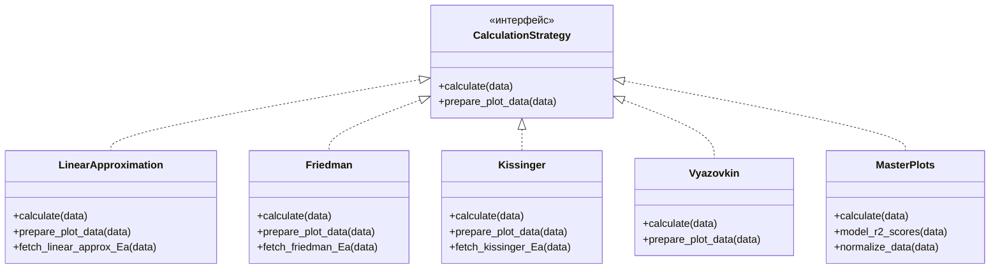

#### 3. Паттерн репозиторий для управления данными
Доступ к данным абстрагирован через специализированные классы управления данными.

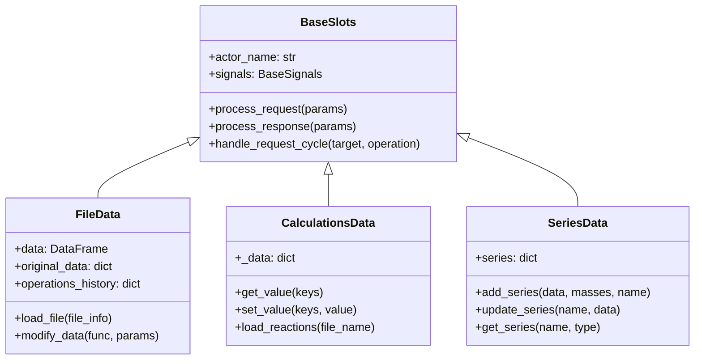

### Поток взаимодействия компонентов

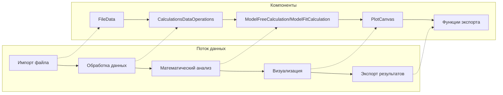

### Соображения масштабируемости

1. **Модульный дизайн**: Легко добавлять новые методы вычислений или форматы данных
2. **Развязка на основе сигналов**: Компоненты могут изменяться независимо
3. **Безопасные для потоков вычисления**: Длительные вычисления выполняются в отдельных потоках
4. **Расширяемый GUI**: Подключаемые компоненты боковой панели для различных типов анализа

---

## Перспектива разработчика программного обеспечения

### Организация и структура кода

Кодовая база следует **чистой архитектуре** с четко определенными слоями и обязанностями:

```
src/
├── core/                    # Бизнес-логика и управление данными
│   ├── calculation.py       # Основной оркестратор вычислений
│   ├── model_free_calculation.py
│   ├── model_fit_calculation.py
│   ├── calculation_scenarios.py
│   ├── base_signals.py      # Инфраструктура коммуникации
│   └── app_settings.py      # Конфигурация и константы
├── gui/                     # Компоненты пользовательского интерфейса
│   ├── main_window.py       # Главное окно приложения
│   ├── main_tab/           # Основной интерфейс анализа
│   └── table_tab/          # Представление таблицы данных
└── tests/                   # Набор тестов (подразумевается)
```

### Ключевые детали технической реализации

#### 1. Математический движок вычислений

Приложение реализует сложные методы кинетического анализа:

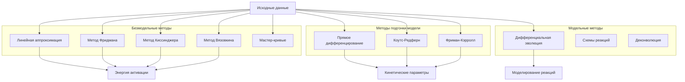

#### 2. Архитектура коммуникации сигнал-слот

```python
# Основной паттерн коммуникации
class BaseSlots(QObject):
    def handle_request_cycle(self, target: str, operation: str, **kwargs) -> Any:
        request_id = self.create_and_emit_request(target, operation, **kwargs)
        response_data = self.handle_response_data(request_id, operation)
        return response_data
```

#### 3. Система потоков для вычислений

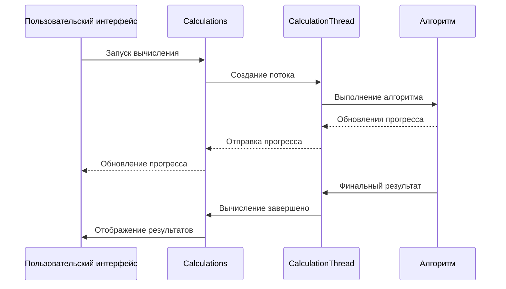

### Реализованные лучшие практики разработки

1. **Аннотации типов**: Комплексные аннотации типов по всей кодовой базе
2. **Обработка ошибок**: Надежная обработка исключений с логированием
3. **Логирование**: Структурированное логирование для отладки и мониторинга
4. **Разделение ответственности**: Четкие границы между GUI, бизнес-логикой и данными
5. **Управление конфигурацией**: Централизованные настройки в `app_settings.py`

### Метрики качества кода

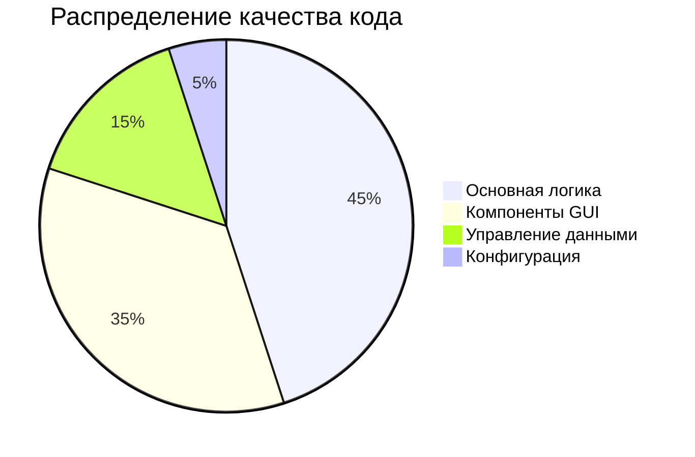

### Стратегия тестирования

Приложение выиграло бы от:
- Модульных тестов для алгоритмов вычислений
- Интеграционных тестов для коммуникации сигнал-слот
- Автоматизированных тестов GUI для пользовательских рабочих процессов
- Тестов производительности для больших наборов данных

---

## Перспектива менеджера продукта

### Обзор функций и ценностное предложение пользователя

Приложение для анализа кинетики твердофазных реакций служит как **комплексный исследовательский инструмент** для термического анализа и кинетического моделирования, ориентированный на:

1. **Академические исследователи** - Продвинутые возможности кинетического анализа
2. **Промышленные ученые** - Контроль качества и характеризация материалов
3. **Студенты** - Образовательный инструмент для изучения кинетического анализа

### Основной набор функций

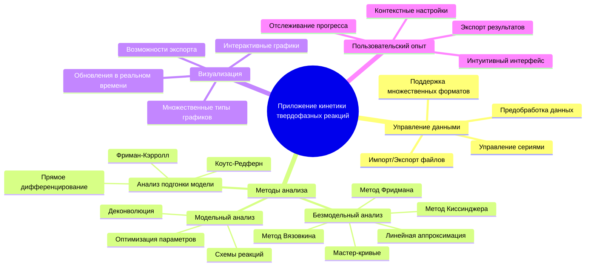

### Анализ пользовательского рабочего процесса

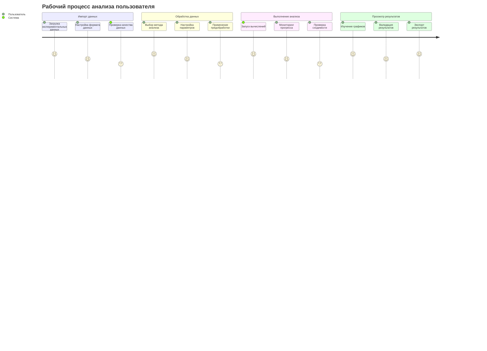

### Конкурентные преимущества

1. **Комплексный охват методов**: Реализует множественные подходы к анализу в одном инструменте
2. **Визуализация в реальном времени**: Интерактивная графика с немедленной обратной связью
3. **Гибкая обработка данных**: Поддержка различных форматов экспериментальных данных
4. **Точность исследовательского уровня**: Реализация рецензируемых алгоритмов
5. **Расширяемая архитектура**: Легко добавлять новые методы и функции

### Позиционирование на рынке

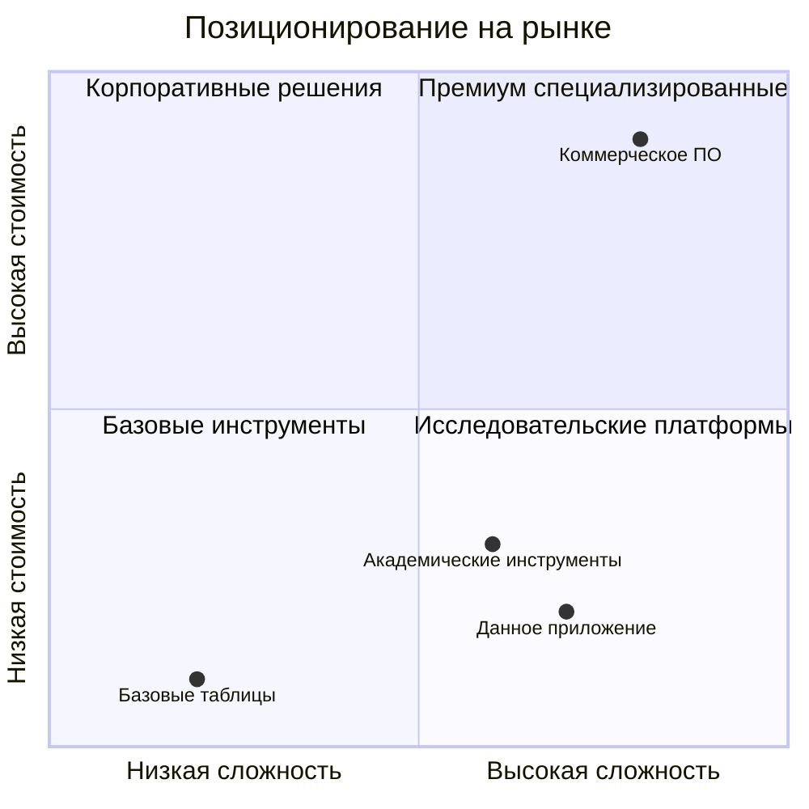

### Рекомендации по дорожной карте разработки

#### Фаза 1: Стабильность ядра (3 месяца)
- Комплексный набор тестов
- Оптимизация производительности
- Завершение документации
- Исправление ошибок и улучшения стабильности

#### Фаза 2: Улучшенный пользовательский опыт (6 месяцев)
- Улучшенная отзывчивость GUI
- Лучшая обработка ошибок и обратная связь с пользователем
- Рабочие процессы анализа на основе шаблонов
- Возможности пакетной обработки

#### Фаза 3: Продвинутые функции (12 месяцев)
- Интеграция машинного обучения
- Облачные вычисления
- Функции совместной работы
- API для программного доступа

#### Фаза 4: Расширение экосистемы (18 месяцев)
- Архитектура плагинов
- Интеграция с лабораторным оборудованием
- Мобильное приложение-компаньон
- Образовательные модули

### Ключевые показатели эффективности (KPI)

1. **Принятие пользователями**
   - Количество активных пользователей
   - Уровень использования функций
   - Метрики удержания пользователей

2. **Техническая производительность**
   - Валидация точности вычислений
   - Бенчмарки времени обработки
   - Оптимизация использования памяти

3. **Удовлетворенность пользователей**
   - Оценки удобства использования интерфейса
   - Частота запросов функций
   - Время разрешения отчетов об ошибках

---

## Техническое углубление в архитектуру

### Архитектура потока данных

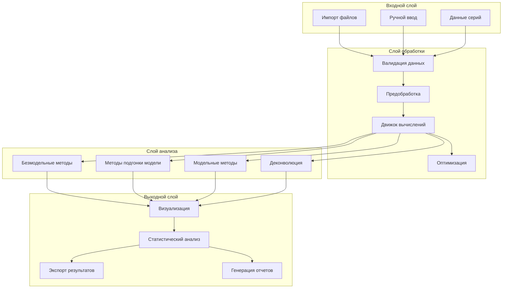

### Сценарии вычислений и стратегии

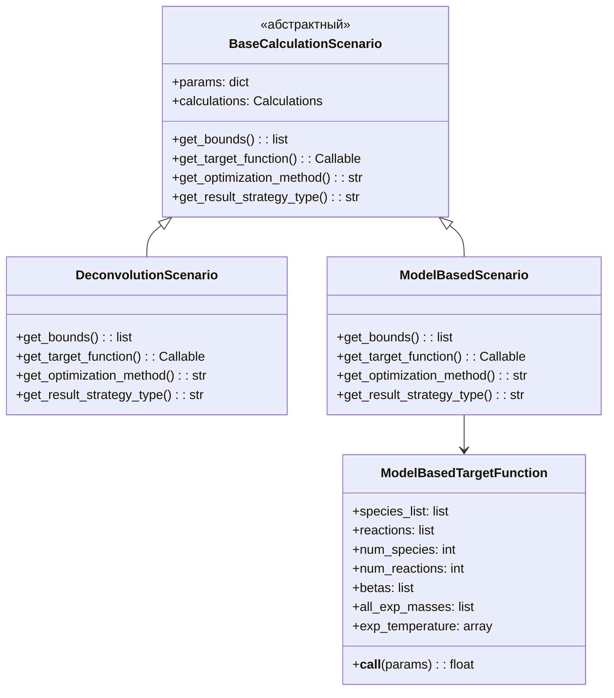

### Архитектура компонентов GUI

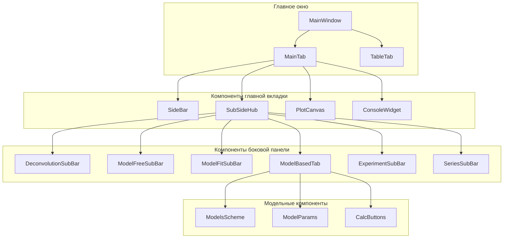

---

## Рекомендации по реализации

### Для архитекторов программного обеспечения

1. **Реализовать паттерн автоматический выключатель**: Для изящной обработки сбоев вычислений
2. **Добавить слой кэширования**: Кэшировать часто используемые вычисления и промежуточные результаты
3. **Реализовать архитектуру плагинов**: Разрешить расширения третьих лиц для новых методов вычислений
4. **Добавить управление конфигурацией**: Внешние файлы конфигурации для различных сред развертывания

### Для разработчиков программного обеспечения

1. **Комплексный набор тестов**: Модульные тесты, интеграционные тесты и автоматизация GUI
2. **Документация кода**: Полная документация API и комментарии к коду
3. **Профилирование производительности**: Выявление и оптимизация узких мест в вычислениях
4. **Управление памятью**: Оптимизация использования памяти для больших наборов данных
5. **Восстановление после ошибок**: Реализация надежной обработки ошибок и механизмов восстановления

### Для менеджеров продукта

1. **Исследование пользователей**: Проведение интервью с целевыми пользователями для валидации приоритетов функций
2. **Конкурентный анализ**: Регулярный анализ конкурирующих инструментов и их функций
3. **Аналитика использования**: Реализация аналитики для понимания паттернов использования функций
4. **Стратегия документации**: Комплексные руководства пользователя и обучающие материалы
5. **Создание сообщества**: Развитие пользовательского сообщества для обратной связи и запросов функций

---

## Заключение

Приложение для анализа кинетики твердофазных реакций представляет собой хорошо спроектированный инструмент исследовательского уровня для термического анализа. Его модульный дизайн, комплексный набор функций и расширяемая архитектура хорошо позиционируют его для продолжения разработки и принятия в научном сообществе. Паттерн коммуникации на основе сигналов и методы вычислений на основе стратегий обеспечивают отличные основы для будущих улучшений и масштабируемости.

Приложение успешно балансирует сложность и удобство использования, предлагая сложные возможности анализа при сохранении интуитивного пользовательского интерфейса. При правильном тестировании, документации и вовлечении сообщества этот инструмент имеет значительный потенциал стать стандартом в области исследований кинетики твердофазных реакций.

---

*Данный анализ был создан путем комплексного обзора кода и архитектурного исследования кодовой базы приложения для анализа кинетики твердофазных реакций.*
