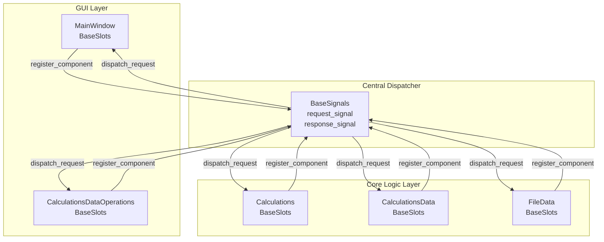
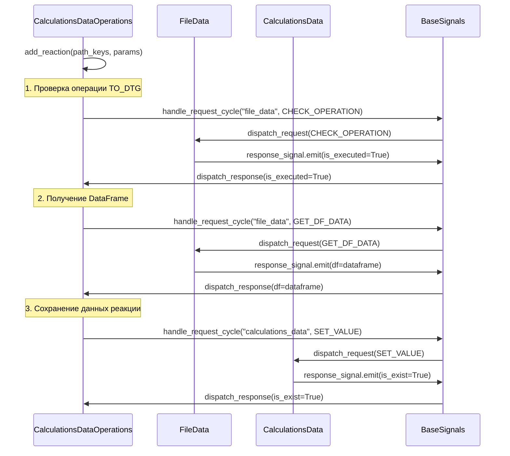
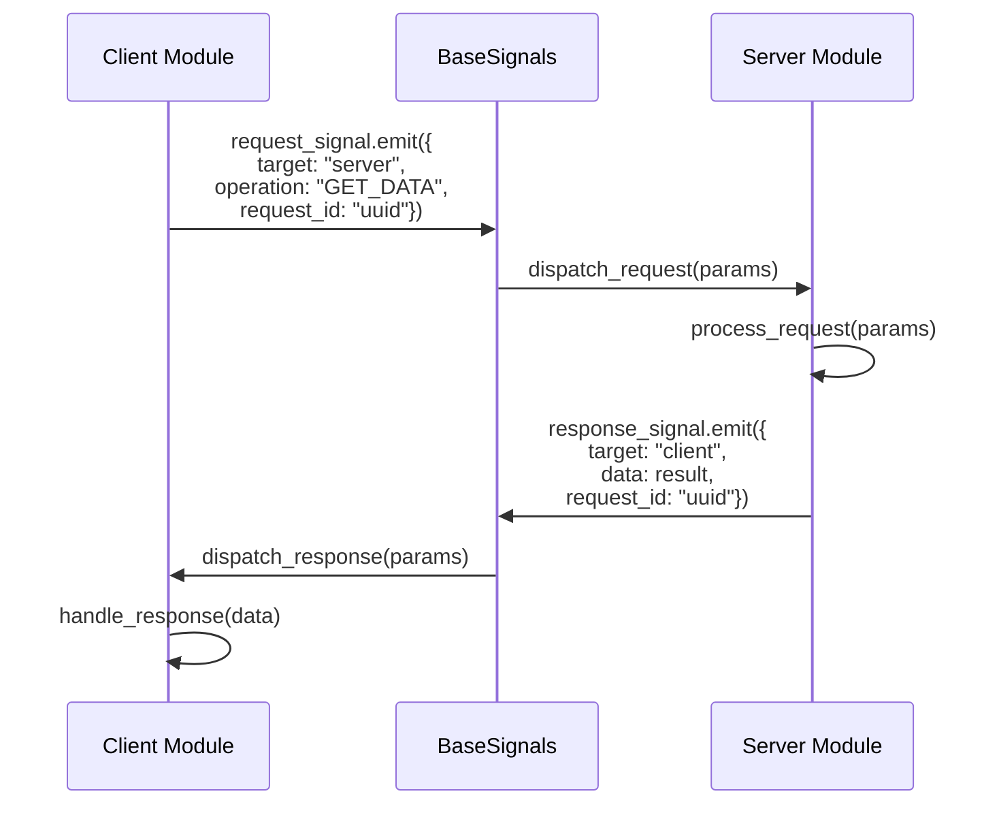
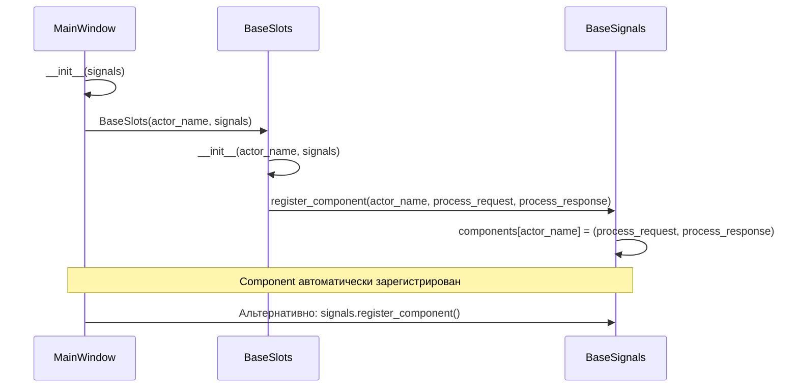

# Архитектура приложения для анализа кинетики твердофазных реакций

## Преимущества архитектуры - АРХИТЕКТУРНЫЙ МАНИФЕСТ

> **ЭТИ ПРИНЦИПЫ НЕ ДОЛЖНЫ НАРУШАТЬСЯ НИКОГДА!**

### 1. Слабое связывание (Loose Coupling)
- **Модули не знают о внутренней реализации друг друга**
- **Коммуникация только через стандартизированный API**
- **Легкое тестирование с mock-объектами**

### 2. Асинхронная коммуникация
- **Использование Qt сигналов для неблокирующих операций**
- **Event loop для синхронных запросов когда нужно**
- **Отсутствие прямых зависимостей между модулями**

### 3. Централизованная маршрутизация
- **Единая точка управления коммуникацией**
- **Логирование всех межмодульных взаимодействий**
- **Возможность добавления middleware (кэширование, валидация)**

### 4. Расширяемость
- **Новые модули легко интегрируются через BaseSlots**
- **Не требуется изменение существующего кода**
- **Поддержка различных паттернов коммуникации**

---

## Техническая архитектура системы

Приложение построено на **модульной сигнально-управляемой архитектуре** с использованием PyQt6, реализующей паттерны **Publisher-Subscriber** и **Request-Response** для межмодульной коммуникации.

## Центральная система коммуникации: BaseSignals/BaseSlots

### Архитектура диспетчера сигналов

```mermaid
classDiagram
    class BaseSignals {
        +request_signal: pyqtSignal
        +response_signal: pyqtSignal
        +components: Dict[str, tuple]
        +__init__()
        +register_component(name, process_req, process_resp)
        +dispatch_request(params)
        +dispatch_response(params)
    }
    
    class BaseSlots {
        +actor_name: str
        +signals: BaseSignals
        +pending_requests: Dict[str, Dict]
        +event_loops: Dict[str, QEventLoop]
        +__init__(actor_name, signals)
        +handle_request_cycle(target, operation, **kwargs)
        +create_and_emit_request(target, operation, **kwargs)
        +wait_for_response(request_id, timeout)
        +process_request(params)
        +process_response(params)
    }
    
    BaseSignals -->|registers| BaseSlots : component registration
    BaseSlots -->|uses| BaseSignals : signal communication
```

```python
# Центральный диспетчер сигналов
class BaseSignals(QObject):
    """Маршрутизатор запросов/ответов между компонентами"""
    request_signal = pyqtSignal(dict)
    response_signal = pyqtSignal(dict)
    
    def __init__(self):
        super().__init__()
        self.components: Dict[str, (Callable, Callable)] = {}
        self.request_signal.connect(self.dispatch_request)
        self.response_signal.connect(self.dispatch_response)
    
    def register_component(self, component_name: str, 
                          process_request_method: Callable,
                          process_response_method: Callable):
        """Регистрация компонента в системе диспетчеризации"""
        self.components[component_name] = (process_request_method, process_response_method)
```

### Базовый класс для модулей

```python
# Базовый класс для всех модулей системы
class BaseSlots(QObject):
    """Обеспечивает request/response механизм через сигналы и event loop"""
    
    def __init__(self, actor_name: str, signals: BaseSignals):
        super().__init__()
        self.actor_name = actor_name
        self.signals = signals
        self.pending_requests: Dict[str, Dict[str, Any]] = {}
        self.event_loops: Dict[str, QEventLoop] = {}
        # Автоматическая регистрация в диспетчере
        self.signals.register_component(actor_name, self.process_request, self.process_response)
    
    def handle_request_cycle(self, target: str, operation: str, **kwargs) -> Any:
        """Создать запрос, отправить и ждать ответа"""
        request_id = self.create_and_emit_request(target, operation, **kwargs)
        response_data = self.wait_for_response(request_id)
        return self.handle_response_data(request_id, operation)
```

## Схема межмодульной коммуникации



## Практические примеры коммуникации

### 1. Пример запроса из MainWindow в CalculationsDataOperations

```python
# В MainWindow
def _handle_add_reaction(self, params: dict):
    """Обработка добавления реакции"""
    file_name = params.get("file_name")
    reaction_name = params.get("reaction_name")
    
    # Синхронный запрос через BaseSlots
    result = self.handle_request_cycle(
        target="calculations_data_operations",  # Имя модуля-получателя
        operation=OperationType.ADD_REACTION,   # Тип операции
        path_keys=[file_name, reaction_name],   # Параметры
        data=True
    )
    return result
```

### 2. Обработка запроса в CalculationsDataOperations

```python
# В CalculationsDataOperations 
@pyqtSlot(dict)
def process_request(self, params: dict):
    """Обработка входящих запросов"""
    path_keys = params.get("path_keys")
    operation = params.get("operation")
    
    operations = {
        OperationType.ADD_REACTION: self.add_reaction,
        OperationType.REMOVE_REACTION: self.remove_reaction,
        OperationType.UPDATE_VALUE: self.update_value,
        OperationType.DECONVOLUTION: self.deconvolution,
    }
    
    if operation in operations:
        logger.debug(f"Processing operation '{operation}' with path_keys: {path_keys}")
        answer = operations[operation](path_keys, params)
        
        # Возвращаем ответ отправителю
        params["target"], params["actor"] = params["actor"], params["target"]
        self.signals.response_signal.emit(params)
```

### 3. Каскадные запросы между модулями



```python
# В CalculationsDataOperations - цепочка запросов к другим модулям
def add_reaction(self, path_keys: list, _params: dict):
    """Добавление реакции с проверкой данных"""
    file_name, reaction_name = path_keys
    
    # 1. Проверяем выполнена ли операция TO_DTG
    is_executed = self.handle_request_cycle(
        "file_data", 
        OperationType.CHECK_OPERATION, 
        file_name=file_name, 
        checked_operation=OperationType.TO_DTG
    )
    
    if is_executed:
        # 2. Получаем DataFrame
        df = self.handle_request_cycle(
            "file_data", 
            OperationType.GET_DF_DATA, 
            file_name=file_name
        )
        
        # 3. Сохраняем данные реакции
        data = cft.generate_default_function_data(df)
        is_exist = self.handle_request_cycle(
            "calculations_data", 
            OperationType.SET_VALUE, 
            path_keys=path_keys.copy(), 
            value=data
        )
```

## Архитектурные паттерны

### 1. Request-Response Pattern



### 2. Event Loop Synchronization

```mermaid
sequenceDiagram
    participant Module as Client Module
    participant Loop as QEventLoop
    participant Timer as QTimer
    participant BS as BaseSignals
    
    Module->>Module: create_and_emit_request()
    Module->>BS: request_signal.emit()
    Module->>Loop: loop = QEventLoop()
    Module->>Timer: timer.start(timeout)
    Module->>Loop: loop.exec() [BLOCKS]
    
    Note over Module, Loop: Waiting for response...
    
    BS->>Module: response_signal received
    Module->>Loop: loop.quit()
    Module->>Timer: timer.stop()
    Module->>Module: return response_data
```

```python
def wait_for_response(self, request_id: str, timeout: int = 1000) -> Optional[dict]:
    """Ожидание ответа с использованием QEventLoop"""
    if request_id not in self.pending_requests:
        return None
    
    # Создаем event loop для блокировки
    loop = QEventLoop()
    self.event_loops[request_id] = loop
    
    # Таймер для timeout
    timer = QTimer()
    timer.timeout.connect(loop.quit)
    timer.start(timeout)
    
    # Блокируем выполнение до получения ответа
    loop.exec()
    
    # Очищаем ресурсы
    timer.stop()
    self.event_loops.pop(request_id, None)
    
    return self.pending_requests.pop(request_id, {}).get("data")
```

### 3. Component Registration Pattern



```python
# Автоматическая регистрация модулей при инициализации
class MainWindow(QMainWindow):
    def __init__(self, signals: BaseSignals):
        super().__init__()
        self.signals = signals
        self.actor_name = "main_window"
        
        # Создание BaseSlots автоматически регистрирует компонент
        self.base_slots = BaseSlots(actor_name=self.actor_name, signals=self.signals)
        
        # Альтернативный способ регистрации
        self.signals.register_component(
            self.actor_name, 
            self.process_request, 
            self.process_response
        )
```

## Управление операциями через OperationType

```python
# Централизованное определение типов операций
class OperationType(Enum):
    # Data operations
    GET_VALUE = "get_value"
    SET_VALUE = "set_value"
    REMOVE_VALUE = "remove_value"
    
    # File operations  
    LOAD_FILE = "load_file"
    GET_DF_DATA = "get_df_data"
    PLOT_DF = "plot_df"
    
    # Calculation operations
    ADD_REACTION = "add_reaction"
    REMOVE_REACTION = "remove_reaction"
    DECONVOLUTION = "deconvolution"
    MODEL_BASED_CALCULATION = "model_based_calculation"
```

## Потенциальные улучшения архитектуры

### 1. Добавление типизации запросов
```python
from typing import TypedDict

class RequestParams(TypedDict):
    actor: str
    target: str  
    operation: OperationType
    request_id: str
    # Дополнительные поля в зависимости от операции
```

### 2. Middleware для обработки запросов
```python
class RequestMiddleware:
    def process_request(self, params: dict) -> dict:
        # Валидация, логирование, кэширование
        pass
    
    def process_response(self, params: dict) -> dict:
        # Пост-обработка ответов
        pass
```

Данная архитектура обеспечивает масштабируемость, поддерживаемость и тестируемость приложения, позволяя легко добавлять новые модули и изменять существующие без нарушения работы системы.
