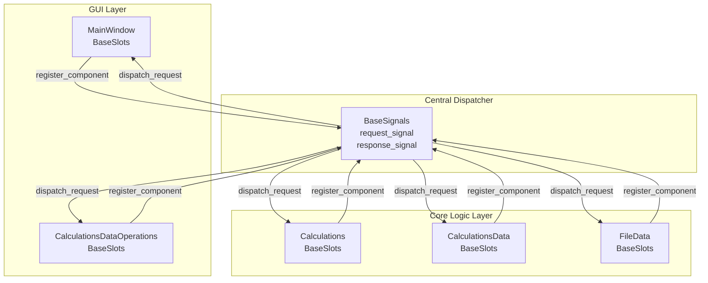
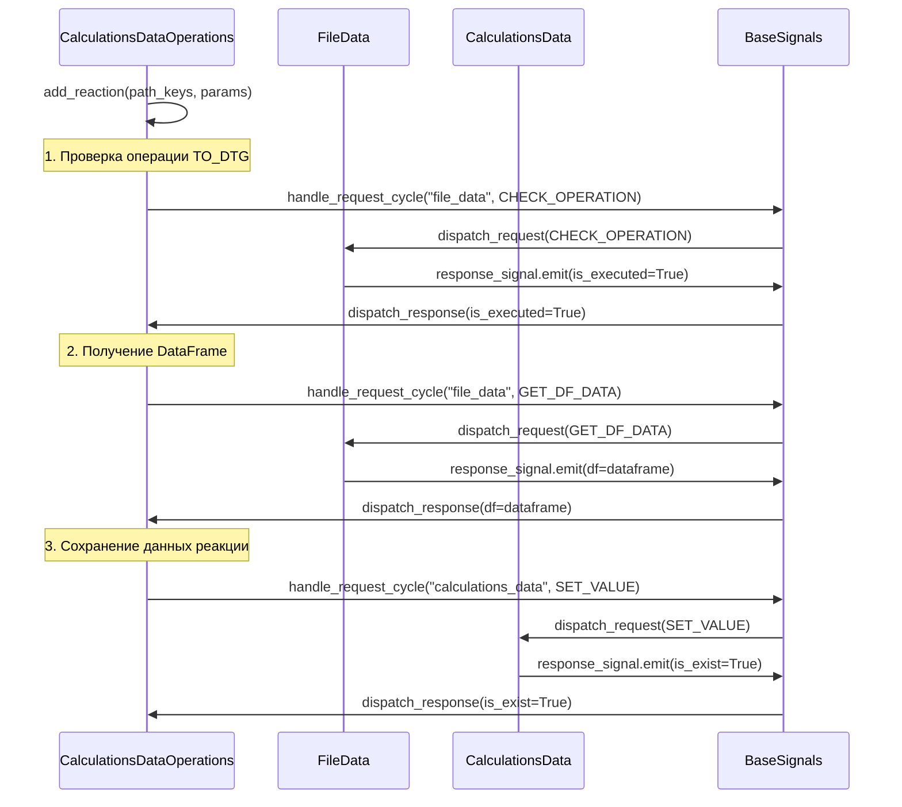
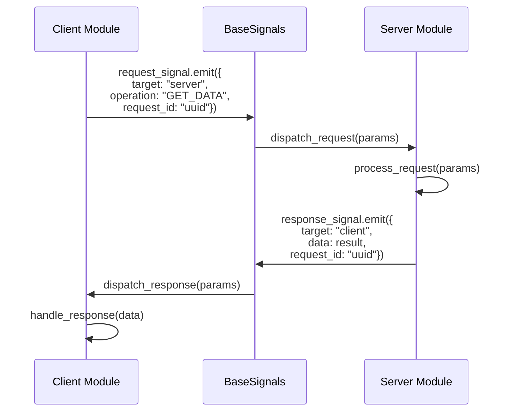
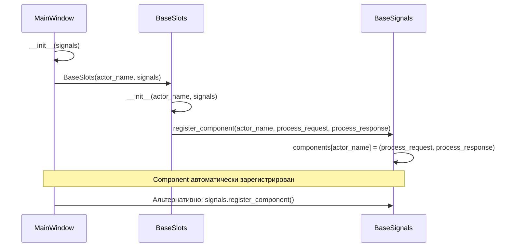
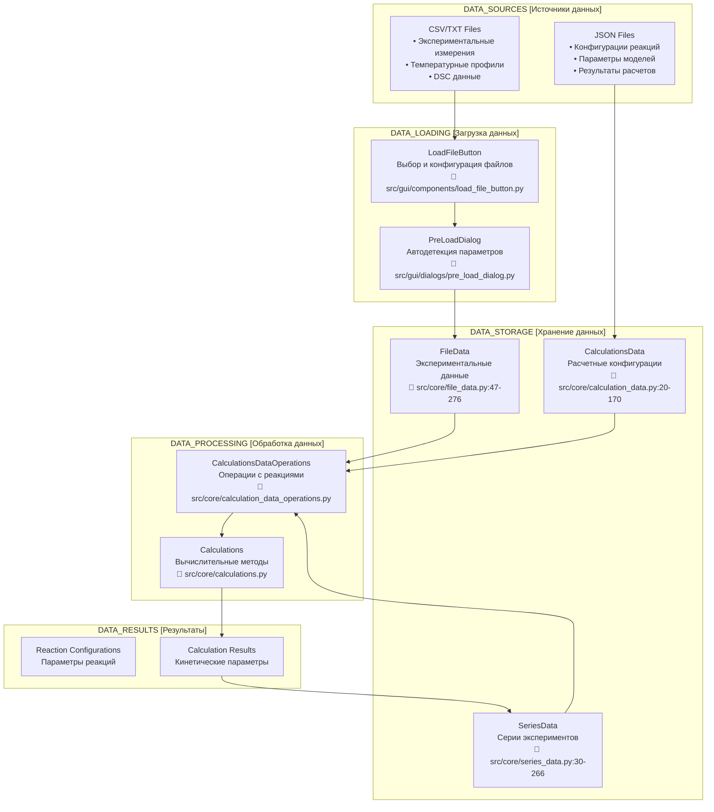
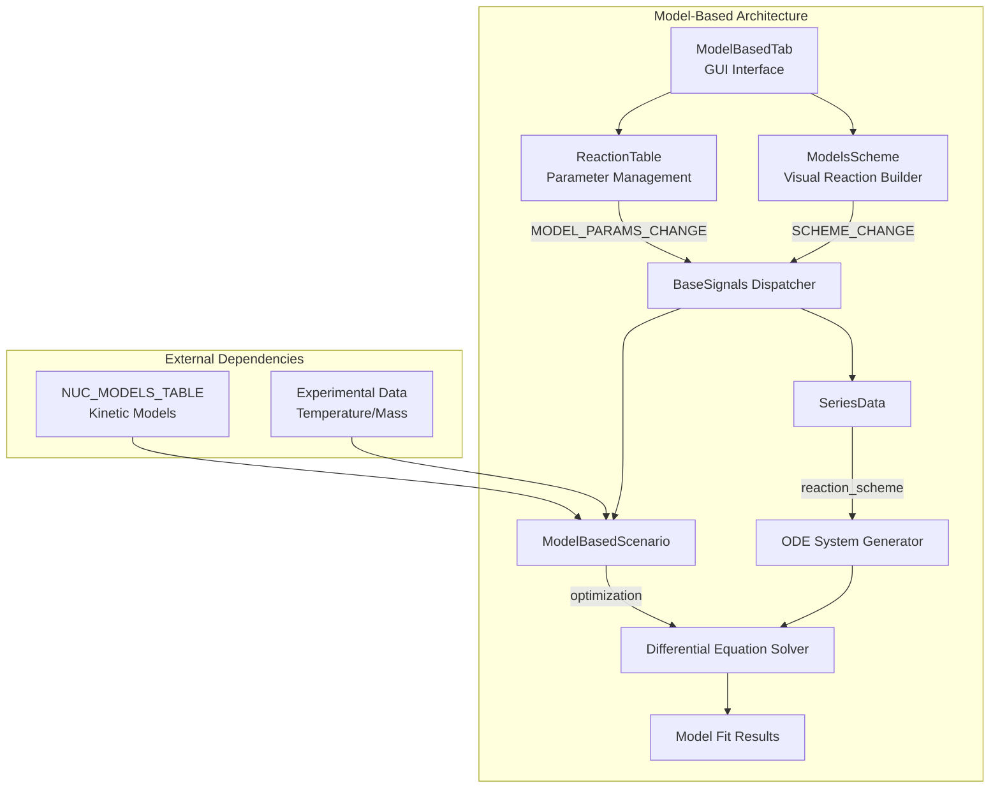
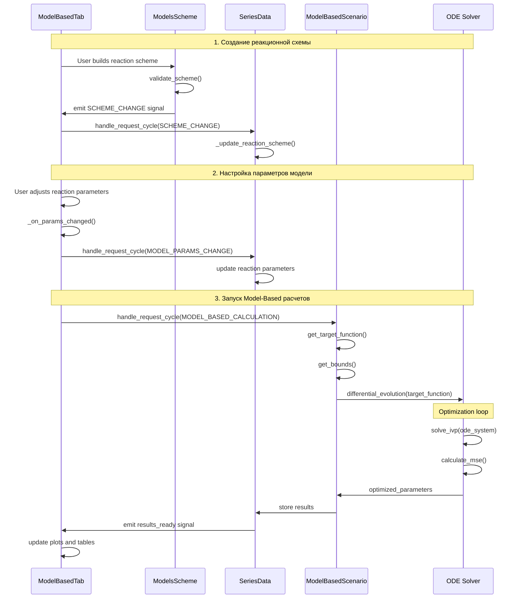

# Архитектура приложения для анализа кинетики твердофазных реакций

## Преимущества архитектуры - АРХИТЕКТУРНЫЙ МАНИФЕСТ

> **ЭТИ ПРИНЦИПЫ НЕ ДОЛЖНЫ НАРУШАТЬСЯ НИКОГДА!**

### 1. Слабое связывание (Loose Coupling)
- **Модули не знают о внутренней реализации друг друга**
- **Коммуникация только через стандартизированный API**
- **Легкое тестирование с mock-объектами**

### 2. Асинхронная коммуникация
- **Использование Qt сигналов для неблокирующих операций**
- **Event loop для синхронных запросов когда нужно**
- **Отсутствие прямых зависимостей между модулями**

### 3. Централизованная маршрутизация
- **Единая точка управления коммуникацией**
- **Логирование всех межмодульных взаимодействий**
- **Возможность добавления middleware (кэширование, валидация)**

### 4. Расширяемость
- **Новые модули легко интегрируются через BaseSlots**
- **Не требуется изменение существующего кода**
- **Поддержка различных паттернов коммуникации**

---

## Техническая архитектура системы

Приложение построено на **модульной сигнально-управляемой архитектуре** с использованием PyQt6, реализующей паттерны **Publisher-Subscriber** и **Request-Response** для межмодульной коммуникации.

## Центральная система коммуникации: BaseSignals/BaseSlots

### Архитектура диспетчера сигналов

```mermaid
classDiagram
    class BaseSignals {
        +request_signal: pyqtSignal
        +response_signal: pyqtSignal
        +components: Dict[str, tuple]
        +__init__()
        +register_component(name, process_req, process_resp)
        +dispatch_request(params)
        +dispatch_response(params)
    }
    
    class BaseSlots {
        +actor_name: str
        +signals: BaseSignals
        +pending_requests: Dict[str, Dict]
        +event_loops: Dict[str, QEventLoop]
        +__init__(actor_name, signals)
        +handle_request_cycle(target, operation, **kwargs)
        +create_and_emit_request(target, operation, **kwargs)
        +wait_for_response(request_id, timeout)
        +process_request(params)
        +process_response(params)
    }
    
    BaseSignals -->|registers| BaseSlots : component registration
    BaseSlots -->|uses| BaseSignals : signal communication
```

```python
# Центральный диспетчер сигналов
class BaseSignals(QObject):
    """Маршрутизатор запросов/ответов между компонентами"""
    request_signal = pyqtSignal(dict)
    response_signal = pyqtSignal(dict)
    
    def __init__(self):
        super().__init__()
        self.components: Dict[str, (Callable, Callable)] = {}
        self.request_signal.connect(self.dispatch_request)
        self.response_signal.connect(self.dispatch_response)
    
    def register_component(self, component_name: str, 
                          process_request_method: Callable,
                          process_response_method: Callable):
        """Регистрация компонента в системе диспетчеризации"""
        self.components[component_name] = (process_request_method, process_response_method)
```

### Базовый класс для модулей

```python
# Базовый класс для всех модулей системы
class BaseSlots(QObject):
    """Обеспечивает request/response механизм через сигналы и event loop"""
    
    def __init__(self, actor_name: str, signals: BaseSignals):
        super().__init__()
        self.actor_name = actor_name
        self.signals = signals
        self.pending_requests: Dict[str, Dict[str, Any]] = {}
        self.event_loops: Dict[str, QEventLoop] = {}
        # Автоматическая регистрация в диспетчере
        self.signals.register_component(actor_name, self.process_request, self.process_response)
    
    def handle_request_cycle(self, target: str, operation: str, **kwargs) -> Any:
        """Создать запрос, отправить и ждать ответа"""
        request_id = self.create_and_emit_request(target, operation, **kwargs)
        response_data = self.wait_for_response(request_id)
        return self.handle_response_data(request_id, operation)
```

## Схема межмодульной коммуникации



## Практические примеры коммуникации

### 1. Пример запроса из MainWindow в CalculationsDataOperations

```python
# В MainWindow
def _handle_add_reaction(self, params: dict):
    """Обработка добавления реакции"""
    file_name = params.get("file_name")
    reaction_name = params.get("reaction_name")
    
    # Синхронный запрос через BaseSlots
    result = self.handle_request_cycle(
        target="calculations_data_operations",  # Имя модуля-получателя
        operation=OperationType.ADD_REACTION,   # Тип операции
        path_keys=[file_name, reaction_name],   # Параметры
        data=True
    )
    return result
```

### 2. Обработка запроса в CalculationsDataOperations

```python
# В CalculationsDataOperations 
@pyqtSlot(dict)
def process_request(self, params: dict):
    """Обработка входящих запросов"""
    path_keys = params.get("path_keys")
    operation = params.get("operation")
    
    operations = {
        OperationType.ADD_REACTION: self.add_reaction,
        OperationType.REMOVE_REACTION: self.remove_reaction,
        OperationType.UPDATE_VALUE: self.update_value,
        OperationType.DECONVOLUTION: self.deconvolution,
    }
    
    if operation in operations:
        logger.debug(f"Processing operation '{operation}' with path_keys: {path_keys}")
        answer = operations[operation](path_keys, params)
        
        # Возвращаем ответ отправителю
        params["target"], params["actor"] = params["actor"], params["target"]
        self.signals.response_signal.emit(params)
```

### 3. Каскадные запросы между модулями



```python
# В CalculationsDataOperations - цепочка запросов к другим модулям
def add_reaction(self, path_keys: list, _params: dict):
    """Добавление реакции с проверкой данных"""
    file_name, reaction_name = path_keys
    
    # 1. Проверяем выполнена ли операция TO_DTG
    is_executed = self.handle_request_cycle(
        "file_data", 
        OperationType.CHECK_OPERATION, 
        file_name=file_name, 
        checked_operation=OperationType.TO_DTG
    )
    
    if is_executed:
        # 2. Получаем DataFrame
        df = self.handle_request_cycle(
            "file_data", 
            OperationType.GET_DF_DATA, 
            file_name=file_name
        )
        
        # 3. Сохраняем данные реакции
        data = cft.generate_default_function_data(df)
        is_exist = self.handle_request_cycle(
            "calculations_data", 
            OperationType.SET_VALUE, 
            path_keys=path_keys.copy(), 
            value=data
        )
```

## Архитектурные паттерны

### 1. Request-Response Pattern



### 2. Event Loop Synchronization

```mermaid
sequenceDiagram
    participant Module as Client Module
    participant Loop as QEventLoop
    participant Timer as QTimer
    participant BS as BaseSignals
    
    Module->>Module: create_and_emit_request()
    Module->>BS: request_signal.emit()
    Module->>Loop: loop = QEventLoop()
    Module->>Timer: timer.start(timeout)
    Module->>Loop: loop.exec() [BLOCKS]
    
    Note over Module, Loop: Waiting for response...
    
    BS->>Module: response_signal received
    Module->>Loop: loop.quit()
    Module->>Timer: timer.stop()
    Module->>Module: return response_data
```

```python
def wait_for_response(self, request_id: str, timeout: int = 1000) -> Optional[dict]:
    """Ожидание ответа с использованием QEventLoop"""
    if request_id not in self.pending_requests:
        return None
    
    # Создаем event loop для блокировки
    loop = QEventLoop()
    self.event_loops[request_id] = loop
    
    # Таймер для timeout
    timer = QTimer()
    timer.timeout.connect(loop.quit)
    timer.start(timeout)
    
    # Блокируем выполнение до получения ответа
    loop.exec()
    
    # Очищаем ресурсы
    timer.stop()
    self.event_loops.pop(request_id, None)
    
    return self.pending_requests.pop(request_id, {}).get("data")
```

### 3. Component Registration Pattern



```python
# Автоматическая регистрация модулей при инициализации
class MainWindow(QMainWindow):
    def __init__(self, signals: BaseSignals):
        super().__init__()
        self.signals = signals
        self.actor_name = "main_window"
        
        # Создание BaseSlots автоматически регистрирует компонент
        self.base_slots = BaseSlots(actor_name=self.actor_name, signals=self.signals)
        
        # Альтернативный способ регистрации
        self.signals.register_component(
            self.actor_name, 
            self.process_request, 
            self.process_response
        )
```

## Управление операциями через OperationType

```python
# Централизованное определение типов операций
class OperationType(Enum):
    # Data operations
    GET_VALUE = "get_value"
    SET_VALUE = "set_value"
    REMOVE_VALUE = "remove_value"
    UPDATE_VALUE = "update_value"  # Реальная операция для обновления коэффициентов
    GET_FULL_DATA = "get_full_data"
    
    # File operations  
    LOAD_FILE = "load_file"
    GET_DF_DATA = "get_df_data"
    GET_ALL_DATA = "get_all_data"
    PLOT_DF = "plot_df"
    TO_DTG = "to_dtg"  # Convert to DTG format
    RESET_FILE_DATA = "reset_file_data"
    CHECK_OPERATION = "check_differential"
    
    # Calculation operations
    ADD_REACTION = "add_reaction"
    REMOVE_REACTION = "remove_reaction"
    DECONVOLUTION = "deconvolution"
    MODEL_BASED_CALCULATION = "model_based_calculation"
    STOP_CALCULATION = "stop_calculation"
    CALCULATION_FINISHED = "calculation_finished"
    UPDATE_REACTIONS_PARAMS = "update_reactions_params"
    
    # Model-based operations (реальные операции из кода)
    SCHEME_CHANGE = "scheme_change"
    MODEL_PARAMS_CHANGE = "model_params_change"
    MODEL_FIT_CALCULATION = "model_fit_calculation"
    MODEL_FREE_CALCULATION = "model_free_calculation"
    GET_MODEL_FIT_REACTION_DF = "get_model_fit_reaction_df"
    GET_MODEL_FREE_REACTION_DF = "get_model_free_reaction_df"
    PLOT_MODEL_FIT_RESULT = "plot_model_fit_result"
    PLOT_MODEL_FREE_RESULT = "plot_model_free_result"
    
    # Series operations (реальные операции из кода)
    ADD_NEW_SERIES = "add_new_series"
    DELETE_SERIES = "delete_series"
    UPDATE_SERIES = "update_series"
    GET_SERIES_VALUE = "get_series_value"
    GET_ALL_SERIES = "get_all_series"
    GET_SERIES = "get_series"
    RENAME_SERIES = "rename_series"
    SELECT_SERIES = "select_series"
    LOAD_DECONVOLUTION_RESULTS = "load_deconvolution_results"
    
    # Import/Export operations
    IMPORT_REACTIONS = "import_reactions"
    EXPORT_REACTIONS = "export_reactions"
    
    # UI operations
    HIGHLIGHT_REACTION = "highlight_reaction"
    PLOT_MSE_LINE = "plot_mse_line"
    GET_FILE_NAME = "get_file_name"
```

### Паттерн использования path_keys

**Структура path_keys** в CalculationsData обеспечивает иерархический доступ к вложенным данным:
`[file_name, reaction_name, parameter_type, parameter_name]`

**Типовые структуры path_keys**:

**Основные параметры реакции**:
- Тип функции: `["NH4_rate_10.csv", "reaction_1", "function"]`
- Температурный массив: `["NH4_rate_10.csv", "reaction_1", "x"]`

**Коэффициенты функций**:
- Базовые параметры: `["file_name", "reaction_name", "coeffs", "h|z|w"]`
- ADS функция: `["file_name", "reaction_name", "coeffs", "ads1|ads2"]`
- Fraser функция: `["file_name", "reaction_name", "coeffs", "fr"]`

**Границы оптимизации**:
- Верхние границы: `["file_name", "reaction_name", "upper_bound_coeffs", "parameter"]`
- Нижние границы: `["file_name", "reaction_name", "lower_bound_coeffs", "parameter"]`

**Использование в UPDATE_VALUE операциях** - `src/core/calculation_data_operations.py`:
- Изменение коэффициентов реакций через BaseSlots.handle_request_cycle()
- Автоматическое сохранение изменений в JSON
- Валидация корректности path_keys структуры

## Потенциальные улучшения архитектуры

### 1. Типизация запросов
**Цель**: Повышение типобезопасности межмодульной коммуникации
**Реализация**: TypedDict классы для стандартизации структуры запросов

### 2. Middleware система  
**Цель**: Централизованная обработка запросов с валидацией и логированием
**Реализация**: Цепочка обработчиков для предобработки и постобработки запросов

## Архитектура системы данных

### Концепция и принципы организации данных

Система построена на **многоуровневой архитектуре данных**, обеспечивающей полный жизненный цикл обработки кинетических данных твердофазных реакций - от импорта экспериментальных измерений до генерации результатов расчетов.

#### Основные принципы:
- **Иммутабельность исходных данных**: Оригинальные экспериментальные файлы сохраняются без изменений
- **Трассируемость операций**: Полное логирование всех трансформаций данных
- **Типизированная структура**: Четкое разделение экспериментальных, расчетных и результирующих данных
- **Многоформатная поддержка**: CSV, TXT, JSON файлы с автодетекцией параметров

### Общая архитектура потоков данных



### Типы данных в системе

Система работает с четырьмя основными типами данных, организованными по иерархическому принципу:

#### 1. Экспериментальные данные (FileData)
**Файл**: `src/core/file_data.py:47-276`

Базовый уровень - хранение и управление исходными экспериментальными данными:

**Основные атрибуты**:
- `original_data: Dict[str, pd.DataFrame]` - Неизменяемые исходные данные
- `dataframe_copies: Dict[str, pd.DataFrame]` - Рабочие копии для трансформаций  
- `operations_history: Dict[str, List[Dict]]` - История операций с данными
- `loaded_files: Set[str]` - Реестр загруженных файлов

**Ключевые методы**:
- `load_file()` (строки 78-102) - Загрузка CSV/TXT файлов
- `check_operation_executed()` (строки 72-78) - Проверка выполненных операций
- `log_operation()` (строки 66-71) - Логирование операций

#### 2. Расчетные данные (CalculationsData) 
**Файл**: `src/core/calculation_data.py:20-170`

Уровень конфигураций реакций и параметров:

**Структура данных** (`_data: Dict[str, Any]`):
- Иерархия: `file_name → reaction_name → {function, coeffs, bounds, x}`
- Типы функций: "gauss", "fraser", "ads" 
- Коэффициенты: специфичные для каждого типа функции
- Границы оптимизации: `upper_bound_coeffs`, `lower_bound_coeffs`

**Ключевые методы**:
- `get_value(keys)` (строки 56-64) - Получение вложенных данных  
- `set_value(keys, value)` (строки 66-76) - Установка значений
- `save_data()` (строки 45-52) - Автосохранение в JSON

#### 3. Серийные данные (SeriesData)
**Файл**: `src/core/series_data.py:30-266`

Уровень серий экспериментов и результатов:

**Структура серий**:
- `experimental_data` - Данные экспериментов с разными скоростями нагрева
- `reaction_scheme` - Схемы многостадийных реакций
- `model_fit_results` - Результаты модельных расчетов
- `model_free_results` - Результаты model-free методов

**Операции**:
- `add_series()` - Создание новой серии экспериментов
- `update_series()` - Обновление параметров серии
- `get_series()` - Получение данных серии

#### 4. Результирующие данные
Финальный уровень - продукты вычислений:

**Типы результатов**:
- **Deconvolution Results**: Результаты деконволюции пиков
- **Model-Fit Results**: Параметры кинетических моделей  
- **Model-Free Results**: Энергии активации методами Фридмана, Киссинджера, ОФВ
- **Statistical Metrics**: Метрики качества подгонки (R², RMSE, MSE)

### Потоки обработки данных

#### 1. Загрузка и предобработка экспериментальных данных

**Поток**: External Files → PreLoadDialog → FileData → CalculationsDataOperations

**Ключевые этапы**:
1. **Автодетекция параметров файла** - `src/gui/dialogs/pre_load_dialog.py`
   - Определение разделителя, кодировки, десятичного символа
   - Автоматическое определение строк для пропуска
   
2. **Загрузка данных** - `src/core/file_data.py:78-102`
   - Использование pandas для чтения CSV/TXT
   - Сохранение в `original_data` (неизменяемые) и `dataframe_copies` (рабочие)
   
3. **Логирование операций** - `src/core/file_data.py:66-71`
   - Запись всех трансформаций в `operations_history`
   - Проверка выполненных операций через `check_operation_executed()`

**Поддерживаемые трансформации**:
- `TO_DTG` - Конвертация в DTG формат
- Дифференцирование данных 
- Нормализация

#### 2. Создание и управление реакциями

**Поток**: FileData → CalculationsDataOperations → CalculationsData

**Процесс создания реакции** - `src/core/calculation_data_operations.py`:
1. **Валидация данных** - проверка выполнения операции TO_DTG
2. **Генерация структуры реакции** - создание конфигурации с параметрами по умолчанию
3. **Сохранение в CalculationsData** - использование path_keys структуры

**Структура path_keys для доступа к данным**:
- `[file_name, reaction_name, "function"]` - тип функции
- `[file_name, reaction_name, "coeffs", coeff_name]` - коэффициенты
- `[file_name, reaction_name, "upper_bound_coeffs", coeff_name]` - верхние границы
- `[file_name, reaction_name, "lower_bound_coeffs", coeff_name]` - нижние границы

#### 3. Вычислительные методы и результаты

**Модуль**: `src/core/calculations.py`

**Категории методов**:

**Model-Free методы**:
- **Friedman Method** - Дифференциальный изоконверсионный метод
- **Kissinger Method** - Метод для определения энергии активации  
- **Ozawa-Flynn-Wall** - Интегральный изоконверсионный метод

**Model-Fitting методы**:
- **Coats-Redfern** - Линейная аппроксимация для определения кинетических параметров
- **Master Plots** - Определение кинетических моделей через мастер-кривые
- **Differential Analysis** - Анализ дифференциальных данных

**Хранение результатов**:
- **CalculationsData** - Промежуточные результаты и параметры оптимизации
- **SeriesData** - Финальные результаты анализа серий экспериментов
- **JSON экспорт** - Автоматическое сохранение результатов

### Операции с данными через OperationType

Система использует централизованную систему типов операций для межмодульной коммуникации. Полный перечень операций определен в `src/core/app_settings.py`.

#### Операции с экспериментальными данными (FileData)

**Модуль**: `src/core/file_data.py:47-276`

**Загрузка и трансформация данных**:
- `LOAD_FILE` - Загрузка CSV/TXT файлов с автодетекцией параметров
- `GET_DF_DATA` - Получение рабочей копии DataFrame
- `GET_ALL_DATA` - Получение всех загруженных DataFrames
- `RESET_FILE_DATA` - Сброс к исходному состоянию

**Операции трансформации**:
- `TO_DTG` - Конвертация в DTG формат (производная термогравиметрии)
- `CHECK_OPERATION` - Проверка выполнения операций

#### Операции с расчетными данными (CalculationsData)

**Модуль**: `src/core/calculation_data.py:20-170`

**CRUD операции с path_keys**:
- `GET_VALUE` - Получение значения по пути ключей
- `SET_VALUE` - Установка значения по пути ключей  
- `REMOVE_VALUE` - Удаление значения по пути ключей
- `UPDATE_VALUE` - Обновление значения по пути ключей
- `GET_FULL_DATA` - Получение полной структуры данных

**Примеры path_keys структур**:
- Тип функции: `["NH4_rate_10.csv", "reaction_1", "function"]`
- Коэффициенты: `["NH4_rate_10.csv", "reaction_1", "coeffs", "h"]`
- Границы оптимизации: `["NH4_rate_10.csv", "reaction_1", "upper_bound_coeffs", "z"]`

**Импорт/экспорт**:
- `IMPORT_REACTIONS` - Импорт конфигураций из JSON
- `EXPORT_REACTIONS` - Экспорт конфигураций в JSON

#### Операции с реакциями (CalculationsDataOperations)

**Модуль**: `src/core/calculation_data_operations.py`

**Управление реакциями**:
- `ADD_REACTION` - Создание новой реакции с параметрами по умолчанию
- `REMOVE_REACTION` - Удаление реакции
- `UPDATE_VALUE` - Обновление параметров реакции

**Вычислительные операции**:
- `DECONVOLUTION` - Деконволюция перекрывающихся пиков
- `MODEL_BASED_CALCULATION` - Model-based анализ многостадийных реакций

#### Операции с сериями экспериментов (SeriesData)

**Модуль**: `src/core/series_data.py:30-266`

**Управление сериями**:
- `ADD_NEW_SERIES` - Создание серии экспериментов с разными скоростями нагрева
- `DELETE_SERIES` - Удаление серии
- `RENAME_SERIES` - Переименование серии
- `GET_ALL_SERIES` - Получение списка всех серий
- `GET_SERIES` - Получение данных конкретной серии

**Конфигурация и результаты**:
- `SCHEME_CHANGE` - Изменение схемы многостадийных реакций
- `UPDATE_SERIES` - Обновление параметров серии
- `GET_SERIES_VALUE` - Получение конкретного значения серии
- `LOAD_DECONVOLUTION_RESULTS` - Загрузка результатов деконволюции

#### Model-Based операции

**Управление схемами реакций**:
- `SCHEME_CHANGE` - Изменение топологии реакционной схемы
- `MODEL_PARAMS_CHANGE` - Изменение параметров кинетических моделей

**Вычислительные методы**:
- `MODEL_BASED_CALCULATION` - Оптимизация многостадийных реакций
- `MODEL_FIT_CALCULATION` - Model-fitting методы
- `MODEL_FREE_CALCULATION` - Model-free методы

**Работа с результатами**:
- `GET_MODEL_FIT_REACTION_DF` - Получение DataFrame для model-fit результатов
- `GET_MODEL_FREE_REACTION_DF` - Получение DataFrame для model-free результатов
- `PLOT_MODEL_FIT_RESULT` - Построение графиков model-fit
- `PLOT_MODEL_FREE_RESULT` - Построение графиков model-free

### Персистентность данных

#### 1. Временное хранение в памяти

**FileData** (`src/core/file_data.py:52-58`):
- `original_data: Dict[str, pd.DataFrame]` - Неизменяемые исходные данные
- `dataframe_copies: Dict[str, pd.DataFrame]` - Рабочие копии для трансформаций
- `operations_history: Dict[str, List[Dict]]` - История операций с данными
- `loaded_files: Set[str]` - Реестр загруженных файлов

**CalculationsData** (`src/core/calculation_data.py:30-35`):
- `_data: Dict[str, Any]` - Структура реакций и результатов расчетов
- Автосохранение при изменениях через метод `save_data()`

**SeriesData** (`src/core/series_data.py`):
- `series_data: Dict[str, Dict]` - Конфигурации серий экспериментов
- Кэшированные результаты model-based и model-free расчетов

#### 2. Постоянное хранение в файлах

**JSON файлы** - Конфигурации и результаты:
- Структуры реакций с коэффициентами и границами оптимизации
- Результаты деконволюции и кинетического анализа
- Схемы многостадийных реакций

**CSV/TXT файлы** - Экспериментальные данные:
- Температурные профили и массовые данные
- DSC (дифференциальная сканирующая калориметрия) измерения
- Только режим чтения для сохранения целостности

**Автосохранение**:
- Триггеры при изменении данных в CalculationsData
- Периодическое сохранение состояния серий экспериментов

#### 3. Схема синхронизации данных

**Сохранение**: User → CalculationsData → JSON File
**Загрузка**: JSON File → CalculationsData → User Interface

**Точки синхронизации**:
- Изменение коэффициентов реакций
- Добавление/удаление реакций
- Создание/обновление серий экспериментов
- Завершение вычислительных операций

### Пример полного потока данных

Типичный сценарий работы с данными в системе включает следующие этапы:

#### 1. Загрузка экспериментального файла
**Компоненты**: `LoadFileButton` → `PreLoadDialog` → `FileData.load_file()`
- Автодетекция параметров CSV/TXT файла
- Сохранение в `original_data` и создание рабочих копий

#### 2. Создание реакции на основе данных  
**Поток**: `CalculationsDataOperations.add_reaction()` → `CalculationsData.set_value()`
- Валидация выполнения операции TO_DTG
- Генерация структуры реакции с параметрами по умолчанию

#### 3. Настройка параметров реакции
**Операции**: `UPDATE_VALUE` через path_keys структуру
- Обновление коэффициентов функций (h, z, w, ads1, ads2, fr)
- Установка границ оптимизации

#### 4. Выполнение вычислительных операций
**Методы**: `DECONVOLUTION`, `MODEL_BASED_CALCULATION`
- Оптимизация коэффициентов реакций
- Анализ кинетических параметров

#### 5. Создание серии экспериментов
**Компонент**: `SeriesData.add_new_series()`
- Объединение файлов с разными скоростями нагрева
- Конфигурация схемы многостадийных реакций

#### 6. Model-based анализ
**Модуль**: `Calculations.model_based_calculation()`
- Определение кинетических параметров (A, E, n)
- Статистические метрики качества подгонки

#### 7. Автосохранение результатов
**Компоненты**: `CalculationsData.save_data()`, `SeriesData.save_data()`
- Экспорт конфигураций и результатов в JSON
- Сохранение истории операций

**Преимущества архитектуры**:
- **Трассируемость**: Полная история операций с данными
- **Безопасность**: Сохранение оригинальных данных без изменений
- **Гибкость**: Возможность отката операций через `operations_history`
- **Масштабируемость**: Поддержка множественных файлов и серий экспериментов

---

## MODEL_BASED архитектура и операции

### Обзор Model-Based подсистемы

Model-Based модуль представляет собой комплексную систему для моделирования многостадийных твердофазных реакций с использованием кинетических схем и дифференциальных уравнений. Система поддерживает как параллельные, так и последовательные реакционные схемы.



### Типы операций MODEL_BASED

#### 1. SCHEME_CHANGE - Изменение реакционной схемы

**Структура операции** - `src/core/series_data.py`:
- **Компоненты реакции**: Список компонентов с уникальными ID (A, B, C, D)
- **Реакционные связи**: Определение переходов между компонентами
- **Топология схемы**: Поддержка параллельных, последовательных и смешанных схем

**Обработка в SeriesData** - `src/core/series_data.py:handle_scheme_change()`:
- Обновление реакционной схемы серии экспериментов
- Генерация параметров по умолчанию для новых реакций
- Валидация корректности схемы

#### 2. MODEL_PARAMS_CHANGE - Изменение параметров модели

**Структура параметров модели**:
- **Кинетическая модель**: Тип реакции (F1/3, F2, F3, A2, R3, D1)
- **Энергия активации**: Ea (кДж/моль) с границами оптимизации
- **Предэкспоненциальный фактор**: log_A с границами
- **Вклад реакции**: contribution (доля в общей массе)

**Кинетические модели** - `src/core/app_settings.py` (NUC_MODELS_TABLE):
- **Дифференциальные и интегральные формы функций** для различных механизмов реакций
- **Физическое описание механизмов**: Random nucleation, Phase boundary, Diffusion
- **Поддерживаемые типы**: F1/3, F2, F3 (нуклеация), A2 (автокаталитические), R3 (фазовые границы), D1 (диффузия)
- **Параметры для различных типов нуклеации и роста** с математическими выражениями
```

### ModelBasedScenario и система оптимизации

**Архитектура оптимизации** - `src/core/calculations.py`:

**Целевая функция ModelBasedTargetFunction**:
- **Векторизация параметров**: [logA, Ea, model_index, contribution] для каждой реакции
- **Система ОДУ**: Решение дифференциальных уравнений для кинетических схем
- **Оценка качества**: Расчет MSE между экспериментальными и расчетными данными

**Компоненты оптимизации**:
- **Температурные профили**: Поддержка множественных скоростей нагрева
- **Кинетические модели**: Интеграция с NUC_MODELS_TABLE  
- **Статистические метрики**: R², RMSE, информация о сходимости
- **Границы оптимизации**: Физически обоснованные ограничения параметров

**Алгоритм оптимизации** - differential_evolution:
- Глобальная оптимизация для многопараметрических задач
- Обработка нелинейных ограничений
- Автоматическая адаптация стратегии поиска

### Потоки данных Model-Based операций



### Реальные структуры данных Model-Based

#### 1. Reaction Scheme в SeriesData

**Структура данных** - `src/core/series_data.py`:

**Базовые схемы реакций**:
- **Параллельная схема**: A → B, A → C (одновременные процессы)
- **Последовательная схема**: A → B → C (поэтапные превращения)  
- **Смешанная схема**: A → B → C, B → D (комбинированные пути)

**Компоненты схемы**:
- **Components**: Список уникальных ID компонентов (A, B, C, D)
- **Reactions**: Связи между компонентами с кинетическими параметрами
- **Allowed_models**: Допустимые кинетические модели для каждой реакции

**Параметры реакций**:
- **Ea (Энергия активации)**: 1.0-2000.0 кДж/моль
- **log_A (Предэкспоненциальный фактор)**: -100.0 до 100.0
- **Contribution (Вклад реакции)**: 0.01-1.0 (доля от общей массы)
- **Reaction_type**: Текущая выбранная кинетическая модель

#### 2. Model-Based Results Structure

**Результаты оптимизации** - хранение в SeriesData:

**Оптимизированные параметры**:
- **logA**: Массив значений для каждой реакции
- **Ea**: Энергии активации в кДж/моль
- **Models**: Оптимальные кинетические модели
- **Contributions**: Доли реакций в общей конверсии

**Статистические метрики**:
- **Total_mse**: Общая среднеквадратичная ошибка
- **Individual_mse**: MSE для каждой скорости нагрева
- **R_squared**: Коэффициент детерминации
- **Convergence_info**: Информация о сходимости оптимизации

**Симуляционные данные** - хранение временных рядов и профилей:
- **Temperature**: Температурный профиль эксперимента
- **Experimental_mass**: Экспериментальные данные массы для различных скоростей нагрева
- **Simulated_mass**: Расчетные данные модели для сравнения с экспериментом
- **Reaction_rates**: Скорости отдельных реакций во времени для каждой скорости нагрева
```

### Операции с Model-Based системой

#### Операции управления схемой

**Основные типы операций с Model-Based системой** - `src/core/app_settings.py`:

**Операции с реакционными схемами**:
- `SCHEME_CHANGE` - Изменение топологии схемы
- `MODEL_PARAMS_CHANGE` - Изменение параметров реакций

**Вычислительные операции**:
- `MODEL_BASED_CALCULATION` - Запуск model-based оптимизации
- `MODEL_FIT_CALCULATION` - Model-fitting методы
- `MODEL_FREE_CALCULATION` - Model-free методы

**Операции с результатами**:
- `GET_MODEL_FIT_REACTION_DF` - Получить DataFrame для model-fit
- `GET_MODEL_FREE_REACTION_DF` - Получить DataFrame для model-free
- `PLOT_MODEL_FIT_RESULT` - Построить графики model-fit
- `PLOT_MODEL_FREE_RESULT` - Построить графики model-free

#### Пример использования Model-Based операций

**Типичный поток работы с Model-Based системой**:

**1. Создание реакционной схемы** - `src/core/series_data.py`:
- Определение компонентов реакции с уникальными ID (A, B, C)
- Установка связей между компонентами (последовательные/параллельные)
- Отправка сигнала `SCHEME_CHANGE` через BaseSignals диспетчер

**2. Настройка параметров модели** - `src/gui/tabs/model_based_tab.py`:
- Выбор кинетической модели (F2, A2, R3) для каждой реакции
- Установка энергий активации и предэкспоненциальных факторов
- Определение границ оптимизации и долей реакций

**3. Запуск оптимизационных расчетов** - `src/core/calculations.py`:
- Подготовка экспериментальных данных с различными скоростями нагрева
- Использование алгоритма differential_evolution для оптимизации
- Решение системы ОДУ для кинетических схем

**4. Получение и анализ результатов** - `src/core/series_data.py`:
- Извлечение оптимизированных кинетических параметров
- Расчет статистических метрик качества подгонки
- Сохранение результатов в структуру SeriesData

### Интеграция с визуальными компонентами

#### ModelsScheme - Визуальный редактор схем

**Функциональность** - `src/gui/components/models_scheme.py`:
- **Графический редактор реакционных схем** с drag-and-drop интерфейсом
- **Экспорт схемы в JSON формат** для передачи через сигналы BaseSignals
- **Валидация корректности схем** перед отправкой данных
- **Автоматическая генерация узлов и связей** на основе пользовательского ввода

#### ReactionTable - Управление параметрами

**Компоненты интерфейса** - `src/gui/components/reaction_table.py`:
- **Редактирование кинетических параметров** (Ea, log_A, contribution)
- **Установка границ оптимизации** (Ea_min, Ea_max, log_A_min, log_A_max)
- **Выбор кинетических моделей** из доступного списка NUC_MODELS_TABLE
- **Валидация вводимых значений** на физическую корректность

### Преимущества Model-Based архитектуры

1. **Модульность**: Четкое разделение GUI, логики и расчетов
2. **Масштабируемость**: Поддержка произвольных реакционных схем
3. **Гибкость**: Поддержка различных кинетических моделей
4. **Визуализация**: Интуитивный графический редактор схем
5. **Оптимизация**: Мощные алгоритмы дифференциальной эволюции
6. **Валидация**: Проверка физической корректности параметров

Эта архитектура обеспечивает полный цикл работы с многостадийными реакциями: от создания схемы до получения оптимизированных кинетических параметров.
