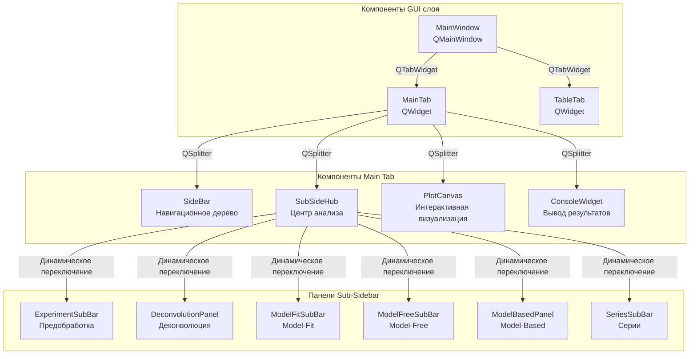

# Архитектура GUI для анализа кинетики твердофазных реакций

## Архитектурные принципы

### Основополагающие принципы GUI (UI АРХИТЕКТУРНЫЙ МАНИФЕСТ)
- **Иерархическая композиция виджетов**: Вложенная иерархия QWidget с четкими отношениями родитель-потомок
- **Сигнально-слотовая коммуникация**: Qt сигналы для слабосвязанного, событийно-управляемого взаимодействия
- **Адаптивное управление компоновкой**: Динамическое изменение размеров через QSplitter с пропорциональным распределением
- **Контекстно-зависимый интерфейс**: Динамическое переключение контента на основе рабочего процесса
- **Интерактивная визуализация**: Интеграция matplotlib с перетаскиваемыми якорями и обновлением в реальном времени
- **Модульная конфигурация**: Управление конфигурацией через dataclass с централизованными константами
- **Модульная структура по сущностям**: Организация модулей по именам существительных, отражающих UI компоненты

---

## Общая архитектура GUI системы

Приложение реализует **табулированный модульный интерфейс** на PyQt6 с **интерактивной научной визуализацией** и **контекстно-зависимыми боковыми панелями** для различных аналитических процессов.

### Рефакторизованная модульная архитектура (текущее состояние)

После завершения **Фазы 1-2 рефакторизации UI**, архитектура GUI была преобразована из монолитных файлов в **модульную структуру по сущностям**:

**Статус завершенной рефакторизации**:
- ✅ **Deconvolution Module**: `7 специализированных компонентов`
- ✅ **Model-Based Module**: `8 специализированных компонентов` 
- ✅ **Plot Canvas Module**: `5 специализированных компонентов`
- ✅ **Experiment Module**: `2 компонента с блочной структурой`
- ✅ **Table Tab Module**: `3 компонента для табличного просмотра`
- ✅ **Извлечение конфигурации**: Все модули имеют выделенные `config.py` файлы

### Структура главного приложения

**MainWindow** (`src/gui/main_window.py:15-50`) - основной контейнер приложения:
- `QTabWidget` центральный виджет с вкладками "Main" и "Table"
- Интеграция BaseSignals для межмодульной коммуникации
- Маршрутизация сигналов между GUI компонентами и модулями основной логики
- Заголовок окна: "Open ThermoKinetics"

**Табличный интерфейс**:
- **Main Tab**: Основной интерфейс анализа с интерактивной визуализацией
- **Table Tab**: Интерфейс просмотра и манипулирования данными

### Архитектура GUI коммуникации



### Основные паттерны потока сигналов

**Рабочий процесс, управляемый навигацией**:
1. Пользователь кликает элемент дерева боковой панели (`SideBar.on_item_clicked()`)
2. Сигнал `sub_side_bar_needed` запускает переключение контента
3. `SubSideHub.update_content()` показывает соответствующую панель анализа
4. Панель излучает сигналы операций в `MainTab.to_main_window_signal`
5. Сигналы маршрутизируются через `MainWindow` к модулям основной логики

**Рабочий процесс интерактивной визуализации**:
1. Пользователь перетаскивает якоря на `PlotCanvas`
2. Излучается сигнал `update_value` с изменениями параметров
3. `MainTab.update_anchors_slot()` обрабатывает обновления якорей
4. Значения распространяются к модулям расчетов через path_keys

---

## Архитектура компоновки Main Tab

### Система отзывчивой компоновки

**MainTab** (`src/gui/main_tab/main_tab.py:25-100`) реализует **пропорциональную 4-панельную компоновку**:

**Константы компоновки**:
```python
MIN_WIDTH_SIDEBAR = 220      # Минимум навигационного дерева
MIN_WIDTH_SUBSIDEBAR = 220   # Минимум панелей анализа  
MIN_WIDTH_CONSOLE = 150      # Минимум консоли вывода
MIN_WIDTH_PLOTCANVAS = 500   # Минимум интерактивного графика
COMPONENTS_MIN_WIDTH = 1190  # Общая минимальная ширина
MIN_HEIGHT_MAINTAB = 700     # Минимальная высота
```

**Конфигурация QSplitter**:
- **Горизонтальная ориентация** с 4 изменяемыми панелями
- **Динамическая видимость**: Sub-sidebar и консоль могут скрываться
- **Пропорциональное изменение размеров**: Соотношения рассчитываются от минимумов компонентов
- **Отзывчивые обновления**: `initialize_sizes()` пересчитывает при изменении видимости

### Управление видимостью панелей

**Динамическое переключение панелей** (`src/gui/main_tab/main_tab.py:101-176`):
- `toggle_sub_sidebar(content_type)` - Показывает/скрывает панели анализа
- `toggle_console_visibility(visible)` - Управляет отображением вывода
- **Специальные соединения canvas**: Интерактивные якоря включаются только для режима деконволюции
- **Пересчет размеров**: Пропорции компоновки обновляются автоматически

---

## Архитектура системы навигации

### Иерархическая древовидная навигация

**SideBar** (`src/gui/main_tab/sidebar.py:24-410`) - **навигация на основе QTreeView**:

**Структура дерева** (`src/gui/main_tab/sidebar.py:47-81`):
```
app tree
├── experiments
│   ├── add file data
│   ├── delete selected
│   └── [загруженные файлы...]
├── series
│   ├── add new series
│   ├── import series
│   ├── delete series
│   └── [созданные серии...]
├── calculation
│   ├── model fit
│   ├── model free
│   └── model based
└── settings
    └── console
        ├── show ☑
        └── hide ☐
```

**Сигналы навигации** (`src/gui/main_tab/sidebar.py:31-37`):
- `sub_side_bar_needed` - Запускает переключение панелей на основе выбора в дереве
- `chosen_experiment_signal` - Выбор файла для загрузки данных
- `console_show_signal` - Управление видимостью консоли
- `active_file_selected` / `active_series_selected` - Переключение контекста

### Контекстно-зависимое переключение интерфейса

**SubSideHub** (`src/gui/main_tab/sub_sidebar/sub_side_hub.py:32-55`) - **динамический менеджер контента**:

**Логика переключения панелей**:
- **Deconvolution**: Анализ пиков и разделение реакций
- **Model Fit**: Определение кинетических параметров (direct-diff, Coats-Redfern)  
- **Model Free**: Изоконверсионный анализ (Friedman, KAS, Starink)
- **Model Based**: Оптимизация схем многостадийных реакций
- **Experiments**: Предобработка данных (сглаживание, вычитание фона)
- **Series**: Управление экспериментами с несколькими скоростями нагрева

**Управление виджетами**:
- Все панели предварительно созданы, но скрыты  
- `update_content()` динамически показывает/скрывает виджеты
- Предыдущий виджет удаляется из компоновки перед добавлением нового
- **Эффективная память**: Виджеты сохраняются между переключениями

---

## Архитектура интерактивной визуализации

### Система научной визуализации

**PlotCanvas** (`src/gui/main_tab/plot_canvas/plot_canvas.py:31-219`) - **интеграция Matplotlib-Qt**:

**Структура компонентов**:
- **Figure**: Экземпляр Matplotlib Figure со стилизацией научных графиков
- **Canvas**: FigureCanvasQTAgg для интеграции с Qt
- **Axes**: Одиночный subplot для визуализации данных
- **Toolbar**: NavigationToolbar2QT для управления панорамированием/масштабированием
- **Anchors**: Интерактивные перетаскиваемые элементы для настройки параметров

**Конфигурация стилизации**:
```python
plt.style.use(["science", "no-latex", "nature", "grid"])
```

### Система интерактивных якорей

**Управление перетаскиваемыми параметрами** (`src/gui/main_tab/plot_canvas/anchor_group.py`):

**Группы якорей**:
- **PositionAnchorGroup**: Управляет позициями центров пиков (параметр z)
- **HeightAnchorGroup**: Управляет высотами пиков (параметр h)  
- **Обновления в реальном времени**: События перетаскивания мыши запускают немедленные обновления параметров

**Обработка событий** (`src/gui/main_tab/plot_canvas/plot_canvas.py:73-84`):
```python
def toggle_event_connections(self, enable: bool):
    if enable:
        self.cid_press = self.canvas.mpl_connect("button_press_event", self.on_click)
        self.cid_release = self.canvas.mpl_connect("button_release_event", self.on_release)
        self.cid_motion = self.canvas.mpl_connect("motion_notify_event", self.on_motion)
```

**Распространение сигналов**:
1. События мыши захватываются на canvas
2. Позиции якорей рассчитываются и валидируются
3. Излучается сигнал `update_value` с изменениями параметров
4. Изменения распространяются к модулям расчетов через систему `path_keys`

---

## Архитектура панелей анализа

### Специализированные интерфейсы рабочих процессов

**Модульная структура деконволюции** - `DeconvolutionPanel` (`src/gui/main_tab/sub_sidebar/deconvolution/deconvolution_panel.py`):

**Компоненты деконволюции**:
- **ReactionTable** (`reaction_table.py`): Управление множественными реакциями с выбором функций
- **CoefficientsView** (`coefficients_view.py`): Редактирование параметров в реальном времени с валидацией
- **FileTransferButtons** (`file_transfer.py`): Импорт/экспорт конфигураций реакций
- **CalculationControls** (`calculation_controls.py`): Запуск/остановка оптимизационных расчетов
- **SettingsDialog** (`settings_dialog.py`): Конфигурация алгоритмов оптимизации

**Обновления параметров в реальном времени**:
- Прямое редактирование коэффициентов запускает немедленные обновления графика
- Изменения типов функций (gauss, ads, fraser) обновляют наборы параметров
- Импорт/экспорт сохраняет полные конфигурации реакций

### Модульный интерфейс Model-Based анализа

**ModelBasedPanel** (`src/gui/main_tab/sub_sidebar/model_based/model_based_panel.py`) - **оптимизация многостадийных реакций**:

**Компоненты Model-Based**:
- **ModelsScheme** (`models_scheme.py`): Визуальный редактор схем реакций (A→B→C→D/E топологии)
- **ParameterTable** (`parameter_table.py`): Границы кинетических параметров (Ea: 1-2000 кДж/моль, log_A: -100 до 100)
- **AdjustmentControls** (`adjustment_controls.py`): Слайдеры параметров в реальном времени с пошаговым управлением
- **CalculationControls** (`calculation_controls.py`): Запуск/остановка оптимизации с отслеживанием прогресса
- **CalculationSettingsDialogs** (`calculation_settings_dialogs.py`): Настройки алгоритмов differential evolution

**Система настройки параметров**:
- **AdjustmentRowWidget**: Компоновка кнопка-слайдер-кнопка для точного управления
- **Обновления в реальном времени**: Изменения слайдера запускают немедленные обновления схемы
- **Валидация**: Границы параметров обеспечиваются на уровне UI

### Интерфейс предобработки экспериментов

**ExperimentSubBar** (`src/gui/main_tab/sub_sidebar/experiment/experiment_sub_bar.py:195`) - **предобработка данных**:

**Блочные компоненты**:
- **SmoothingBlock**: Конфигурация фильтра Савицкого-Голая
  - Выбор метода (Savitzky-Golay, Other)
  - Входы размера окна и порядка полинома
  - Кнопка применения для обработки
- **BackgroundSubtractionBlock**: Методы коррекции базовой линии  
  - 8 методов вычитания (Linear, Sigmoidal, Tangential и др.)
  - Входы левого/правого диапазона для определения базовой линии
- **ActionButtonsBlock**: Кнопки управления рабочим процессом
  - "reset changes" - Восстановление исходных данных
  - "to da/dT" - Вычисление производной
  - "deconvolution" - Переключение в режим анализа пиков

### Интерфейс анализа серий

**SeriesSubBar** (`src/gui/main_tab/sub_sidebar/series/series_sub_bar.py`) - **эксперименты с несколькими скоростями нагрева**:

**Компоненты рабочего процесса**:
- **Load Button**: Импорт результатов деконволюции нескольких файлов  
- **Results ComboBox**: Выбор реакции для визуализации
- **Method ComboBox**: Выбор метода model-fit
- **Results Table**: Табличное отображение кинетических параметров (Ea, A)
- **Export Button**: Функциональность вывода результатов

**Диалог загрузки файлов**:
- **Динамические входы файлов**: Добавление нескольких файлов со скоростями нагрева
- **Валидация скорости нагрева**: Валидация числового ввода
- **Отзывчивые размеры**: Высота диалога регулируется с количеством файлов

---

## Система управления компоновкой

### Паттерны отзывчивого дизайна

**Пропорциональное изменение размеров** (`src/gui/main_tab/main_tab.py:84-96`):
```python
def initialize_sizes(self):
    total_width = self.width()
    sidebar_ratio = MIN_WIDTH_SIDEBAR / COMPONENTS_MIN_WIDTH
    subsidebar_ratio = MIN_WIDTH_SUBSIDEBAR / COMPONENTS_MIN_WIDTH
    console_ratio = MIN_WIDTH_CONSOLE / COMPONENTS_MIN_WIDTH
    
    sidebar_width = int(total_width * sidebar_ratio)
    console_width = int(total_width * console_ratio) if self.console_widget.isVisible() else 0
    sub_sidebar_width = int(total_width * subsidebar_ratio) if self.sub_sidebar.isVisible() else 0
    canvas_width = total_width - (sidebar_width + sub_sidebar_width + console_width)
    self.splitter.setSizes([sidebar_width, sub_sidebar_width, canvas_width, console_width])
```

**Обработка динамической видимости**:
- Скрытые панели вносят 0 в расчеты ширины
- Оставшееся пространство распределяется пропорционально видимым панелям
- **Автоматический пересчет**: Запускается при событиях показа/скрытия панелей

### Ограничения минимальных размеров

**Минимумы компонентов**:
- **Общее приложение**: минимум 1290px ширина × 700px высота
- **Sidebar**: минимум 220px ширина для навигации по дереву
- **Sub-sidebar**: минимум 220px ширина для управления анализом
- **Plot Canvas**: минимум 500px ширина для четкости визуализации  
- **Console**: минимум 150px ширина для читаемого вывода

---

## Управление состоянием и взаимодействие с пользователем

### Отслеживание активного контекста

**Управление состоянием файл/серия** (`src/gui/main_tab/sidebar.py:94-410`):
- `active_file_item` - Текущий выбранный экспериментальный файл
- `active_series_item` - Текущий выбранный анализ серии
- **Визуальные индикаторы**: Жирный шрифт для активных элементов
- **Распространение контекста**: Активный контекст включается во все сигналы операций

**Интеграция Path-Keys**:
- Имя файла автоматически добавляется к path_keys операций
- Имя серии включается для операций с несколькими экспериментами
- **Последовательная адресация**: Единообразный доступ к данным через все панели

### Взаимодействия пользователя на основе сигналов

**Основные паттерны взаимодействия**:

**Операции с файлами**:
- `LoadButton.file_selected` → `FileData.load_file`
- Выбор файла обновляет дерево sidebar и активирует панель эксперимента
- **Валидация данных**: Автоматическая проверка формата и сообщения об ошибках

**Рабочий процесс анализа**:
- Выбор sidebar запускает переключение панелей через `sub_side_bar_needed`
- Операции панели излучают в `MainTab.to_main_window_signal`
- **Координированные обновления**: График, таблицы и элементы управления обновляются синхронно

**Настройка параметров**:
- Перетаскивание якорей излучает `update_value` с дельтами параметров
- Редактирование таблицы запускает немедленную валидацию и распространение
- **Обратная связь в реальном времени**: Визуальные обновления обеспечивают немедленный отклик

---

## Интеграция визуализации данных

### Конфигурация научной визуализации

**Интеграция Matplotlib**:
- **Стилизация Science Plots**: Профессиональный вид, готовый для публикации
- **Интерактивная навигация**: Панорамирование, масштабирование и сброс через панель инструментов
- **Система сетки**: Улучшенная читаемость для интерпретации данных

**Поддержка множественных наборов данных**:
- Построение экспериментальных данных с несколькими скоростями нагрева
- Наложение подогнанных кривых для валидации модели
- **Цветовое кодирование серий**: Автоматическое различение наборов данных

### Обновления в реальном времени

**Синхронизация графика**:
- Изменения параметров запускают немедленные обновления графика
- **Кэширование фона**: Эффективная перерисовка с использованием matplotlib blitting
- **Интеграция Event Loop**: Неблокирующие обновления через сигналы Qt

**Интерактивные элементы**:
- Перетаскиваемые якоря для ручной настройки параметров
- **Валидация ограничений**: Якоря соблюдают физические и математические границы
- **Визуальная обратная связь**: Состояния наведения и индикаторы перетаскивания

---

## Архитектура Table Tab

### Интерфейс просмотра данных

**TableTab** (`src/gui/table_tab/table_tab.py:8-28`) - **упрощенный просмотрщик данных**:

**Структура компонентов**:
- **QSplitter Layout**: Горизонтальное разделение между sidebar и таблицей
- **TableSideBar**: Элементы навигации для выбора данных
- **TableWidget**: Отображение pandas DataFrame с интеграцией Qt
- **Пропорциональные размеры**: Соотношение sidebar к таблице 1:4

**Интеграция данных**:
- Прямое отображение pandas DataFrame
- **Обновления в реальном времени**: Таблица отражает текущее состояние данных файла
- **Синхронизация выбора**: Координируется с выбором файла главной вкладки

---

## Ключевые архитектурные преимущества

### Модульность и расширяемость
1. **Изоляция компонентов**: Каждый метод анализа в отдельной панели
2. **Развязка сигналов**: Слабая связь между UI и логическими компонентами
3. **Динамическая загрузка**: Панели созданы, но скрыты для производительности
4. **Последовательные интерфейсы**: Единообразные паттерны сигналов через все панели

### Оптимизация пользовательского опыта
1. **Контекстно-зависимый интерфейс**: UI адаптируется к текущему этапу рабочего процесса
2. **Отзывчивая компоновка**: Пропорциональные размеры поддерживают удобство использования на разных размерах экрана
3. **Интерактивная визуализация**: Прямое манипулирование параметрами анализа
4. **Обратная связь в реальном времени**: Немедленная визуальная реакция на изменения параметров

### Поддержка научного рабочего процесса
1. **Мультимодальный анализ**: Бесшовное переключение между методами анализа
2. **Постоянство данных**: Состояние сохраняется при переключении панелей
3. **Экспорт/Импорт**: Полное сохранение и обмен рабочими процессами
4. **Интеграция валидации**: Валидация параметров и данных в реальном времени

### Характеристики производительности
1. **Ленивая загрузка панелей**: Виджеты создаются один раз, эффективно переиспользуются
2. **Оптимизированная визуализация**: Кэширование фона и выборочные перерисовки
3. **Событийно-управляемые обновления**: Минимальные вычислительные накладные расходы
4. **Управление памятью**: Эффективное управление жизненным циклом виджетов

Архитектура GUI обеспечивает комплексную, интерактивную среду для анализа кинетики твердофазных реакций с профессиональной визуализацией, интуитивной навигацией и бесшовной интеграцией с базовыми вычислительными модулями.
