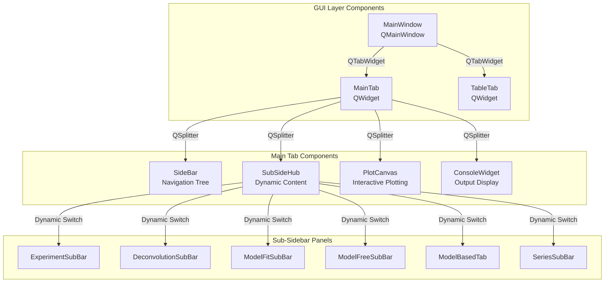

# GUI Architecture for Solid-State Kinetics Application

## Architectural Principles

### Foundational GUI Design Patterns (UI ARCHITECTURAL MANIFESTO)
- **Hierarchical Widget Composition**: Nested QWidget hierarchy with clear parent-child relationships
- **Signal-Slot Communication**: PyQt6 signals for decoupled, event-driven UI interactions
- **Responsive Layout Management**: Dynamic sizing with QSplitter and proportional component allocation
- **Context-Sensitive Interface**: Dynamic content switching based on user workflow stage
- **Interactive Visualization**: Matplotlib integration with draggable anchors and real-time updates

---

## Overall GUI System Architecture

The application implements a **tabbed modular interface** built on PyQt6, featuring **interactive scientific visualization** with **context-aware sidebars** for different analysis workflows.

### Main Application Structure

**MainWindow** (`src/gui/main_window.py:15-49`) - primary application container:
- `QTabWidget` central widget with "Main" and "Table" tabs
- BaseSignals integration for cross-module communication
- Signal routing between GUI components and core logic modules
- Window title: "Open ThermoKinetics"

**Tab-based Interface**:
- **Main Tab**: Primary analysis interface with interactive plotting
- **Table Tab**: Data viewing and manipulation interface

### GUI Communication Architecture



### Primary Signal Flow Patterns

**Navigation-Driven Workflow**:
1. User clicks sidebar tree item (`SideBar.on_item_clicked()`)
2. `sub_side_bar_needed` signal triggers content switching
3. `SubSideHub.update_content()` shows appropriate analysis panel
4. Panel emits operation signals to `MainTab.to_main_window()`
5. Signals routed through `MainWindow` to core logic modules

**Interactive Plotting Workflow**:
1. User drags anchors on `PlotCanvas`
2. `update_value` signal emitted with parameter changes
3. `MainTab.update_anchors_slot()` processes anchor updates
4. Values propagated to calculation modules via path_keys

---

## Main Tab Layout Architecture

### Responsive Layout System

**MainTab** (`src/gui/main_tab/main_tab.py:25-84`) implements **proportional 4-panel layout**:

**Layout Constants**:
```python
MIN_WIDTH_SIDEBAR = 220      # Navigation tree minimum
MIN_WIDTH_SUBSIDEBAR = 220   # Analysis panels minimum  
MIN_WIDTH_CONSOLE = 150      # Output console minimum
MIN_WIDTH_PLOTCANVAS = 500   # Interactive plot minimum
COMPONENTS_MIN_WIDTH = 1190  # Total minimum width
MIN_HEIGHT_MAINTAB = 700     # Minimum height
```

**QSplitter Configuration** (`src/gui/main_tab/main_tab.py:32-45`):
- **Horizontal orientation** with 4 resizable panels
- **Dynamic visibility**: Sub-sidebar and console can be hidden
- **Proportional sizing**: Ratios calculated from component minimums
- **Responsive updates**: `initialize_sizes()` recalculates on visibility changes

### Panel Visibility Management

**Dynamic Panel Switching** (`src/gui/main_tab/main_tab.py:101-115`):
- `toggle_sub_sidebar(content_type)` - Shows/hides analysis panels
- `toggle_console_visibility(visible)` - Controls output display
- **Special canvas connections**: Interactive anchors only enabled for deconvolution mode
- **Size recalculation**: Layout proportions update automatically

---

## Navigation System Architecture

### Hierarchical Tree Navigation

**SideBar** (`src/gui/main_tab/sidebar.py:24-94`) - **QTreeView-based navigation**:

**Tree Structure** (`src/gui/main_tab/sidebar.py:47-81`):
```
app tree
├── experiments
│   ├── add file data
│   ├── delete selected
│   └── [loaded files...]
├── series
│   ├── add new series
│   ├── import series
│   ├── delete series
│   └── [created series...]
├── calculation
│   ├── model fit
│   ├── model free
│   └── model based
└── settings
    └── console
        ├── show ☑
        └── hide ☐
```

**Navigation Signals** (`src/gui/main_tab/sidebar.py:31-37`):
- `sub_side_bar_needed` - Triggers panel switching based on tree selection
- `chosen_experiment_signal` - File selection for data loading
- `console_show_signal` - Console visibility control
- `active_file_selected` / `active_series_selected` - Context switching

### Context-Aware Interface Switching

**SubSideHub** (`src/gui/main_tab/sub_sidebar/sub_side_hub.py:32-55`) - **Dynamic content manager**:

**Panel Switching Logic**:
- **Deconvolution**: Peak analysis and reaction separation
- **Model Fit**: Kinetic parameter determination (direct-diff, Coats-Redfern)  
- **Model Free**: Isoconversional analysis (Friedman, KAS, Starink)
- **Model Based**: Multi-stage reaction scheme optimization
- **Experiments**: Data preprocessing (smoothing, background subtraction)
- **Series**: Multi-heating rate experiment management

**Widget Management**:
- All panels pre-instantiated but hidden
- `update_content()` dynamically shows/hides widgets
- Previous widget removed from layout before new one added
- **Memory efficient**: Widgets persist across switches

---

## Interactive Plotting Architecture

### Scientific Visualization System

**PlotCanvas** (`src/gui/main_tab/plot_canvas/plot_canvas.py:31-84`) - **Matplotlib-Qt integration**:

**Component Structure**:
- **Figure**: Matplotlib Figure instance with science plot styling
- **Canvas**: FigureCanvasQTAgg for Qt integration
- **Axes**: Single subplot for data visualization
- **Toolbar**: NavigationToolbar2QT for pan/zoom controls
- **Anchors**: Interactive draggable elements for parameter adjustment

**Styling Configuration**:
```python
plt.style.use(["science", "no-latex", "nature", "grid"])
```

### Interactive Anchor System

**Draggable Parameter Control** (`src/gui/main_tab/plot_canvas/anchor_group.py`):

**Anchor Groups**:
- **PositionAnchorGroup**: Controls peak center positions (z parameter)
- **HeightAnchorGroup**: Controls peak heights (h parameter)  
- **Real-time Updates**: Mouse drag events trigger immediate parameter updates

**Event Handling** (`src/gui/main_tab/plot_canvas/plot_canvas.py:73-84`):
```python
def toggle_event_connections(self, enable: bool):
    if enable:
        self.cid_press = self.canvas.mpl_connect("button_press_event", self.on_click)
        self.cid_release = self.canvas.mpl_connect("button_release_event", self.on_release)
        self.cid_motion = self.canvas.mpl_connect("motion_notify_event", self.on_motion)
```

**Signal Propagation**:
1. Mouse events captured on canvas
2. Anchor positions calculated and validated
3. `update_value` signal emitted with parameter changes
4. Changes propagated to calculation modules via `path_keys` system

---

## Analysis Panel Architecture

### Specialized Workflow Interfaces

**Experiment Processing Panel** - `ExperimentSubBar` (`src/gui/main_tab/sub_sidebar/experiment_sub_bar.py:159-178`):

**Component Blocks**:
- **SmoothingBlock**: Savitzky-Golay filtering configuration
  - Method selection (Savitzky-Golay, Other)
  - Window size and polynomial order inputs
  - Apply button for processing
- **BackgroundSubtractionBlock**: Baseline correction methods
  - 8 subtraction methods (Linear, Sigmoidal, Tangential, etc.)
  - Left/right range inputs for baseline definition
- **ActionButtonsBlock**: Workflow control buttons
  - "reset changes" - Restore original data
  - "to da/dT" - Calculate derivative
  - "deconvolution" - Switch to peak analysis mode

### Deconvolution Analysis Interface

**DeconvolutionSubBar** (`src/gui/main_tab/sub_sidebar/deconvolution_sub_bar.py:848-872`) - **Peak separation controls**:

**UI Components**:
- **ReactionTable**: Multi-file reaction management with function selection
- **CoeffsTable**: Real-time parameter editing with validation
- **FileTransferButtons**: Import/export reaction configurations
- **CalcButtons**: Start/stop optimization calculations

**Real-time Parameter Updates**:
- Direct coefficient editing triggers immediate plot updates
- Function type changes (gauss, ads, fraser) update parameter sets
- Import/export preserves complete reaction configurations

### Model-Based Analysis Interface

**ModelBasedTab** (`src/gui/main_tab/sub_sidebar/model_based/model_based.py:347-430`) - **Multi-stage reaction optimization**:

**Layout Configuration** (`src/gui/main_tab/sub_sidebar/model_based/model_based.py:71-79`):
```python
MODEL_BASED_TAB_LAYOUT = {
    "reactions_combo": {"min_width": 200, "min_height": 30},
    "reaction_type_combo": {"min_width": 100, "min_height": 30},
    "range_calc_widget": {"min_height": 45},
    "reaction_table": {"min_height": 90},
    "adjusting_settings_box": {"min_height": 180},
    "models_scene": {"min_width": 200, "min_height": 150},
    "calc_buttons": {"button_width": 80, "button_height": 30},
}
```

**Interactive Components**:
- **ReactionTable**: Kinetic parameter bounds (Ea: 1-2000 kJ/mol, log_A: -100 to 100)
- **AdjustingSettingsBox**: Real-time parameter sliders with step controls
- **ModelsScheme**: Visual reaction scheme editor (A→B→C→D/E topologies)
- **ModelCalcButtons**: Optimization start/stop with progress tracking

**Parameter Adjustment System** (`src/gui/main_tab/sub_sidebar/model_based/model_based.py:182-233`):
- **AdjustmentRowWidget**: Button-slider-button layout for fine control
- **Real-time Updates**: Slider changes trigger immediate scheme updates
- **Validation**: Parameter bounds enforced at UI level

### Series Analysis Interface

**SeriesSubBar** (`src/gui/main_tab/sub_sidebar/series_sub_bar.py:134-157`) - **Multi-heating rate experiments**:

**Workflow Components**:
- **Load Button**: Multi-file deconvolution results import
- **Results ComboBox**: Reaction selection for visualization
- **Method ComboBox**: Model-fit method selection
- **Results Table**: Tabular display of kinetic parameters (Ea, A)
- **Export Button**: Results output functionality

**File Loading Dialog** (`src/gui/main_tab/sub_sidebar/series_sub_bar.py:37-93`):
- **Dynamic File Inputs**: Add multiple files with heating rates
- **Heating Rate Validation**: Numerical input validation
- **Responsive Sizing**: Dialog height adjusts with file count

---

## Layout Management System

### Responsive Design Patterns

**Proportional Sizing** (`src/gui/main_tab/main_tab.py:84-96`):
```python
def initialize_sizes(self):
    total_width = self.width()
    sidebar_ratio = MIN_WIDTH_SIDEBAR / COMPONENTS_MIN_WIDTH
    subsidebar_ratio = MIN_WIDTH_SUBSIDEBAR / COMPONENTS_MIN_WIDTH
    console_ratio = MIN_WIDTH_CONSOLE / COMPONENTS_MIN_WIDTH
    
    sidebar_width = int(total_width * sidebar_ratio)
    console_width = int(total_width * console_ratio) if self.console_widget.isVisible() else 0
    sub_sidebar_width = int(total_width * subsidebar_ratio) if self.sub_sidebar.isVisible() else 0
    canvas_width = total_width - (sidebar_width + sub_sidebar_width + console_width)
    self.splitter.setSizes([sidebar_width, sub_sidebar_width, canvas_width, console_width])
```

**Dynamic Visibility Handling**:
- Hidden panels contribute 0 to width calculations
- Remaining space allocated proportionally to visible panels
- **Automatic Recalculation**: Triggered on panel show/hide events

### Minimum Size Constraints

**Component Minimums**:
- **Total Application**: 1290px width × 700px height minimum
- **Sidebar**: 220px width minimum for tree navigation
- **Sub-sidebar**: 220px width minimum for analysis controls
- **Plot Canvas**: 500px width minimum for visualization clarity
- **Console**: 150px width minimum for readable output

---

## State Management and User Interaction

### Active Context Tracking

**File/Series State Management** (`src/gui/main_tab/sidebar.py:94-126`):
- `active_file_item` - Currently selected experimental file
- `active_series_item` - Currently selected series analysis
- **Visual Indicators**: Bold font for active items
- **Context Propagation**: Active context included in all operation signals

**Path-Keys Integration**:
- File name automatically prepended to operation path_keys
- Series name included for multi-experiment operations
- **Consistent Addressing**: Uniform data access across all panels

### Signal-Based User Interactions

**Primary Interaction Patterns**:

**File Operations**:
- `LoadButton.file_selected` → `FileData.load_file`
- File selection updates sidebar tree and activates experiment panel
- **Data Validation**: Automatic format checking and error reporting

**Analysis Workflow**:
- Sidebar selection triggers panel switching via `sub_side_bar_needed`
- Panel operations emit to `MainTab.to_main_window_signal`
- **Coordinated Updates**: Plot, tables, and controls update synchronously

**Parameter Adjustment**:
- Anchor dragging emits `update_value` with parameter deltas
- Table editing triggers immediate validation and propagation
- **Real-time Feedback**: Visual updates provide immediate response

---

## Data Visualization Integration

### Scientific Plotting Configuration

**Matplotlib Integration**:
- **Science Plots Styling**: Professional publication-ready appearance
- **Interactive Navigation**: Pan, zoom, and reset controls via toolbar
- **Grid System**: Enhanced readability for data interpretation

**Multi-Dataset Support**:
- Experimental data plotting with multiple heating rates
- Fitted curves overlay for model validation
- **Color-Coded Series**: Automatic differentiation of data sets

### Real-Time Updates

**Plot Synchronization**:
- Parameter changes trigger immediate plot updates
- **Background Caching**: Efficient redraw using matplotlib blitting
- **Event Loop Integration**: Non-blocking updates via Qt signals

**Interactive Elements**:
- Draggable anchors for manual parameter adjustment
- **Constraint Validation**: Anchors respect physical and mathematical bounds
- **Visual Feedback**: Hover states and drag indicators

---

## Table Tab Architecture

### Data Viewing Interface

**TableTab** (`src/gui/table_tab/table_tab.py:8-28`) - **Simplified data viewer**:

**Component Structure**:
- **QSplitter Layout**: Horizontal split between sidebar and table
- **TableSideBar**: Navigation controls for data selection
- **TableWidget**: Pandas DataFrame display with Qt integration
- **Proportional Sizing**: 1:4 ratio sidebar to table

**Data Integration**:
- Direct pandas DataFrame display
- **Real-time Updates**: Table reflects current file data state
- **Selection Sync**: Coordinates with main tab file selection

---

## Key Architectural Advantages

### Modularity and Extensibility
1. **Component Isolation**: Each analysis method in separate panel
2. **Signal Decoupling**: Loose coupling between UI and logic components
3. **Dynamic Loading**: Panels instantiated but hidden for performance
4. **Consistent Interfaces**: Uniform signal patterns across all panels

### User Experience Optimization
1. **Context-Aware Interface**: UI adapts to current workflow stage
2. **Responsive Layout**: Proportional sizing maintains usability across screen sizes
3. **Interactive Visualization**: Direct manipulation of analysis parameters
4. **Real-time Feedback**: Immediate visual response to parameter changes

### Scientific Workflow Support
1. **Multi-Modal Analysis**: Seamless switching between analysis methods
2. **Data Persistence**: State maintained across panel switches
3. **Export/Import**: Complete workflow preservation and sharing
4. **Validation Integration**: Real-time parameter and data validation

### Performance Characteristics
1. **Lazy Panel Loading**: Widgets created once, reused efficiently
2. **Optimized Plotting**: Background caching and selective redraws
3. **Event-Driven Updates**: Minimal computational overhead
4. **Memory Management**: Efficient widget lifecycle management

The GUI architecture provides a comprehensive, interactive environment for solid-state kinetics analysis with professional-grade visualization, intuitive navigation, and seamless integration with the underlying computational modules.
