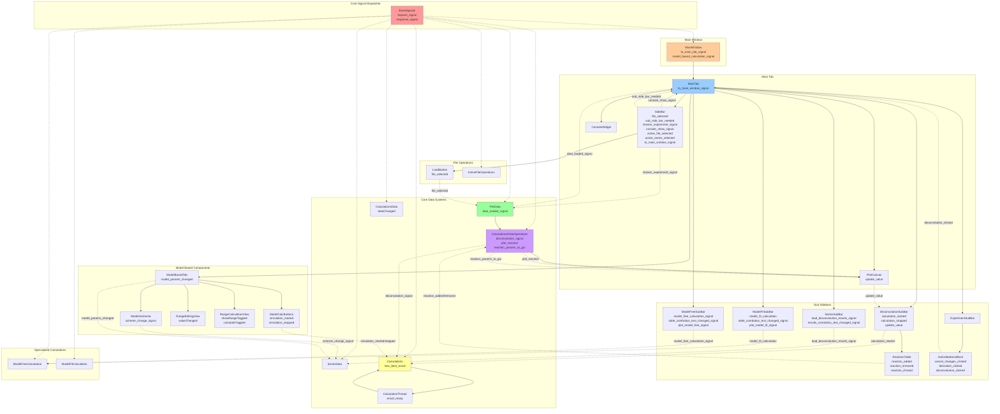

# GUI Refactoring Plan - Solid State Kinetics

## Executive Summary

This document outlines a comprehensive refactoring plan for the PyQt6 GUI code to improve maintainability, modularity, and adherence to domain-driven design principles. The refactoring will transform the current 22-file structure with several oversized components into a modular, entity-based architecture.

## Current State Analysis

### File Size Issues
Large files exceeding 350-line limit:
- `main_window.py`: 620 lines
- `plot_canvas.py`: 607 lines  
- `deconvolution_sub_bar.py`: 913 lines
- `model_based.py`: 1114 lines
- `models_scheme.py`: 711 lines

### Architectural Issues
1. **Action-based naming**: Files named by what they do (`deconvolution_sub_bar.py`) rather than what they represent
2. **Mixed responsibilities**: Single files containing multiple unrelated classes
3. **Magic values**: Hardcoded constants scattered throughout the code
4. **Relative imports**: Inconsistent import patterns
5. **String literals**: UI text embedded directly in code
6. **Complex inheritance**: Large widget hierarchies in single files

## Signal and Slot Architecture Mapping

This mermaid diagram maps all current signal/slot connections between GUI components and core systems:



### Signal Categories and Patterns

**1. Central Dispatcher Pattern**
- `BaseSignals` with `request_signal`/`response_signal` - centralized communication hub
- All core components inherit from `BaseSlots` for standardized messaging

**2. GUI Event Signals**
- File operations: `file_selected`, `data_loaded_signal`
- UI state: `console_show_signal`, `sub_side_bar_needed`, `active_file_selected`
- User actions: `calculation_started`, `simulation_started`, `deconvolution_clicked`

**3. Data Flow Signals**
- Visualization: `plot_reaction`, `plot_data_from_dataframe`, `add_anchors`
- Updates: `update_value`, `dataChanged`, `model_params_changed`
- Results: `reaction_params_to_gui`, `result_ready`, `new_best_result`

**4. Analysis Workflow Signals**
- Calculations: `deconvolution_signal`, `model_fit_calculation`, `model_free_calculation_signal`
- Series operations: `load_deconvolution_results_signal`, `scheme_change_signal`
- Model operations: `simulation_started`, `simulation_stopped`, `valueChanged`

**5. Table/UI Update Signals**
- Reactions: `reaction_added`, `reaction_removed`, `reaction_chosed`
- Dropdowns: `table_combobox_text_changed_signal`, `results_combobox_text_changed_signal`
- Plotting: `plot_model_fit_signal`, `plot_model_free_signal`

### Critical Signal Paths for Refactoring

1. **File Loading Chain**: LoadButton → FileData → PlotCanvas → GUI Updates
2. **Calculation Chain**: GUI → CalculationsDataOperations → Calculations → Results
3. **Model-Based Chain**: ModelsScheme → SeriesData → ModelCalcButtons → Calculations
4. **Visualization Chain**: Data Changes → PlotCanvas → Anchor Updates → GUI Feedback

## Module Organization Principles

### 1. Entity-Based Structure
Follow the existing `main_tab` pattern where each UI entity becomes a module:
- `main_tab` → 4 widgets (sidebar, sub_sidebar, plot_canvas, console) → 4 modules
- Large widgets (>350 lines) become modules with sub-entities
- Each module has: orchestrating file + config.py + child entities

### 2. Orchestrating File Pattern
Each module contains:
- **Orchestrating file**: Main class that coordinates child components (e.g., `main_tab.py`, `deconvolution_panel.py`)
- **config.py**: Module-specific configuration and constants
- **Child entities**: Focused components implementing specific UI functionality

### 3. Naming Conventions
- **Modules**: Noun-based names representing UI entities (`sidebar/`, `plot_canvas/`, `reaction_scheme/`)
- **Files**: Descriptive nouns without "-er" suffix (`navigation.py`, not `navigator.py`)
- **Classes**: CamelCase matching file purpose (`ReactionTable`, `SchemeEditor`)

### 4. Size Constraints
- **Target**: Files ≤ 350 lines
- **Rule**: When entity exceeds 350 lines → convert to module
- **Priority**: Logical entity separation over strict line limits

## New Module Structure

Following the established pattern from `main_tab` (4 widgets: sidebar, sub_sidebar, plot_canvas, console), the structure should reflect actual UI entities and their hierarchical relationships:

```
src/gui/
├── __main__.py                    # Entry point (unchanged)
├── main_window.py                # Main application window (< 350 lines)
├── console_widget.py             # Console widget (unchanged if < 350 lines)
├── main_tab/                     # Main tab module (follows existing pattern)
│   ├── main_tab.py              # Orchestrating file
│   ├── config.py                # Main tab configuration
│   ├── sidebar/                 # Navigation and file operations
│   │   ├── sidebar.py           # Orchestrating file
│   │   ├── config.py            # Sidebar configuration
│   │   ├── file_navigation.py   # File tree and selection
│   │   ├── series_navigation.py # Series selection and management
│   │   └── load_button.py       # File loading button (if separate entity)
│   ├── sub_sidebar/             # Analysis panels module
│   │   ├── sub_side_hub.py      # Orchestrating file
│   │   ├── config.py            # Sub-sidebar configuration
│   │   ├── experiment/          # Experiment analysis panel
│   │   │   ├── experiment_panel.py
│   │   │   ├── config.py
│   │   │   ├── action_buttons.py
│   │   │   └── data_transform.py
│   │   ├── deconvolution/       # Deconvolution analysis panel (>350 lines → module)
│   │   │   ├── deconvolution_panel.py  # Orchestrating file
│   │   │   ├── config.py               # Deconvolution constants
│   │   │   ├── reaction_table.py       # Reactions management table
│   │   │   ├── calculation_controls.py # Optimization controls
│   │   │   ├── coefficients_view.py    # Coefficients display
│   │   │   └── settings_dialog.py      # Calculation settings
│   │   ├── model_based/         # Model-based analysis module (>350 lines → module)
│   │   │   ├── model_based_panel.py    # Orchestrating file
│   │   │   ├── config.py               # Model-based constants
│   │   │   ├── reaction_scheme/        # Reaction scheme editor (>350 lines → module)
│   │   │   │   ├── scheme_editor.py    # Orchestrating file
│   │   │   │   ├── config.py           # Scheme editor constants
│   │   │   │   ├── scheme_canvas.py    # Graphics canvas
│   │   │   │   ├── component_node.py   # Reaction components
│   │   │   │   └── connection_arrow.py # Reaction connections
│   │   │   ├── parameter_table.py      # Kinetic parameters table
│   │   │   ├── adjustment_controls.py  # Parameter adjustment widgets
│   │   │   └── simulation_controls.py  # Calculation controls
│   │   ├── model_fit/           # Model-fit analysis panel
│   │   │   ├── model_fit_panel.py
│   │   │   ├── config.py
│   │   │   ├── method_selection.py
│   │   │   └── results_view.py
│   │   ├── model_free/          # Model-free analysis panel
│   │   │   ├── model_free_panel.py
│   │   │   ├── config.py
│   │   │   ├── method_selection.py
│   │   │   └── results_view.py
│   │   └── series/              # Series analysis panel
│   │       ├── series_panel.py
│   │       ├── config.py
│   │       ├── data_loading.py
│   │       └── results_view.py
│   ├── plot_canvas/             # Plotting module (>350 lines → module)
│   │   ├── plot_canvas.py       # Orchestrating file
│   │   ├── config.py            # Plot configuration
│   │   ├── anchor/              # Anchor management (if >350 lines → module)
│   │   │   ├── anchor_group.py  # Orchestrating file
│   │   │   ├── config.py        # Anchor constants
│   │   │   ├── anchor_point.py  # Individual anchor
│   │   │   └── anchor_line.py   # Anchor guidelines
│   │   ├── plot_interaction.py  # Mouse/keyboard interactions
│   │   └── plot_styling.py      # Plot appearance management
│   └── console/                 # Console integration (if needed as separate module)
│       ├── console_widget.py
│       └── config.py
├── table_tab/                   # Table tab module (follows existing pattern)
│   ├── table_tab.py            # Orchestrating file
│   ├── config.py               # Table tab configuration
│   ├── data_table/             # Main data table (if >350 lines → module)
│   │   ├── data_table.py       # Orchestrating file
│   │   ├── config.py           # Table configuration
│   │   ├── table_view.py       # Table display
│   │   ├── column_controls.py  # Column management
│   │   └── export_controls.py  # Data export
│   └── results_table/          # Results table (if >350 lines → module)
│       ├── results_table.py
│       ├── config.py
│       ├── results_view.py
│       └── formatting.py
├── dialogs/                     # Reusable dialogs
│   ├── config.py               # Dialog constants
│   ├── file_dialog.py          # File operations
│   ├── settings_dialog.py      # Application settings
│   └── calculation_dialog.py   # Calculation parameters
├── widgets/                     # Reusable UI components
│   ├── config.py               # Widget constants
│   ├── buttons.py              # Custom buttons
│   ├── inputs.py               # Input controls
│   ├── tables.py               # Table components
│   └── plots.py                # Plot components
└── resources/                   # UI resources and constants
    ├── config.py               # Global UI configuration
    ├── styles.py               # Styling constants
    ├── strings.py              # UI text constants
    └── icons.py                # Icon management
```

## Configuration Structure

### Module Configuration Pattern
Each module follows the pattern: `module_name/config.py` with dataclass constants:

```python
# src/gui/main_tab/config.py
from dataclasses import dataclass

@dataclass
class MainTabConfig:
    min_width_sidebar: int = 220
    min_width_sub_sidebar: int = 220
    min_width_console: int = 150
    min_width_plot_canvas: int = 500
    splitter_width: int = 100
    min_height: int = 700

# src/gui/main_tab/sub_sidebar/deconvolution/config.py
@dataclass
class DeconvolutionConfig:
    default_functions: list[str] = ("ads", "gauss", "fraser")
    optimization_methods: list[str] = ("differential_evolution", "minimize")
    max_iterations_default: int = 200
    population_size_default: int = 15
    table_column_widths: dict[str, int] = (
        {"function": 100, "h": 80, "z": 80, "w": 80}
    )

# src/gui/main_tab/plot_canvas/config.py
@dataclass
class PlotCanvasConfig:
    style: str = "science"
    figure_dpi: int = 100
    default_colors: list[str] = ("#1f77b4", "#ff7f0e", "#2ca02c", "#d62728")
    line_width: float = 1.5
    marker_size: float = 4.0
    min_width: int = 500
```

### Global UI Configuration
```python
# src/gui/resources/config.py
from dataclasses import dataclass

@dataclass
class GlobalUIConfig:
    app_title: str = "Open ThermoKinetics"
    min_window_width: int = 1200
    min_window_height: int = 800
    default_window_width: int = 1600
    default_window_height: int = 1000

@dataclass
class UIStrings:
    # Buttons
    calculate: str = "Calculate"
    plot: str = "Plot"
    settings: str = "Settings"
    load: str = "Load"
    save: str = "Save"
    export: str = "Export"
    import_: str = "Import"
    reset: str = "Reset"
    cancel: str = "Cancel"
    
    # Analysis panels
    deconvolution: str = "Deconvolution"
    model_fit: str = "Model Fit"
    model_free: str = "Model Free"
    model_based: str = "Model Based"
    
    # Error messages
    invalid_input: str = "Invalid input value"
    file_not_found: str = "File not found"
    calculation_error: str = "Calculation error occurred"
```

## Example Refactored Components

### Before: Monolithic deconvolution_sub_bar.py (790 lines)
```python
# Old structure - single large file
class DeconvolutionSubBar(QWidget):
    def __init__(self, parent=None):
        # ... 200+ lines of UI setup with magic numbers
        self.button.setFixedSize(80, 30)  # Magic values
        self.label.setText("Calculate")   # Hardcoded string
        # ... 300+ lines of table setup
        # ... 250+ lines of calculation controls
```

### After: Modular deconvolution/ structure
```python
# src/gui/main_tab/sub_sidebar/deconvolution/deconvolution_panel.py (~150 lines)
from .config import DeconvolutionConfig
from .reaction_table import ReactionTable
from .calculation_controls import CalculationControls
from .coefficients_view import CoefficientsView

class DeconvolutionPanel(QWidget):
    update_value = pyqtSignal(dict)
    
    def __init__(self, parent=None):
        super().__init__(parent)
        self.config = DeconvolutionConfig()
        self._setup_ui()
        self._connect_signals()
    
    def _setup_ui(self):
        self.layout = QVBoxLayout(self)
        
        # Child components with clear responsibilities
        self.reaction_table = ReactionTable(self)
        self.calculation_controls = CalculationControls(self)
        self.coefficients_view = CoefficientsView(self)
        
        self.layout.addWidget(self.reaction_table)
        self.layout.addWidget(self.calculation_controls)
        self.layout.addWidget(self.coefficients_view)
    
    def _connect_signals(self):
        # Signal routing between child components
        self.reaction_table.reaction_selected.connect(
            self.coefficients_view.display_coefficients
        )
        self.calculation_controls.calculation_started.connect(
            self.update_value.emit
        )

# src/gui/main_tab/sub_sidebar/deconvolution/config.py
from dataclasses import dataclass

@dataclass
class DeconvolutionConfig:
    default_functions: list[str] = ("ads", "gauss", "fraser")
    optimization_methods: list[str] = ("differential_evolution", "minimize")
    max_iterations_default: int = 200
    population_size_default: int = 15
    
    # Table configuration
    table_column_widths: dict[str, int] = None
    
    def __post_init__(self):
        if self.table_column_widths is None:
            self.table_column_widths = {
                "function": 100, "h": 80, "z": 80, "w": 80,
                "ads1": 80, "ads2": 80
            }
    
    # Button sizes
    button_width: int = 80
    button_height: int = 30
    
    # UI strings
    calculate_text: str = "Calculate"
    settings_text: str = "Settings"
    reset_text: str = "Reset"

# src/gui/main_tab/sub_sidebar/deconvolution/reaction_table.py (~200 lines)
from PyQt6.QtWidgets import QTableWidget, QVBoxLayout, QWidget
from PyQt6.QtCore import pyqtSignal

from .config import DeconvolutionConfig

class ReactionTable(QWidget):
    reaction_added = pyqtSignal(dict)
    reaction_removed = pyqtSignal(dict)
    reaction_selected = pyqtSignal(str)
    
    def __init__(self, parent=None):
        super().__init__(parent)
        self.config = DeconvolutionConfig()
        self._setup_table()
    
    def _setup_table(self):
        self.layout = QVBoxLayout(self)
        self.table = QTableWidget(self)
        
        # Configure table using config values
        self._setup_columns()
        self.layout.addWidget(self.table)
    
    def _setup_columns(self):
        columns = list(self.config.table_column_widths.keys())
        self.table.setColumnCount(len(columns))
        self.table.setHorizontalHeaderLabels(columns)
        
        for i, (col_name, width) in enumerate(self.config.table_column_widths.items()):
            self.table.setColumnWidth(i, width)
    
    # ... rest of focused table logic
```

### Model-Based Scheme Editor Refactoring
```python
# src/gui/main_tab/sub_sidebar/model_based/reaction_scheme/scheme_editor.py
from .config import SchemeConfig
from .scheme_canvas import SchemeCanvas
from .component_node import ComponentNode
from .connection_arrow import ConnectionArrow

class SchemeEditor(QWidget):
    scheme_change_signal = pyqtSignal(dict)
    
    def __init__(self, parent=None):
        super().__init__(parent)
        self.config = SchemeConfig()
        self._setup_ui()
    
    def _setup_ui(self):
        self.layout = QVBoxLayout(self)
        self.canvas = SchemeCanvas(self)
        self.layout.addWidget(self.canvas)
    
    # ... focused scheme editing logic

# src/gui/main_tab/sub_sidebar/model_based/reaction_scheme/config.py
@dataclass
class SchemeConfig:
    # Node styling
    node_width: float = 40.0
    node_height: float = 40.0
    node_spacing_x: float = 80.0
    node_spacing_y: float = 60.0
    
    # Arrow styling
    arrow_width: float = 2.0
    arrow_color: str = "#333333"
    
    # Available kinetic models
    available_models: list[str] = None
    
    def __post_init__(self):
        if self.available_models is None:
            self.available_models = [
                "F1/3", "F3/4", "F3/2", "F2", "F3", 
                "A2", "R3", "D1"
            ]
```

## Refactoring Steps

### Phase 1: Extract Configurations (Week 1)
1. **Create config.py files** for each existing module following the pattern:
   - `src/gui/main_tab/config.py`
   - `src/gui/main_tab/sidebar/config.py`
   - `src/gui/main_tab/plot_canvas/config.py`
   - `src/gui/main_tab/sub_sidebar/config.py`
   - `src/gui/resources/config.py` (global constants)

2. **Extract constants** from existing files:
   - Magic numbers from `main_tab.py` → `MainTabConfig`
   - UI strings → `UIStrings` in global config
   - Layout constants from each component

### Phase 2: Refactor Large Sub-Sidebar Components (Week 2-3)

1. **deconvolution_sub_bar.py (790 lines) → deconvolution/ module**:
   ```
   sub_sidebar/deconvolution/
   ├── deconvolution_panel.py      # Main orchestrating class (~150 lines)
   ├── config.py                   # Deconvolution constants
   ├── reaction_table.py           # Reactions management table (~200 lines)
   ├── calculation_controls.py     # Optimization controls (~150 lines)
   ├── coefficients_view.py        # Coefficients display (~150 lines)
   └── settings_dialog.py          # Calculation settings (~140 lines)
   ```

2. **model_based.py (913 lines) → model_based/ module**:
   ```
   sub_sidebar/model_based/
   ├── model_based_panel.py        # Main orchestrating class (~150 lines)
   ├── config.py                   # Model-based constants
   ├── parameter_table.py          # Kinetic parameters table (~250 lines)
   ├── adjustment_controls.py      # Parameter adjustment widgets (~200 lines)
   ├── simulation_controls.py      # Calculation controls (~150 lines)
   └── reaction_scheme/            # Scheme editor module (models_scheme.py 612 lines)
       ├── scheme_editor.py        # Main scheme editor (~200 lines)
       ├── config.py               # Scheme constants
       ├── scheme_canvas.py        # Graphics canvas (~150 lines)
       ├── component_node.py       # Reaction components (~130 lines)
       └── connection_arrow.py     # Reaction connections (~130 lines)
   ```

### Phase 3: Refactor Plot Canvas Module (Week 3)

**plot_canvas.py (505 lines) → plot_canvas/ module**:
```
main_tab/plot_canvas/
├── plot_canvas.py              # Main plotting orchestrator (~200 lines)
├── config.py                   # Plot configuration
├── anchor/                     # Anchor management (if needed)
│   ├── anchor_group.py         # Existing file (~150 lines)
│   └── config.py               # Anchor constants
├── plot_interaction.py         # Mouse/keyboard interactions (~150 lines)
└── plot_styling.py            # Plot appearance management (~150 lines)
```

### Phase 4: Create Reusable Modules (Week 4)

1. **Extract common widgets**:
   ```
   gui/widgets/
   ├── config.py                  # Widget constants
   ├── buttons.py                 # Custom buttons (from various files)
   ├── inputs.py                  # Input controls
   ├── tables.py                  # Table components
   └── plots.py                   # Plot components
   ```

2. **Create dialog modules**:
   ```
   gui/dialogs/
   ├── config.py                  # Dialog constants
   ├── file_dialog.py             # File operations
   ├── settings_dialog.py         # Application settings
   └── calculation_dialog.py      # Calculation parameters
   ```

### Phase 5: Update Imports and Integration (Week 5)
1. **Convert to absolute imports** in all modules
2. **Update signal connections** maintaining existing interfaces
3. **Integrate configuration dataclasses** in all components
4. **Test all module interactions** and fix any broken connections
5. **Update orchestrating files** to use new child modules

## Signal Architecture Preservation

### Maintaining Existing Signal Flow
The refactoring preserves all existing signal connections while improving internal organization:

```python
# Before: All signals in monolithic file
class DeconvolutionSubBar(QWidget):
    calculation_started = pyqtSignal(dict)
    calculation_stopped = pyqtSignal(dict)
    update_value = pyqtSignal(dict)

# After: Orchestrating panel routes signals from child components
class DeconvolutionPanel(QWidget):
    # Preserve same external interface
    calculation_started = pyqtSignal(dict)
    calculation_stopped = pyqtSignal(dict)  
    update_value = pyqtSignal(dict)
    
    def __init__(self, parent=None):
        super().__init__(parent)
        self._setup_ui()
        self._connect_internal_signals()
    
    def _connect_internal_signals(self):
        # Route child signals to external interface
        self.calculation_controls.started.connect(self.calculation_started.emit)
        self.calculation_controls.stopped.connect(self.calculation_stopped.emit)
        self.reaction_table.value_changed.connect(self.update_value.emit)
```

### Signal Connection Mapping
Key external signal connections remain unchanged:

1. **MainTab connections** (preserved):
   ```python
   # main_tab.py - No changes needed
   self.sub_sidebar.deconvolution_sub_bar.update_value.connect(self.to_main_window)
   ```

2. **Internal routing** (new):
   ```python
   # deconvolution_panel.py - Internal signal management
   self.reaction_table.reaction_selected.connect(self.coefficients_view.update_display)
   self.calculation_controls.parameters_changed.connect(self.reaction_table.update_row)
   ```

## Implementation Strategy

### Migration Approach
1. **Incremental refactoring**: One module at a time to avoid breaking changes
2. **Signal interface preservation**: Maintain all external signal signatures
3. **Backward compatibility**: Existing imports continue to work during transition
4. **Testing at each step**: Verify functionality after each module conversion

### File Movement Strategy
```powershell
# Example migration for deconvolution module
# Step 1: Create new module structure
New-Item -Path "src/gui/main_tab/sub_sidebar/deconvolution" -ItemType Directory
New-Item -Path "src/gui/main_tab/sub_sidebar/deconvolution/config.py" -ItemType File

# Step 2: Extract components from original file
# (Done through code refactoring tools)

# Step 3: Update imports gradually
# Old import continues to work via __init__.py re-export
# from src.gui.main_tab.sub_sidebar.deconvolution_sub_bar import DeconvolutionSubBar
# New import becomes available
# from src.gui.main_tab.sub_sidebar.deconvolution import DeconvolutionPanel as DeconvolutionSubBar

# Step 4: Remove original file after full migration
```

### Testing Strategy
```python
# Unit tests for each new module
# tests/gui/main_tab/sub_sidebar/test_deconvolution_panel.py
import pytest
from src.gui.main_tab.sub_sidebar.deconvolution import DeconvolutionPanel

class TestDeconvolutionPanel:
    def test_signal_routing(self):
        """Test that internal signals are properly routed to external interface"""
        panel = DeconvolutionPanel()
        
        # Test signal connections exist
        assert panel.calculation_started is not None
        assert panel.update_value is not None
        
        # Test child components exist
        assert hasattr(panel, 'reaction_table')
        assert hasattr(panel, 'calculation_controls')

    def test_config_integration(self):
        """Test that configuration is properly loaded"""
        panel = DeconvolutionPanel()
        
        assert panel.config.default_functions == ("ads", "gauss", "fraser")
        assert panel.config.max_iterations_default == 200
```

## Benefits of Refactoring

### 1. Maintainability
- **Focused files**: Each file has a single, clear responsibility under 350 lines
- **Modular structure**: Following the proven `main_tab` pattern across all UI components
- **Configuration centralization**: All constants in dedicated `config.py` files per module
- **Clear hierarchies**: Orchestrating files coordinate child components with explicit interfaces

### 2. Extensibility
- **Module-based growth**: New features can be added as new modules without affecting existing code
- **Component reusability**: Extracted widgets can be reused across different panels
- **Plugin architecture**: New analysis methods can be added by creating new sub-modules
- **Configuration flexibility**: Easy to modify UI behavior through dataclass configurations

### 3. Code Quality
- **Consistent organization**: All modules follow the same structural pattern
- **Reduced complexity**: Large files broken down into manageable, focused components
- **Better encapsulation**: Clear boundaries between UI entities and their responsibilities
- **Eliminated magic values**: All constants extracted to configuration dataclasses

### 4. Developer Experience
- **Predictable structure**: Developers can easily locate functionality using the established pattern
- **Easier debugging**: Smaller files make it easier to trace issues and understand code flow
- **Simplified testing**: Focused components are easier to unit test in isolation
- **Better IDE support**: Smaller files provide better code navigation and autocomplete

### 5. Signal Architecture Preservation
- **Zero breaking changes**: All existing signal connections continue to work unchanged
- **Internal optimization**: Better signal routing within modules without external interface changes
- **Easier signal tracing**: Clear signal flow from child components through orchestrating files
- **Maintainable connections**: Signal logic is centralized in orchestrating files

## Risk Mitigation

### Implementation Risks
- **Signal connection breaks**: Mitigated by preserving external interfaces and comprehensive testing
- **Import circular dependencies**: Prevented by clear module hierarchy and dependency analysis
- **Performance degradation**: Monitored through profiling during each refactoring phase
- **Regression introduction**: Addressed through incremental migration and extensive testing

### Project Risks
- **Extended development time**: Managed through phased approach with clear milestones
- **Team disruption**: Minimized by maintaining backward compatibility during transition
- **Merge conflicts**: Reduced by coordinating refactoring with active development work

## Success Metrics

### Quantitative Targets
- ✅ All files under 350 lines (currently: 5 files exceed limit)
- ✅ Zero magic values in UI code (extract ~50 hardcoded constants)
- ✅ 100% absolute imports (convert ~30 relative imports)
- ✅ Complete configuration externalization (create ~15 config.py files)
- ✅ Preserved signal architecture (maintain ~40 signal connections)

### Qualitative Improvements
- **Code readability**: Smaller, focused files with clear responsibilities
- **Development velocity**: Faster feature development through reusable components
- **Bug resolution**: Easier debugging through modular architecture
- **Knowledge transfer**: Self-documenting code structure for new team members

## Timeline and Deliverables

### Week 1: Configuration Extraction
**Deliverables**:
- Configuration dataclasses for all existing modules
- Global UI configuration in `resources/config.py`
- Constants extracted from 5 large files

**Validation**: All magic values removed, UI behavior unchanged

### Week 2-3: Large File Refactoring
**Deliverables**:
- `deconvolution/` module (790 lines → 5 files < 350 lines each)
- `model_based/` module (913 lines → 6 files < 350 lines each)
- `plot_canvas/` module (505 lines → 4 files < 350 lines each)

**Validation**: All functionality preserved, signals working correctly

### Week 4: Reusable Components
**Deliverables**:
- `widgets/` module with common UI components
- `dialogs/` module with reusable dialogs
- Extracted duplicate code into shared components

**Validation**: No code duplication, consistent UI behavior

### Week 5: Final Integration
**Deliverables**:
- All imports converted to absolute paths
- Complete module documentation
- Migration guide for future development
- Performance validation and optimization

**Validation**: Full application functionality, no performance regression

## Conclusion

This refactoring plan transforms the current PyQt6 GUI from a collection of large, monolithic files into a well-organized, modular architecture that follows the established `main_tab` pattern. The entity-based organization, configuration extraction, and careful preservation of the existing signal architecture ensure that the refactoring improves code maintainability without breaking functionality.

The phased approach minimizes development disruption while providing clear progress milestones. Upon completion, the GUI codebase will be significantly more maintainable, extensible, and developer-friendly, positioning the project for efficient future development and feature additions.

**Key Success Factors**:
1. Following the proven `main_tab` organizational pattern
2. Preserving all existing signal connections and interfaces
3. Incremental migration with comprehensive testing at each phase
4. Configuration-driven approach enabling easy customization
5. Clear module boundaries with focused responsibilities

The refactored architecture will serve as a solid foundation for the solid-state kinetics analysis application, enabling rapid development of new features while maintaining high code quality and system reliability.
