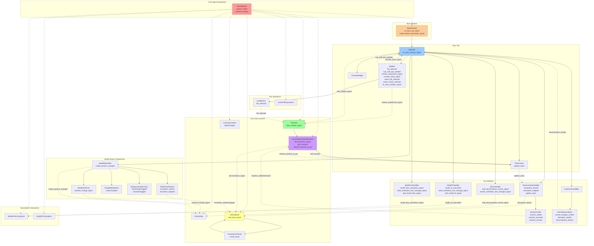

# GUI Refactoring Plan - Solid State Kinetics

## Executive Summary

This document outlines a comprehensive refactoring plan for the PyQt6 GUI code to improve maintainability, modularity, and adherence to domain-driven design principles. The refactoring will transform the current 22-file structure with several oversized components into a modular, entity-based architecture.

## Current State Analysis

### File Size Issues
Large files exceeding 350-line limit:
- `main_window.py`: 620 lines
- `plot_canvas.py`: 607 lines  
- `deconvolution_sub_bar.py`: 913 lines
- `model_based.py`: 1114 lines
- `models_scheme.py`: 711 lines

### Architectural Issues
1. **Action-based naming**: Files named by what they do (`deconvolution_sub_bar.py`) rather than what they represent
2. **Mixed responsibilities**: Single files containing multiple unrelated classes
3. **Magic values**: Hardcoded constants scattered throughout the code
4. **Relative imports**: Inconsistent import patterns
5. **String literals**: UI text embedded directly in code
6. **Complex inheritance**: Large widget hierarchies in single files

## Signal and Slot Architecture Mapping

This mermaid diagram maps all current signal/slot connections between GUI components and core systems:



### Signal Categories and Patterns

**1. Central Dispatcher Pattern**
- `BaseSignals` with `request_signal`/`response_signal` - centralized communication hub
- All core components inherit from `BaseSlots` for standardized messaging

**2. GUI Event Signals**
- File operations: `file_selected`, `data_loaded_signal`
- UI state: `console_show_signal`, `sub_side_bar_needed`, `active_file_selected`
- User actions: `calculation_started`, `simulation_started`, `deconvolution_clicked`

**3. Data Flow Signals**
- Visualization: `plot_reaction`, `plot_data_from_dataframe`, `add_anchors`
- Updates: `update_value`, `dataChanged`, `model_params_changed`
- Results: `reaction_params_to_gui`, `result_ready`, `new_best_result`

**4. Analysis Workflow Signals**
- Calculations: `deconvolution_signal`, `model_fit_calculation`, `model_free_calculation_signal`
- Series operations: `load_deconvolution_results_signal`, `scheme_change_signal`
- Model operations: `simulation_started`, `simulation_stopped`, `valueChanged`

**5. Table/UI Update Signals**
- Reactions: `reaction_added`, `reaction_removed`, `reaction_chosed`
- Dropdowns: `table_combobox_text_changed_signal`, `results_combobox_text_changed_signal`
- Plotting: `plot_model_fit_signal`, `plot_model_free_signal`

### Critical Signal Paths for Refactoring

1. **File Loading Chain**: LoadButton → FileData → PlotCanvas → GUI Updates
2. **Calculation Chain**: GUI → CalculationsDataOperations → Calculations → Results
3. **Model-Based Chain**: ModelsScheme → SeriesData → ModelCalcButtons → Calculations
4. **Visualization Chain**: Data Changes → PlotCanvas → Anchor Updates → GUI Feedback

## Module Organization Principles

### 1. Entity-Based Structure
Follow the existing `main_tab` pattern where each UI entity becomes a module:
- `main_tab` → 4 widgets (sidebar, sub_sidebar, plot_canvas, console) → 4 modules
- Large widgets (>350 lines) become modules with sub-entities
- Each module has: orchestrating file + config.py + child entities

### 2. Orchestrating File Pattern
Each module contains:
- **Orchestrating file**: Main class that coordinates child components (e.g., `main_tab.py`, `deconvolution_panel.py`)
- **config.py**: Module-specific configuration and constants
- **Child entities**: Focused components implementing specific UI functionality

### 3. Naming Conventions
- **Modules**: Noun-based names representing UI entities (`sidebar/`, `plot_canvas/`, `reaction_scheme/`)
- **Files**: Descriptive nouns without "-er" suffix (`navigation.py`, not `navigator.py`)
- **Classes**: CamelCase matching file purpose (`ReactionTable`, `SchemeEditor`)

### 4. Size Constraints
- **Target**: Files ≤ 350 lines
- **Rule**: When entity exceeds 350 lines → convert to module
- **Priority**: Logical entity separation over strict line limits

## New Module Structure

Following the established pattern from `main_tab` (4 widgets: sidebar, sub_sidebar, plot_canvas, console), the structure should reflect actual UI entities and their hierarchical relationships:

```
src/gui/
├── __main__.py                    # Entry point (unchanged)
├── main_window.py                # Main application window (< 350 lines)
├── console_widget.py             # Console widget (unchanged if < 350 lines)
├── main_tab/                     # Main tab module (follows existing pattern)
│   ├── main_tab.py              # Orchestrating file
│   ├── config.py                # Main tab configuration
│   ├── sidebar/                 # Navigation and file operations
│   │   ├── sidebar.py           # Orchestrating file
│   │   ├── config.py            # Sidebar configuration
│   │   ├── file_navigation.py   # File tree and selection
│   │   ├── series_navigation.py # Series selection and management
│   │   └── load_button.py       # File loading button (if separate entity)
│   ├── sub_sidebar/             # Analysis panels module
│   │   ├── sub_side_hub.py      # Orchestrating file
│   │   ├── config.py            # Sub-sidebar configuration
│   │   ├── experiment/          # Experiment analysis panel
│   │   │   ├── experiment_panel.py
│   │   │   ├── config.py
│   │   │   ├── action_buttons.py
│   │   │   └── data_transform.py
│   │   ├── deconvolution/       # Deconvolution analysis panel (>350 lines → module)
│   │   │   ├── deconvolution_panel.py  # Orchestrating file
│   │   │   ├── config.py               # Deconvolution constants
│   │   │   ├── reaction_table.py       # Reactions management table
│   │   │   ├── calculation_controls.py # Optimization controls
│   │   │   ├── coefficients_view.py    # Coefficients display
│   │   │   └── settings_dialog.py      # Calculation settings
│   │   ├── model_based/         # Model-based analysis module (>350 lines → module)
│   │   │   ├── model_based_panel.py    # Orchestrating file
│   │   │   ├── config.py               # Model-based constants
│   │   │   ├── reaction_scheme/        # Reaction scheme editor (>350 lines → module)
│   │   │   │   ├── scheme_editor.py    # Orchestrating file
│   │   │   │   ├── config.py           # Scheme editor constants
│   │   │   │   ├── scheme_canvas.py    # Graphics canvas
│   │   │   │   ├── component_node.py   # Reaction components
│   │   │   │   └── connection_arrow.py # Reaction connections
│   │   │   ├── parameter_table.py      # Kinetic parameters table
│   │   │   ├── adjustment_controls.py  # Parameter adjustment widgets
│   │   │   └── simulation_controls.py  # Calculation controls
│   │   ├── model_fit/           # Model-fit analysis panel
│   │   │   ├── model_fit_panel.py
│   │   │   ├── config.py
│   │   │   ├── method_selection.py
│   │   │   └── results_view.py
│   │   ├── model_free/          # Model-free analysis panel
│   │   │   ├── model_free_panel.py
│   │   │   ├── config.py
│   │   │   ├── method_selection.py
│   │   │   └── results_view.py
│   │   └── series/              # Series analysis panel
│   │       ├── series_panel.py
│   │       ├── config.py
│   │       ├── data_loading.py
│   │       └── results_view.py
│   ├── plot_canvas/             # Plotting module (>350 lines → module)
│   │   ├── plot_canvas.py       # Orchestrating file
│   │   ├── config.py            # Plot configuration
│   │   ├── anchor/              # Anchor management (if >350 lines → module)
│   │   │   ├── anchor_group.py  # Orchestrating file
│   │   │   ├── config.py        # Anchor constants
│   │   │   ├── anchor_point.py  # Individual anchor
│   │   │   └── anchor_line.py   # Anchor guidelines
│   │   ├── plot_interaction.py  # Mouse/keyboard interactions
│   │   └── plot_styling.py      # Plot appearance management
│   └── console/                 # Console integration (if needed as separate module)
│       ├── console_widget.py
│       └── config.py
├── table_tab/                   # Table tab module (follows existing pattern)
│   ├── table_tab.py            # Orchestrating file
│   ├── config.py               # Table tab configuration
│   ├── data_table/             # Main data table (if >350 lines → module)
│   │   ├── data_table.py       # Orchestrating file
│   │   ├── config.py           # Table configuration
│   │   ├── table_view.py       # Table display
│   │   ├── column_controls.py  # Column management
│   │   └── export_controls.py  # Data export
│   └── results_table/          # Results table (if >350 lines → module)
│       ├── results_table.py
│       ├── config.py
│       ├── results_view.py
│       └── formatting.py
├── dialogs/                     # Reusable dialogs
│   ├── config.py               # Dialog constants
│   ├── file_dialog.py          # File operations
│   ├── settings_dialog.py      # Application settings
│   └── calculation_dialog.py   # Calculation parameters
├── widgets/                     # Reusable UI components
│   ├── config.py               # Widget constants
│   ├── buttons.py              # Custom buttons
│   ├── inputs.py               # Input controls
│   ├── tables.py               # Table components
│   └── plots.py                # Plot components
└── resources/                   # UI resources and constants
    ├── config.py               # Global UI configuration
    ├── styles.py               # Styling constants
    ├── strings.py              # UI text constants
    └── icons.py                # Icon management
```

---

## PHASE 2 ACTIVE TASKS - Model-Based Module Refactoring 🔄

### 2.1 Model-Based Components (1114 lines → target: 4-5 components)

**File**: `src/gui/main_tab/sub_sidebar/model_based.py`

**Proposed Split**:
```
src/gui/main_tab/sub_sidebar/model_based/
├── __init__.py                    # Backward compatibility
├── model_based_panel.py           # Main orchestrator (~200 lines)
├── models_scheme.py               # Models scheme visual editor (~250 lines)
├── reaction_table.py              # Reaction parameters table (~250 lines)
├── calculation_controls.py        # Controls for model-based calculations (~200 lines)
├── calculation_settings_dialogs.py   # Series creation and management (~150 lines)
└── config.py                      # Configuration constants (~64 lines)
```

**Status**: 📋 **PENDING** (Next in Phase 2 after deconvolution completion)

### 2.2 Plot Canvas Components (607 lines → target: 3-4 components)

**File**: `src/gui/main_tab/plot_canvas.py`

**Proposed Split**:
```
src/gui/main_tab/plot_canvas/
├── __init__.py                    # Backward compatibility
├── plot_canvas.py                 # Main orchestrator (~200 lines)
├── plot_interaction.py            # Mouse interactions (~150 lines)
├── plot_styling.py                # Plot appearance (~150 lines)
├── anchor_management.py           # Anchor functionality (~100 lines)
└── config.py                      # Plot configuration (~7 lines)
```

**Status**: ⏳ **PLANNED** (Phase 2 final task)

---

## Phase 1: Extract Configurations (Week 1) - ✅ COMPLETED

**Deliverables**: Configuration dataclasses for all existing modules

**Validation**: All magic values removed, UI behavior unchanged

### Phase 2: Refactor Large Sub-Sidebar Components (Week 2-3)

### ✅ 2.1 Deconvolution Module - COMPLETED

**Original**: `deconvolution_sub_bar.py` (792 lines) → **Modular Structure**:
```
src/gui/main_tab/sub_sidebar/deconvolution/
├── __init__.py                    # Backward compatibility (11 lines)
├── deconvolution_panel.py         # Main orchestrator (170 lines)
├── config.py                      # Configuration dataclass (101 lines)
├── reaction_table.py              # Reaction management (306 lines)
├── coefficients_view.py           # Coefficients display (180 lines)  
├── file_transfer.py              # Import/export operations (125 lines)
├── calculation_controls.py       # Calculation controls (109 lines)
└── settings_dialog.py            # Settings dialog (382 lines)
```

**Validation**: ✅ All functionality preserved, signals working correctly, critical path_keys bug fixed

### ✅ 2.2 Model-Based Module - COMPLETED

**Original**: `model_based.py` (1114 lines) → **Modular Structure**:
```
src/gui/main_tab/sub_sidebar/model_based/
├── __init__.py                      # Backward compatibility (15 lines)
├── model_based_panel.py             # Main orchestrator (543 lines)
├── config.py                        # Configuration dataclass (64 lines)
├── models_scheme.py                 # Models scheme visual editor (251 lines)
├── reaction_table.py                # Reaction parameters table (249 lines)
├── calculation_controls.py          # Controls for calculations (200 lines)
└── calculation_settings_dialogs.py  # Series management dialogs (425 lines)
```

**Critical Fixes Applied**:
- ✅ **Division by zero protection** in simulation function (line 472)
- ✅ **Function access fix** for NUC_MODELS_TABLE (`differential_form` key)
- ✅ **Real-time simulation updates** when parameters change
- ✅ **Live testing verified** - all functionality working correctly

**Validation**: ✅ All functionality preserved, simulation working, critical bugs fixed

### ⏳ 2.3 Plot Canvas Module - PLANNED

**Future**: `plot_canvas.py` (607 lines) → plot_canvas/ module

---

### Phase 3: Refactor Plot Canvas Module (Week 3)

**plot_canvas.py (607 lines) → plot_canvas/ module**:
```
main_tab/plot_canvas/
├── plot_canvas.py              # Main plotting orchestrator (~200 lines)
├── config.py                   # Plot configuration
├── anchor/                     # Anchor management (if needed)
│   ├── anchor_group.py         # Existing file (~150 lines)
│   └── config.py               # Anchor constants
├── plot_interaction.py         # Mouse/keyboard interactions (~150 lines)
└── plot_styling.py            # Plot appearance management (~150 lines)
```

**Status**: ⏳ **PLANNED** (After model_based.py completion)

### Phase 4: Create Reusable Modules (Week 4)

**Extract common widgets**:
```
gui/widgets/
├── config.py                  # Widget constants
├── buttons.py                 # Custom buttons (from various files)
├── inputs.py                  # Input controls
├── tables.py                  # Table components
└── plots.py                   # Plot components
```

**Create dialog modules**:
```
gui/dialogs/
├── config.py                  # Dialog constants
├── file_dialog.py             # File operations
├── settings_dialog.py         # Application settings
└── calculation_dialog.py      # Calculation parameters
```

**Status**: ⏳ **PLANNED** (Extract duplicate UI components)

### Phase 5: Update Imports and Integration (Week 5)

**Final integration tasks**:
- Convert to absolute imports in all modules
- Update signal connections maintaining existing interfaces
- Integrate configuration dataclasses in all components
- Test all module interactions and fix any broken connections
- Update orchestrating files to use new child modules
- Performance validation and optimization

**Status**: ⏳ **PLANNED** (Final cleanup and testing)

### Phase 6: Main Window and Table Tab Refactoring (Week 6)

**main_window.py (620 lines) → main_window/ module**:
```
gui/main_window/
├── main_window.py             # Main orchestrator (~200 lines)
├── config.py                  # Window configuration
├── menu_bar.py               # Application menu (~150 lines)
├── toolbar.py                # Main toolbar (~100 lines)
└── status_bar.py             # Status information (~150 lines)
```

**table_tab.py refactoring** (if >350 lines):
```
gui/table_tab/
├── table_tab.py              # Main orchestrator
├── config.py                 # Table configuration
├── data_table.py            # Main data display
└── export_controls.py        # Data export functionality
```

**Status**: ⏳ **PLANNED** (Final large files)

---

## Implementation Timeline Summary

| Phase | Duration | Focus                    | Files              | Status        |
| ----- | -------- | ------------------------ | ------------------ | ------------- |
| 1     | Week 1   | Configuration extraction | 15 config files    | ✅ COMPLETED   |
| 2.1   | Week 2   | Deconvolution module     | 792→8 files        | ✅ COMPLETED   |
| 2.2   | Week 3   | Model-based module       | 1114→6 files       | 🔄 IN PROGRESS |
| 2.3   | Week 3   | Plot canvas module       | 607→4 files        | ⏳ PLANNED     |
| 3     | Week 4   | Reusable components      | widgets/, dialogs/ | ⏳ PLANNED     |
| 4     | Week 5   | Final integration        | Import cleanup     | ⏳ PLANNED     |
| 5     | Week 6   | Main window/table tab    | 620→4 files        | ⏳ PLANNED     |

---
