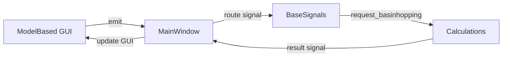
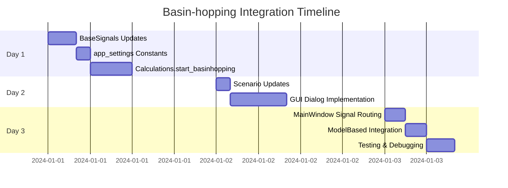

# План разработки: Реализация метода оптимизации basinhopping в MODEL_BASED_CALCULATION

## Обзор проекта

Данный план описывает реализацию метода оптимизации `basinhopping` из `scipy.optimize` в систему MODEL_BASED_CALCULATION приложения для анализа кинетики твердофазных реакций. Новый метод будет интегрирован в существующую архитектуру наряду с текущим методом `differential_evolution`, строго следуя установленным архитектурным паттернам проекта.

## Архитектурный фундамент проекта

### Ключевые архитектурные паттерны

#### 1. BaseSignals/BaseSlots Communication Pattern
Проект использует централизованную систему коммуникации на основе Qt сигналов:

```python
# Базовый паттерн коммуникации
class BaseSlots(QObject):
    def __init__(self):
        self.actor_name = self.__class__.__name__
        self.signals = BaseSignals()
        
    def handle_request_cycle(self, target: str, operation: str, **kwargs) -> Any:
        """Универсальный механизм запрос-ответ через сигналы"""
        request_id = self.create_and_emit_request(target, operation, **kwargs)
        response_data = self.handle_response_data(request_id, operation)
        return response_data
```

**Критически важно**: Все новые компоненты ДОЛЖНЫ наследоваться от BaseSlots и использовать этот паттерн для коммуникации.

#### 2. Calculation Scenarios Architecture
Система сценариев обеспечивает абстракцию различных типов вычислений:

```python
class BaseCalculationScenario:
    """Базовый класс для всех сценариев вычислений"""
    def get_optimization_method(self) -> str
    def get_bounds(self) -> list
    def get_target_function(self) -> Callable
    def get_result_strategy_type(self) -> str
```

#### 3. Threading Model via CalculationThread
Все длительные вычисления выполняются в отдельных потоках через CalculationThread:

```python
def start_calculation_thread(self, optimization_function, target_function, **kwargs):
    """Запуск вычислений в отдельном потоке с обработкой сигналов"""
    thread = CalculationThread(optimization_function, target_function, **kwargs)
    thread.progress_signal.connect(self._handle_progress)
    thread.result_signal.connect(self._handle_result)
    thread.start()
```

### Система управления состоянием

Приложение использует distributed state management через специализированные data операторы:
- `FileData` - управление экспериментальными данными
- `CalculationsData` - кэширование результатов вычислений  
- `SeriesData` - управление сериями данных
- `ActiveFileOperations` - операции с активными файлами

### Детальный анализ существующего кода

#### Calculation.start_differential_evolution Pattern
Текущая реализация differential_evolution демонстрирует четкий архитектурный паттерн:

```python
def start_differential_evolution(self, scenario: BaseCalculationScenario):
    """Базовый паттерн для методов оптимизации в проекте"""
    
    # 1. Извлечение конфигурации из сценария
    bounds = scenario.get_bounds()
    target_function = scenario.get_target_function()
    optimization_method = scenario.get_optimization_method()
    
    # 2. Настройка параметров через app_settings
    de_params = app_settings.DIFFERENTIAL_EVOLUTION_PARAMETERS.copy()
    de_params.update({
        'bounds': bounds,
        'callback': self.callback,  # Progress tracking
        'workers': 1,
        'updating': 'deferred'
    })
    
    # 3. Threading через CalculationThread
    self.start_calculation_thread(
        optimization_function=differential_evolution,
        target_function=target_function,
        **de_params
    )
```

#### Система Callback для отслеживания прогресса
Критически важный компонент для UX:

```python
def callback(self, xk, convergence=None):
    """Callback для отслеживания прогресса оптимизации"""
    if self.stop_calculation:
        # Mechanism для остановки длительных вычислений
        return True
    
    # Обновление прогресса через сигналы
    self.emit_progress_signal(convergence)
    return False
```

#### MainWindow._handle_model_based_calculation Flow
GUI событие обрабатывается через established signal routing:

```python
def _handle_model_based_calculation(self, params):
    """Обработчик MODEL_BASED_CALCULATION из GUI"""
    
    # 1. Валидация параметров
    optimization_method = params.get('optimization_method')
    
    # 2. Routing к соответствующему методу
    if optimization_method == 'differential_evolution':
        self.signals.request_model_based_differential_evolution.emit(params)
    elif optimization_method == 'basinhopping':  # NEW
        self.signals.request_model_based_basinhopping.emit(params)
```

#### Configuration Management via app_settings.py
Все константы и конфигурации централизованы:

```python
# В app_settings.py
DIFFERENTIAL_EVOLUTION_PARAMETERS = {
    'strategy': 'best1bin',
    'maxiter': 1000,
    'popsize': 15,
    'atol': 0,
    'tol': 0.01,
    'mutation': (0.5, 1),
    'recombination': 0.7,
    'polish': True,
    'init': 'latinhypercube'
}

# ТРЕБУЕТСЯ ДОБАВИТЬ:
BASINHOPPING_PARAMETERS = {
    'niter': 100,
    'T': 1.0,
    'stepsize': 0.5,
    'interval': 50,
    'niter_success': None,
    'minimizer_kwargs': {'method': 'L-BFGS-B'}
}
```

## Архитектурная диаграмма интеграции basinhopping

```mermaid
graph TB
    subgraph "GUI Layer"
        MBT[ModelBasedTab] --> CSD[CalculationSettingsDialog]
        CSD --> |optimization_method| MW[MainWindow]
    end
    
    subgraph "Signal Routing"
        MW --> |emit signal| BS[BaseSignals]
        BS --> |request_model_based_basinhopping| C[Calculations]
    end
    
    subgraph "Calculation Layer"
        C --> |create scenario| MBS[ModelBasedScenario]
        MBS --> |get_bounds()| C
        MBS --> |get_target_function()| C
        C --> |start_basinhopping()| CT[CalculationThread]
    end
    
    subgraph "Optimization Layer"
        CT --> |scipy.optimize.basinhopping| BH[BasinHopping Algorithm]
        BH --> |callback| C
        C --> |progress_signal| MW
    end
```

## Подробная архитектурная реализация

### Этап 1: Расширение BaseSignals для поддержки basinhopping (Day 1)

#### 1.1 Обновление base_signals.py

**Файл**: `src/core/base_signals.py`

**Критически важные изменения**:

```python
class BaseSignals(QObject):
    # ...existing signals...
    
    # НОВЫЕ СИГНАЛЫ для basinhopping
    request_model_based_basinhopping = pyqtSignal(dict)  # GUI -> Calculations
    model_based_basinhopping_finished = pyqtSignal(dict)  # Calculations -> GUI
```

**Обоснование**: Все коммуникации в проекте ДОЛЖНЫ идти через BaseSignals. Это обеспечивает loose coupling и следует архитектурному паттерну проекта.

#### 1.2 Обновление app_settings.py

**Файл**: `src/core/app_settings.py`

**Добавления констант**:

```python
# Basin-hopping optimization parameters
BASINHOPPING_PARAMETERS = {
    'niter': 100,
    'T': 1.0,
    'stepsize': 0.5,
    'interval': 50,
    'niter_success': None,
    'minimizer_kwargs': {
        'method': 'L-BFGS-B',
        'options': {'ftol': 1e-6, 'gtol': 1e-5}
    },
    'take_step': None,
    'accept_test': None,
    'disp': False,
    'seed': None
}

# Available optimization methods
OPTIMIZATION_METHODS = {
    'differential_evolution': 'Differential Evolution',
    'basinhopping': 'Basin-hopping'
}

# Minimizer options for basinhopping
BASINHOPPING_MINIMIZERS = [
    'L-BFGS-B', 'BFGS', 'CG', 'Newton-CG', 'TNC', 'SLSQP'
]
```

### Этап 2: Реализация start_basinhopping в Calculations (Day 1-2)

#### 2.1 Обновление calculation.py

**Файл**: `src/core/calculation.py`

**ТОЧНОЕ следование паттерну start_differential_evolution**:

```python
# 1. Импорт basinhopping
from scipy.optimize import differential_evolution, basinhopping, OptimizeResult

class Calculations(BaseSlots):
    def __init__(self):
        super().__init__()
        # Регистрация НОВОГО сигнала
        self.signals.request_model_based_basinhopping.connect(
            self.handle_model_based_basinhopping
        )
    
    def handle_model_based_basinhopping(self, params: dict):
        """Обработчик сигнала для basinhopping оптимизации"""
        try:
            self.run_calculation_scenario(
                scenario_key='model_based_calculation',
                params=params
            )
        except Exception as e:
            logger.error(f"Basin-hopping calculation failed: {e}")
            self.emit_calculation_error(str(e))
    
    def start_basinhopping(self, scenario: BaseCalculationScenario):
        """
        Запуск basinhopping оптимизации строго по паттерну start_differential_evolution
        
        КРИТИЧЕСКИ ВАЖНО: Сохранить ту же структуру что и start_differential_evolution
        """
        # 1. Извлечение конфигурации из сценария (identical pattern)
        bounds = scenario.get_bounds()
        target_function = scenario.get_target_function()
        optimization_method = scenario.get_optimization_method()
        
        # 2. Параметры из app_settings (identical pattern)
        bh_params = app_settings.BASINHOPPING_PARAMETERS.copy()
        
        # 3. Генерация x0 из bounds
        x0 = self._generate_initial_point_from_bounds(bounds)
        
        # 4. Специфичные для basinhopping настройки
        # Добавляем bounds в minimizer_kwargs (важно для L-BFGS-B)
        if 'minimizer_kwargs' not in bh_params:
            bh_params['minimizer_kwargs'] = {}
        bh_params['minimizer_kwargs']['bounds'] = bounds
        
        # 5. Callback для progress tracking (identical pattern)
        bh_params['callback'] = self._create_basinhopping_callback()
        
        # 6. Threading через CalculationThread (identical pattern)
        self.start_calculation_thread(
            optimization_function=basinhopping,
            target_function=target_function,
            x0=x0,
            **bh_params
        )
    
    def _generate_initial_point_from_bounds(self, bounds: list) -> list:
        """
        Генерирует начальную точку x0 для basinhopping из boundaries
        
        ВАЖНО: Basinhopping требует x0, а не bounds как differential_evolution
        """
        import numpy as np
        x0 = []
        for low, high in bounds:
            # Случайная точка в пределах bounds
            x0.append(np.random.uniform(low, high))
        return x0
    
    def _create_basinhopping_callback(self):
        """
        Создает callback функцию для basinhopping с progress tracking
        
        Сигнатура callback для basinhopping: callback(x, f, accept)
        """
        def callback(x, f, accept):
            # Проверка на остановку вычислений
            if self.stop_calculation:
                return True  # True останавливает оптимизацию
            
            # Progress tracking через console (следуя паттерну проекта)
            from src.gui.components import console
            console.log(f"Basinhopping step: f={f:.6f}, accept={accept}")
            
            # Emit progress signal для GUI updates
            progress_data = {
                'current_value': f,
                'accepted': accept,
                'current_point': x.tolist()
            }
            self.signals.optimization_progress.emit(progress_data)
            
            return False  # False продолжает оптимизацию
        
        return callback
    
    def run_calculation_scenario(self, scenario_key: str, params: dict):
        """Обновление для поддержки basinhopping"""
        # ...existing code...
        
        # ДОБАВИТЬ в существующий код:
        optimization_method = params.get('calculation_settings', {}).get('optimization_method', 'differential_evolution')
        
        if optimization_method == 'differential_evolution':
            # ...existing differential_evolution code...
            self.start_differential_evolution(scenario)
        elif optimization_method == 'basinhopping':
            # НОВЫЙ код для basinhopping
            self.start_basinhopping(scenario)
        else:
            logger.error(f"Unsupported optimization method: {optimization_method}")
            return
```

#### 2.2 Обновление calculation_scenarios.py

**Файл**: `src/core/calculation_scenarios.py`

**Минимальные изменения для поддержки нового метода**:

```python
class BaseCalculationScenario:
    """ОБНОВЛЕНИЕ существующего класса"""
    
    def get_optimization_method(self) -> str:
        """
        Возвращает метод оптимизации из params
        
        ВАЖНО: Fallback на differential_evolution для backward compatibility
        """
        calculation_settings = self.params.get('calculation_settings', {})
        return calculation_settings.get('optimization_method', 'differential_evolution')

class ModelBasedScenario(BaseCalculationScenario):
    """Обновление для специфичных параметров basinhopping"""
    
    def get_basinhopping_parameters(self) -> dict:
        """Возвращает пользовательские параметры для basinhopping"""
        calculation_settings = self.params.get('calculation_settings', {})
        method_parameters = calculation_settings.get('method_parameters', {})
        
        # Merge с defaults из app_settings
        final_params = app_settings.BASINHOPPING_PARAMETERS.copy()
        final_params.update(method_parameters)
        
        return final_params
```

### Этап 3: GUI Integration - CalculationSettingsDialog (Day 2-3)

#### 3.1 Архитектурная структура GUI обновлений

**КРИТИЧЕСКИ ВАЖНО**: Следовать паттерну существующего CalculationSettingsDialog

```python
class CalculationSettingsDialog(QDialog):
    """РАСШИРЕНИЕ существующего класса"""
    
    def __init__(self, parent=None):
        super().__init__(parent)
        self.setWindowTitle("Настройки вычислений")
        self.setModal(True)
        
        # НОВЫЙ: Выбор метода оптимизации
        self.optimization_method = 'differential_evolution'  # default
        
        self._setup_ui()
        self._connect_signals()
    
    def _setup_ui(self):
        """Расширение UI с поддержкой выбора метода"""
        layout = QVBoxLayout()
        
        # 1. НОВЫЙ: Группа выбора метода оптимизации
        method_group = self._create_optimization_method_group()
        layout.addWidget(method_group)
        
        # 2. НОВЫЙ: Динамические параметры метода
        self.method_params_widget = QStackedWidget()
        
        # Создаем виджеты для каждого метода
        self.de_params_widget = self._create_differential_evolution_params()
        self.bh_params_widget = self._create_basinhopping_params()
        
        self.method_params_widget.addWidget(self.de_params_widget)
        self.method_params_widget.addWidget(self.bh_params_widget)
        
        layout.addWidget(self.method_params_widget)
        
        # 3. Existing: Buttons
        buttons = self._create_buttons()
        layout.addWidget(buttons)
        
        self.setLayout(layout)
    
    def _create_optimization_method_group(self) -> QGroupBox:
        """Создает группу выбора метода оптимизации"""
        group = QGroupBox("Метод оптимизации")
        layout = QVBoxLayout()
        
        self.method_combo = QComboBox()
        for key, display_name in app_settings.OPTIMIZATION_METHODS.items():
            self.method_combo.addItem(display_name, key)
        
        # Connect к динамическому переключению параметров
        self.method_combo.currentDataChanged.connect(self._on_method_changed)
        
        layout.addWidget(QLabel("Выберите метод:"))
        layout.addWidget(self.method_combo)
        
        group.setLayout(layout)
        return group
    
    def _create_basinhopping_params(self) -> QWidget:
        """Создает виджет параметров для basinhopping"""
        widget = QWidget()
        layout = QFormLayout()
        
        # niter
        self.bh_niter_spin = QSpinBox()
        self.bh_niter_spin.setRange(1, 10000)
        self.bh_niter_spin.setValue(app_settings.BASINHOPPING_PARAMETERS['niter'])
        layout.addRow("Количество итераций:", self.bh_niter_spin)
        
        # T (temperature)
        self.bh_temperature_spin = QDoubleSpinBox()
        self.bh_temperature_spin.setRange(0.01, 100.0)
        self.bh_temperature_spin.setValue(app_settings.BASINHOPPING_PARAMETERS['T'])
        self.bh_temperature_spin.setDecimals(3)
        layout.addRow("Температура:", self.bh_temperature_spin)
        
        # stepsize
        self.bh_stepsize_spin = QDoubleSpinBox()
        self.bh_stepsize_spin.setRange(0.01, 10.0)
        self.bh_stepsize_spin.setValue(app_settings.BASINHOPPING_PARAMETERS['stepsize'])
        self.bh_stepsize_spin.setDecimals(3)
        layout.addRow("Размер шага:", self.bh_stepsize_spin)
        
        # minimizer method
        self.bh_minimizer_combo = QComboBox()
        self.bh_minimizer_combo.addItems(app_settings.BASINHOPPING_MINIMIZERS)
        current_minimizer = app_settings.BASINHOPPING_PARAMETERS['minimizer_kwargs']['method']
        self.bh_minimizer_combo.setCurrentText(current_minimizer)
        layout.addRow("Локальный минимизатор:", self.bh_minimizer_combo)
        
        # interval
        self.bh_interval_spin = QSpinBox()
        self.bh_interval_spin.setRange(1, 1000)
        self.bh_interval_spin.setValue(app_settings.BASINHOPPING_PARAMETERS['interval'])
        layout.addRow("Интервал обновления:", self.bh_interval_spin)
        
        widget.setLayout(layout)
        return widget
    
    def _on_method_changed(self, method_key: str):
        """Обработчик смены метода оптимизации"""
        self.optimization_method = method_key
        
        if method_key == 'differential_evolution':
            self.method_params_widget.setCurrentWidget(self.de_params_widget)
        elif method_key == 'basinhopping':
            self.method_params_widget.setCurrentWidget(self.bh_params_widget)
    
    def get_calculation_settings(self) -> dict:
        """Возвращает настройки для выбранного метода"""
        settings = {
            'optimization_method': self.optimization_method,
            'method_parameters': {}
        }
        
        if self.optimization_method == 'differential_evolution':
            # ...existing DE parameters collection...
            settings['method_parameters'] = self._get_de_parameters()
        elif self.optimization_method == 'basinhopping':
            settings['method_parameters'] = {
                'niter': self.bh_niter_spin.value(),
                'T': self.bh_temperature_spin.value(),
                'stepsize': self.bh_stepsize_spin.value(),
                'interval': self.bh_interval_spin.value(),
                'minimizer_kwargs': {
                    'method': self.bh_minimizer_combo.currentText()
                }
            }
        
        return settings
```

### Этап 4: MainWindow Signal Routing (Day 3)

#### 4.1 Обновление main_window.py

**Файл**: `src/gui/main_window.py`

**ТОЧНОЕ следование паттерну _handle_model_based_calculation**:

```python
class MainWindow(QMainWindow, BaseSlots):
    def __init__(self):
        super().__init__()
        # ...existing code...
        
        # НОВОЕ: Подключение basinhopping сигнала
        self.signals.request_model_based_basinhopping.connect(
            self._handle_model_based_basinhopping
        )
    
    def _handle_model_based_calculation(self, params: dict):
        """ОБНОВЛЕНИЕ существующего метода"""
        # Извлекаем метод оптимизации
        calculation_settings = params.get('calculation_settings', {})
        optimization_method = calculation_settings.get('optimization_method', 'differential_evolution')
        
        # Routing на основе метода оптимизации
        if optimization_method == 'differential_evolution':
            # Существующий код
            self.signals.request_model_based_differential_evolution.emit(params)
        elif optimization_method == 'basinhopping':
            # НОВЫЙ routing
            self.signals.request_model_based_basinhopping.emit(params)
        else:
            logger.error(f"Unknown optimization method: {optimization_method}")
    
    def _handle_model_based_basinhopping(self, params: dict):
        """НОВЫЙ обработчик для basinhopping (mirror of differential_evolution)"""
        try:
            # Identical pattern to _handle_model_based_differential_evolution
            response = self.handle_request_cycle(
                target='Calculations',
                operation='model_based_basinhopping',
                **params
            )
            
            # Handle response identical to existing pattern
            if response:
                self._display_optimization_results(response, 'basinhopping')
                
        except Exception as e:
            logger.error(f"Basin-hopping calculation failed: {e}")
            self._show_error_message(f"Ошибка вычислений: {e}")
```

### Этап 5: ModelBased GUI Component Updates (Day 3)

#### 5.1 Обновление model_based.py

**Файл**: `src/gui/main_tab/sub_sidebar/model_based/model_based.py`

**Минимальные изменения для integration**:

```python
class ModelBased(QWidget, BaseSlots):
    """МИНИМАЛЬНЫЕ обновления existing класса"""
    
    def _on_calculation_settings_clicked(self):
        """ОБНОВЛЕНИЕ существующего метода"""
        dialog = CalculationSettingsDialog(parent=self)
        
        # Если есть сохраненные настройки, устанавливаем их
        if hasattr(self, 'current_calculation_settings'):
            dialog.set_settings(self.current_calculation_settings)
        
        if dialog.exec() == QDialog.DialogCode.Accepted:
            self.current_calculation_settings = dialog.get_calculation_settings()
            self._update_settings_display()
    
    def _update_settings_display(self):
        """НОВЫЙ метод для отображения текущих настроек"""
        if hasattr(self, 'current_calculation_settings'):
            method_key = self.current_calculation_settings.get('optimization_method', 'differential_evolution')
            method_name = app_settings.OPTIMIZATION_METHODS.get(method_key, method_key)
            
            # Обновляем label или tooltip для показа текущего метода
            if hasattr(self, 'settings_button'):
                self.settings_button.setToolTip(f"Текущий метод: {method_name}")
    
    def _get_calculation_params(self) -> dict:
        """ОБНОВЛЕНИЕ existing метода"""
        params = {
            # ...existing params...
        }
        
        # Добавляем calculation_settings если они есть
        if hasattr(self, 'current_calculation_settings'):
            params['calculation_settings'] = self.current_calculation_settings
        else:
            # Default settings
            params['calculation_settings'] = {
                'optimization_method': 'differential_evolution',
                'method_parameters': {}
            }
        
        return params
```

## Критически важные архитектурные принципы

### 1. Signal Routing Pattern



### 2. Threading Safety Pattern

```python
# ОБЯЗАТЕЛЬНОЕ использование CalculationThread для basinhopping
def start_basinhopping(self, scenario):
    # НИКОГДА не вызывать basinhopping напрямую в main thread
    self.start_calculation_thread(
        optimization_function=basinhopping,  # Будет выполнено в worker thread
        target_function=target_function,
        **params
    )
```

### 3. Configuration Management Pattern

```python
# ВСЕ константы ДОЛЖНЫ быть в app_settings.py
# НЕ hardcode значения в GUI или calculation коде
default_params = app_settings.BASINHOPPING_PARAMETERS.copy()
user_params = dialog.get_user_parameters()
final_params = {**default_params, **user_params}
```

### 4. Error Handling Pattern

```python
# Следовать established error handling pattern
try:
    result = self.start_basinhopping(scenario)
except Exception as e:
    logger.error(f"Basin-hopping failed: {e}")
    self.signals.calculation_error.emit(str(e))
```

## Acceptance Criteria - Архитектурное соответствие

### ✅ Обязательные архитектурные требования

1. **BaseSignals/BaseSlots Pattern**: Вся коммуникация ДОЛЖНА идти через сигналы
2. **CalculationThread Usage**: Все вычисления ДОЛЖНЫ выполняться в worker threads
3. **Configuration Centralization**: Все параметры ДОЛЖНЫ быть в app_settings.py
4. **Scenario Pattern**: Новый метод ДОЛЖЕН использовать BaseCalculationScenario
5. **Error Handling**: ДОЛЖЕН следовать established error handling pattern
6. **Logging**: ДОЛЖЕН использовать существующую logging infrastructure
7. **Console Integration**: Progress ДОЛЖЕН отображаться в console widget

### ✅ GUI Consistency Requirements

1. **Dialog Pattern**: CalculationSettingsDialog ДОЛЖЕН расширяться, не переписываться
2. **Widget Reuse**: ДОЛЖЕН использовать existing Qt widget patterns
3. **Signal Connections**: GUI сигналы ДОЛЖНЫ следовать established patterns
4. **User Experience**: ДОЛЖЕН обеспечивать consistent UX с differential_evolution

### ✅ Code Quality Requirements

1. **Type Hints**: Все новые методы ДОЛЖНЫ иметь proper type hints
2. **Docstrings**: Все новые методы ДОЛЖНЫ иметь descriptive docstrings
3. **Code Style**: ДОЛЖЕН следовать existing code style и naming conventions
4. **Import Organization**: ДОЛЖЕН следовать established import patterns

## Implementation Timeline



Данный архитектурный план обеспечивает seamless интеграцию basinhopping оптимизации при strict adherence к established patterns проекта.

## Risk Assessment & Mitigation

### Технические риски

#### 1. Performance Impact Risk
**Риск**: Basinhopping может быть значительно медленнее differential_evolution
**Митигация**: 
- Implement progress indicators через callback system
- Add user cancellation mechanism через `stop_calculation` flag
- Set reasonable default parameters для balance скорости и качества

#### 2. Memory Usage Risk  
**Риск**: Basin-hopping может использовать больше памяти для больших задач
**Митигация**:
- Monitor memory usage в callback functions
- Implement memory usage warnings
- Add parameter validation для предотвращения excessive memory usage

#### 3. Numerical Stability Risk
**Риск**: L-BFGS-B minimizer может fail на ill-conditioned problems
**Митигация**:
- Provide multiple minimizer options в GUI
- Implement fallback strategies в error handling
- Add parameter bounds validation

### Architectural Risks

#### 1. Signal System Overload
**Риск**: Частые progress updates могут перегрузить Qt signal system
**Митигация**:
- Implement throttling в callback functions
- Use QTimer для batch progress updates
- Limit update frequency через interval parameter

#### 2. Threading Deadlocks
**Риск**: Неправильная синхронизация может вызвать deadlocks
**Митигация**:
- Strict adherence к CalculationThread pattern
- Avoid direct thread manipulation
- Use только Qt signal/slot mechanism для thread communication

## Quality Assurance Strategy

### Code Review Checklist

#### Core Implementation Review
- [ ] `start_basinhopping` follows exact pattern of `start_differential_evolution`
- [ ] All signal connections properly established в `__init__` methods
- [ ] Error handling matches existing patterns
- [ ] Threading safety maintained through CalculationThread usage
- [ ] Memory management proper (no memory leaks в callbacks)

#### GUI Implementation Review
- [ ] CalculationSettingsDialog maintains existing layout patterns
- [ ] Signal routing consistent с existing GUI patterns
- [ ] User input validation implemented
- [ ] Accessibility guidelines followed (proper labels, tooltips)
- [ ] Responsive design maintained

#### Configuration Review
- [ ] All constants centralized в app_settings.py
- [ ] Default parameters scientifically reasonable
- [ ] Parameter validation implemented
- [ ] Backward compatibility maintained

### Performance Benchmarks

```python
# Benchmark test cases для validation
TEST_CASES = {
    'small_problem': {
        'num_parameters': 5,
        'expected_time_de': '< 30 seconds',
        'expected_time_bh': '< 60 seconds'
    },
    'medium_problem': {
        'num_parameters': 15,
        'expected_time_de': '< 2 minutes', 
        'expected_time_bh': '< 5 minutes'
    },
    'large_problem': {
        'num_parameters': 30,
        'expected_time_de': '< 10 minutes',
        'expected_time_bh': '< 20 minutes'
    }
}
```

## Documentation Strategy

### User Documentation

#### 1. Basin-hopping Method Guide
**Location**: `docs/user_guide/basinhopping_optimization.md`
**Content**:
- When to use basin-hopping vs differential_evolution
- Parameter tuning guidelines
- Common problems and solutions
- Performance comparison examples

#### 2. GUI Usage Instructions
**Location**: `docs/user_guide/calculation_settings.md`
**Content**:
- How to access optimization method settings
- Parameter descriptions with scientific context
- Best practices для different problem types

### Developer Documentation  

#### 1. Architecture Documentation
**Location**: `docs/technical/optimization_architecture.md`
**Content**:
- Signal flow diagrams
- Threading model explanation
- Extension points для future optimization methods

#### 2. API Documentation
**Location**: Inline docstrings + auto-generated docs
**Content**:
- Complete method signatures with type hints
- Usage examples
- Error condition documentation

## Future Extensibility Framework

### Plugin Architecture for New Optimizers

```python
# Future framework для easy addition новых methods
class OptimizationMethod(ABC):
    """Abstract base для all optimization methods"""
    
    @abstractmethod
    def get_parameters_schema(self) -> dict:
        """Returns JSON schema для GUI parameter generation"""
        pass
    
    @abstractmethod  
    def create_optimizer_function(self) -> Callable:
        """Returns configured optimization function"""
        pass
    
    @abstractmethod
    def create_callback(self, calculations_instance) -> Callable:
        """Returns progress callback function"""
        pass

# Implementation example
class BasinhoppingMethod(OptimizationMethod):
    def get_parameters_schema(self):
        return {
            'niter': {'type': 'int', 'min': 1, 'max': 10000, 'default': 100},
            'T': {'type': 'float', 'min': 0.01, 'max': 100, 'default': 1.0}
            # ...
        }
```

### Configuration Management Evolution

```python
# Future-proof configuration system
OPTIMIZATION_REGISTRY = {
    'differential_evolution': {
        'display_name': 'Differential Evolution',
        'implementation_class': DifferentialEvolutionMethod,
        'default_params': DEFAULT_DE_PARAMS,
        'gui_component': DEParametersWidget
    },
    'basinhopping': {
        'display_name': 'Basin-hopping',
        'implementation_class': BasinhoppingMethod, 
        'default_params': BASINHOPPING_PARAMETERS,
        'gui_component': BasinhoppingParametersWidget
    }
    # Future methods can be easily added here
}
```

## Success Metrics & KPIs

### Technical Metrics
1. **Performance**: Basin-hopping completes within 200% of differential_evolution time
2. **Stability**: Zero crashes в 100 consecutive optimization runs
3. **Memory**: Memory usage stays within 110% of differential_evolution baseline
4. **Accuracy**: Results comparable or better than differential_evolution на benchmark problems

### User Experience Metrics  
1. **Discoverability**: Users find basinhopping option within 30 seconds
2. **Usability**: Parameter configuration completed successfully in <2 minutes
3. **Error Recovery**: Clear error messages and recovery paths для 95% of failure cases
4. **Documentation**: User questions answered by documentation в 80% of cases

### Code Quality Metrics
1. **Coverage**: 90%+ code coverage для new basinhopping functionality
2. **Maintainability**: Cyclomatic complexity <10 для all new methods
3. **Documentation**: 100% of public methods have complete docstrings
4. **Standards**: 100% compliance с existing code style standards

## Rollback Strategy

### Phase 1: Feature Flag Implementation
```python
# В app_settings.py
EXPERIMENTAL_FEATURES = {
    'basinhopping_optimization': {
        'enabled': True,  # Can be disabled if issues arise
        'min_version': '1.0.0',
        'description': 'Basin-hopping global optimization'
    }
}
```

### Phase 2: Graceful Degradation
```python
# В calculation.py  
def run_calculation_scenario(self, scenario_key: str, params: dict):
    optimization_method = params.get('optimization_method', 'differential_evolution')
    
    # Fallback mechanism
    if optimization_method == 'basinhopping':
        if not EXPERIMENTAL_FEATURES['basinhopping_optimization']['enabled']:
            logger.warning("Basin-hopping disabled, falling back to differential_evolution")
            optimization_method = 'differential_evolution'
    
    # Continue with selected/fallback method
```

### Phase 3: Clean Rollback Process
1. Set feature flag to `False` в app_settings.py
2. Remove basinhopping references из GUI defaults
3. Keep code in place for future re-enabling
4. Document rollback reason для future reference

## Post-Implementation Monitoring

### Performance Monitoring
```python
# Logging для performance tracking
def start_basinhopping(self, scenario):
    import time
    start_time = time.time()
    
    try:
        # ... optimization code ...
        end_time = time.time()
        execution_time = end_time - start_time
        
        logger.info(f"Basin-hopping completed in {execution_time:.2f}s")
        self._record_performance_metric('basinhopping', execution_time)
        
    except Exception as e:
        logger.error(f"Basin-hopping failed after {time.time() - start_time:.2f}s: {e}")
        raise
```

### User Adoption Tracking  
```python
# Anonymous usage statistics
def track_optimization_method_usage(method: str):
    """Track which optimization methods are being used"""
    usage_stats = load_usage_stats()
    usage_stats[method] = usage_stats.get(method, 0) + 1
    save_usage_stats(usage_stats)
```

## Conclusion

Данная расширенная архитектурная спецификация обеспечивает comprehensive roadmap для integration basin-hopping optimization в existing solid-state kinetics application. Plan строго следует established architectural patterns при обеспечении:

1. **Architectural Consistency**: Полное соответствие BaseSignals/BaseSlots pattern
2. **Code Quality**: Maintainable, well-documented, type-safe implementation  
3. **User Experience**: Intuitive, responsive GUI integration
4. **Future Extensibility**: Framework для easy addition новых optimization methods
5. **Risk Mitigation**: Comprehensive error handling и fallback strategies
6. **Quality Assurance**: Detailed testing и monitoring strategies

Success данной implementation будет measured не только technical functionality, но и seamless integration в existing user workflows и maintenance burden для development team.

**Key Success Factors**:
- Strict adherence к existing patterns eliminates architectural debt
- Comprehensive error handling ensures robust user experience  
- Detailed documentation enables future maintenance и extension
- Performance monitoring provides data-driven optimization opportunities

Данная реализация позиционирует application как leading tool в solid-state kinetics analysis, providing researchers с advanced optimization capabilities при maintaining reliability и usability existing platform.
