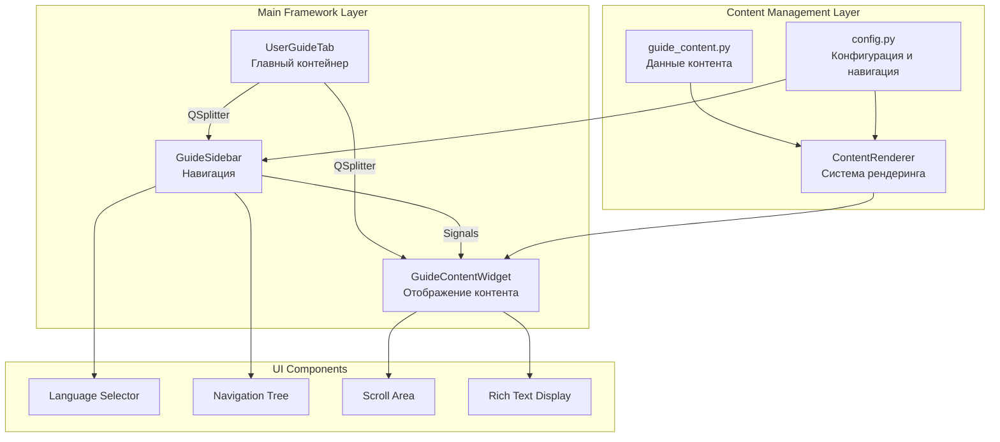

# User Guide Framework - Руководство по использованию

## Архитектурные принципы фреймворка

### Основополагающие принципы (FRAMEWORK МАНИФЕСТ)
- **Модульная композиция**: Компоненты создаются как независимые PyQt виджеты с четкой ответственностью
- **Конфигурационное управление**: Весь контент и стили управляются через JSON и dataclass конфигурации
- **Сигнально-слотовая коммуникация**: Слабая связанность через Qt сигналы для межкомпонентного взаимодействия
- **Многоязычная поддержка**: Встроенная локализация с динамическим переключением языков
- **Расширяемая архитектура**: Новые типы контента добавляются через систему рендереров

---

## Общая архитектура фреймворка

Фреймворк построен на **модульной компонентной архитектуре** с PyQt6, реализующей паттерны **Observer** и **Strategy** для управления контентом и рендерингом.

### Архитектура компонентов фреймворка



### Паттерны коммуникации

**Observer Pattern**:
1. `GuideSidebar` излучает сигнал `section_selected(str)` при выборе раздела
2. `GuideContentWidget` подписывается на сигнал и обновляет контент
3. Смена языка через `language_changed(Language)` обновляет все компоненты

**Strategy Pattern**:
1. `ContentRenderer` использует стратегии рендеринга для разных типов контента
2. Каждый тип контента (`paragraph`, `heading`, `list`, etc.) имеет свой метод рендеринга
3. Добавление новых типов через расширение `_render_*` методов

---

## Компоненты фреймворка

### 1. UserGuideTab - Главный контейнер

**Расположение**: `src/gui/user_guide_tab/user_guide_tab.py`

**Ответственность**:
- Создание основной компоновки с `QSplitter`
- Инициализация и связывание дочерних компонентов
- Управление размерами и пропорциями интерфейса

**Основные методы**:
```python
class UserGuideTab(QWidget):
    def __init__(self, parent=None):
        # Инициализация с конфигурацией
        
    def setup_ui(self):
        # Создание splitter layout с sidebar и content
        
    def setup_connections(self):
        # Связывание сигналов между компонентами
        
    def initialize_sizes(self):
        # Установка пропорциональных размеров
```

**Конфигурация размеров**:
```python
# Минимальные размеры из config.py
MIN_WIDTH_SIDEBAR = 250    # Боковая панель навигации
MIN_WIDTH_CONTENT = 600    # Область контента
MIN_HEIGHT_GUIDE = 600     # Общая высота фреймворка
```

### 2. GuideSidebar - Система навигации

**Расположение**: `src/gui/user_guide_tab/guide_sidebar.py`

**Ответственность**:
- Отображение иерархической структуры разделов
- Управление переключением языков
- Поиск по контенту (опционально)

**Ключевые компоненты**:
```python
class GuideSidebar(QWidget):
    # Сигналы
    section_selected = pyqtSignal(str)
    language_changed = pyqtSignal(Language)
    
    def __init__(self, parent=None):
        # Создание language combo и navigation tree
        
    def set_language(self, language: Language):
        # Обновление языка навигации
        
    def build_navigation_tree(self):
        # Построение дерева из GUIDE_SECTIONS
```

**Структура навигации**:
- **QComboBox** для выбора языка (RU/EN)
- **QTreeWidget** для иерархической навигации
- Автоматическое построение дерева из `GUIDE_SECTIONS` конфигурации

### 3. GuideContentWidget - Отображение контента

**Расположение**: `src/gui/user_guide_tab/guide_content_widget.py`

**Ответственность**:
- Рендеринг структурированного контента
- Управление прокруткой и отображением
- Обработка внутренних ссылок

**Система рендеринга**:
```python
class GuideContentWidget(QWidget):
    def display_section(self, section_id: str):
        # Загрузка и рендеринг контента раздела
        
    def set_language(self, language: Language):
        # Переключение языка контента
        
    def _render_content_block(self, block: dict) -> QWidget:
        # Рендеринг отдельного блока контента
```

**Поддерживаемые типы контента**:
```python
# Система рендеринга поддерживает:
{
    "paragraph": self._render_paragraph,
    "heading": self._render_heading,
    "list": self._render_list,
    "code": self._render_code,
    "note": self._render_note,
    "image": self._render_image
}
```

---

## Система конфигурации

### 1. config.py - Центральная конфигурация

**Языки и структура навигации**:
```python
class Language(Enum):
    ENGLISH = "en"
    RUSSIAN = "ru"

GUIDE_SECTIONS = {
    "ru": {
        "Введение": "introduction",
        "Начало работы": {
            "Загрузка файлов": "file_loading",
            "Предобработка данных": "data_preprocessing"
        },
        "Методы анализа": {
            "Деконволюция пиков": "deconvolution",
            "Model-Fit анализ": "model_fit",
            "Model-Free анализ": "model_free",
            "Model-Based анализ": "model_based",
        }
    }
}
```

**Стилевая конфигурация**:
```python
@dataclass
class GuideConfig:
    # Шрифты
    HEADING_FONT_SIZE = 16
    SUBHEADING_FONT_SIZE = 14
    BODY_FONT_SIZE = 11
    CODE_FONT_SIZE = 10
    
    # Цвета
    HEADING_COLOR = "#2c3e50"
    CODE_BACKGROUND = "#f8f9fa"
    CODE_BORDER = "#e9ecef"
    LINK_COLOR = "#3498db"
    
    # Отступы
    SECTION_SPACING = 20
    PARAGRAPH_SPACING = 10
    LIST_INDENT = 20
```

### 2. guide_content.py - Структурированный контент

**Организация данных**:
```python
GUIDE_CONTENT = {
    "ru": {
        "section_id": {
            "title": "Заголовок раздела",
            "content": [
                {
                    "type": "paragraph",
                    "text": "Текст параграфа с <b>HTML</b> поддержкой"
                },
                {
                    "type": "heading",
                    "text": "Подзаголовок"
                },
                {
                    "type": "list",
                    "items": ["Элемент 1", "Элемент 2", "Элемент 3"]
                },
                {
                    "type": "code",
                    "text": "# Пример кода\nprint('Hello, World!')"
                },
                {
                    "type": "note",
                    "text": "<b>Важно:</b> Примечание для пользователя"
                }
            ]
        }
    }
}
```

---

## Добавление нового контента

### Шаг 1: Добавление раздела в навигацию

Отредактируйте `config.py`:
```python
GUIDE_SECTIONS = {
    "ru": {
        # Добавление нового раздела верхнего уровня
        "Новый раздел": "new_section_id",
        
        # Или в существующую категорию
        "Методы анализа": {
            "Деконволюция пиков": "deconvolution",
            "Новый метод анализа": "new_analysis_method"  # НОВЫЙ
        }
    },
    "en": {
        # Аналогично для английского языка
        "New Section": "new_section_id"
    }
}
```

### Шаг 2: Создание контента

Добавьте в `guide_content.py`:
```python
GUIDE_CONTENT = {
    "ru": {
        "new_section_id": {
            "title": "Новый раздел",
            "content": [
                {
                    "type": "paragraph",
                    "text": "Описание нового функционала..."
                },
                {
                    "type": "heading",
                    "text": "Пошаговые инструкции"
                },
                {
                    "type": "list",
                    "items": [
                        "Шаг 1: Подготовьте данные",
                        "Шаг 2: Выберите параметры",
                        "Шаг 3: Запустите анализ"
                    ]
                },
                {
                    "type": "code",
                    "text": "# Пример использования API\nresult = analysis.run_new_method(data)"
                },
                {
                    "type": "note",
                    "text": "<b>Совет:</b> Для лучших результатов используйте предварительную фильтрацию данных"
                }
            ]
        }
    },
    "en": {
        "new_section_id": {
            "title": "New Section",
            "content": [
                # Английская версия контента
            ]
        }
    }
}
```

### Шаг 3: Автоматическое обновление

**Контент обновляется автоматически** - не требуется изменений в коде компонентов:
1. `GuideSidebar` автоматически строит дерево навигации из `GUIDE_SECTIONS`
2. `GuideContentWidget` загружает и рендерит контент из `GUIDE_CONTENT`
3. Переключение языков работает без дополнительной настройки

---

## Расширение типов контента

### Добавление нового типа контента

**Шаг 1**: Добавьте метод рендеринга в `GuideContentWidget`:
```python
class GuideContentWidget(QWidget):
    def _render_content_block(self, block: dict) -> QWidget:
        content_type = block.get("type", "paragraph")
        
        # Существующие типы...
        if content_type == "custom_widget":
            return self._render_custom_widget(block)
        
    def _render_custom_widget(self, block: dict) -> QWidget:
        """Рендеринг пользовательского виджета"""
        widget = QWidget()
        layout = QVBoxLayout(widget)
        
        # Реализация пользовательского рендеринга
        custom_data = block.get("data", {})
        
        return widget
```

**Шаг 2**: Используйте новый тип в контенте:
```python
GUIDE_CONTENT = {
    "ru": {
        "advanced_section": {
            "content": [
                {
                    "type": "custom_widget",
                    "data": {
                        "widget_type": "parameter_slider",
                        "min_value": 0,
                        "max_value": 100,
                        "default_value": 50
                    }
                }
            ]
        }
    }
}
```

### Поддерживаемые типы контента (текущие)

| Тип         | Описание               | Параметры         | Пример использования        |
| ----------- | ---------------------- | ----------------- | --------------------------- |
| `paragraph` | Обычный текст с HTML   | `text`            | Основной текст разделов     |
| `heading`   | Подзаголовок раздела   | `text`            | Структурирование контента   |
| `list`      | Маркированный список   | `items: []`       | Пошаговые инструкции        |
| `code`      | Блок кода              | `text`            | Примеры кода и конфигураций |
| `note`      | Выделенное примечание  | `text` (HTML)     | Важные замечания            |
| `image`     | Изображение с подписью | `path`, `caption` | Скриншоты и диаграммы       |

---

## Система стилизации

### Применение стилей

**Автоматическая стилизация**:
```python
def _apply_styles(self, widget: QWidget, style_type: str):
    """Применение стилей на основе конфигурации"""
    config = self.config
    
    if style_type == "heading":
        widget.setStyleSheet(f"""
            QLabel {{
                font-size: {config.HEADING_FONT_SIZE}px;
                font-weight: bold;
                color: {config.HEADING_COLOR};
                margin-bottom: {config.PARAGRAPH_SPACING}px;
            }}
        """)
    elif style_type == "code":
        widget.setStyleSheet(f"""
            QTextEdit {{
                background-color: {config.CODE_BACKGROUND};
                border: 1px solid {config.CODE_BORDER};
                font-family: 'Consolas', 'Monaco', monospace;
                font-size: {config.CODE_FONT_SIZE}px;
                padding: 10px;
                border-radius: 4px;
            }}
        """)
```

### Настройка стилей

**Изменение через конфигурацию**:
```python
@dataclass
class GuideConfig:
    # Темная тема
    HEADING_COLOR = "#ffffff"
    CODE_BACKGROUND = "#2d3748"
    CODE_BORDER = "#4a5568"
    
    # Увеличенные шрифты
    HEADING_FONT_SIZE = 18
    BODY_FONT_SIZE = 13
```

---

## Многоязычная поддержка

### Добавление нового языка

**Шаг 1**: Расширьте enum языков в `config.py`:
```python
class Language(Enum):
    ENGLISH = "en"
    RUSSIAN = "ru"
    GERMAN = "de"      # Новый язык
    FRENCH = "fr"      # Еще один язык
```

**Шаг 2**: Добавьте структуру навигации:
```python
GUIDE_SECTIONS = {
    "de": {
        "Einführung": "introduction",
        "Erste Schritte": {
            "Dateien laden": "file_loading",
            "Datenvorverarbeitung": "data_preprocessing"
        }
    }
}
```

**Шаг 3**: Создайте контент:
```python
GUIDE_CONTENT = {
    "de": {
        "introduction": {
            "title": "Einführung",
            "content": [
                {
                    "type": "paragraph",
                    "text": "Open ThermoKinetics ist eine spezialisierte Anwendung..."
                }
            ]
        }
    }
}
```

**Шаг 4**: Обновите селектор языков в `guide_sidebar.py`:
```python
def _create_language_selector(self) -> QComboBox:
    combo = QComboBox()
    combo.addItem("Русский", Language.RUSSIAN)
    combo.addItem("English", Language.ENGLISH)
    combo.addItem("Deutsch", Language.GERMAN)    # НОВЫЙ
    combo.addItem("Français", Language.FRENCH)   # НОВЫЙ
    return combo
```

### Переключение языков

**Автоматическая синхронизация**:
1. Пользователь выбирает язык в `GuideSidebar`
2. Излучается сигнал `language_changed(Language)`
3. `UserGuideTab` получает сигнал и обновляет оба компонента:
   ```python
   def on_language_changed(self, language: Language):
       self.current_language = language
       self.sidebar.set_language(language)
       self.content_widget.set_language(language)
   ```

---

## Интеграция с основным приложением

### Подключение к MainWindow

**В `main_window.py`**:
```python
from src.gui.user_guide_tab import UserGuideTab

class MainWindow(QMainWindow):
    def __init__(self):
        # ...существующий код...
        
        # Создание tab widget
        self.tab_widget = QTabWidget()
        self.setCentralWidget(self.tab_widget)
        
        # Добавление main tab
        self.main_tab = MainTab()
        self.tab_widget.addTab(self.main_tab, "Main")
        
        # Добавление user guide tab
        self.user_guide_tab = UserGuideTab()
        self.tab_widget.addTab(self.user_guide_tab, "User Guide")
```

### Связывание с системой справки

**Контекстная справка**:
```python
class MainTab(QWidget):
    def show_context_help(self, section_id: str):
        """Показать справку для конкретного раздела"""
        # Переключиться на вкладку User Guide
        main_window = self.parent()
        main_window.tab_widget.setCurrentWidget(main_window.user_guide_tab)
        
        # Открыть нужный раздел
        main_window.user_guide_tab.sidebar.select_section(section_id)
```

---

## Архитектурные преимущества

### 1. Модульность и расширяемость
- **Независимые компоненты**: Каждый компонент имеет четкую ответственность
- **Слабая связанность**: Взаимодействие только через сигналы Qt
- **Легкое расширение**: Новые типы контента добавляются без изменения существующего кода

### 2. Конфигурационное управление
- **Централизованная конфигурация**: Все настройки в `config.py`
- **Структурированный контент**: JSON-подобная структура в `guide_content.py`
- **Автоматическое обновление**: Изменения конфигурации применяются без перезапуска

### 3. Многоязычная архитектура
- **Динамическое переключение**: Смена языка без перезагрузки приложения
- **Полная локализация**: Навигация и контент на выбранном языке
- **Легкое добавление языков**: Только данные, без изменения кода

### 4. Производительность и UX
- **Ленивая загрузка**: Контент загружается по требованию
- **Отзывчивый интерфейс**: Адаптивная компоновка с QSplitter
- **Интуитивная навигация**: Иерархическое дерево с поиском

### 5. Поддерживаемость
- **Понятная структура**: Четкое разделение данных, конфигурации и логики
- **Документированный API**: Каждый компонент имеет четкий интерфейс
- **Тестируемость**: Компоненты можно тестировать независимо

---

## Дальнейшее развитие

### Планируемые улучшения

**1. Расширенные типы контента**:
- `video` - встроенное воспроизведение видео
- `interactive_demo` - интерактивные демонстрации
- `table` - таблицы с сортировкой и фильтрацией
- `workflow` - пошаговые интерактивные руководства

**2. Улучшения навигации**:
- Полнотекстовый поиск по всему контенту
- История просмотра разделов
- Закладки и избранное
- Экспорт в PDF/HTML

**3. Интерактивные функции**:
- Встроенные примеры с данными
- Интерактивные параметры для демонстрации
- Обратная связь и комментарии
- Система оценки полезности разделов

**4. Интеграция с приложением**:
- Контекстные подсказки в основном интерфейсе
- Автоматические ссылки на соответствующие разделы справки
- Встроенные туры по функциональности
- Система онбординга для новых пользователей

Фреймворк User Guide обеспечивает масштабируемую, поддерживаемую и расширяемую основу для создания комплексной документации с профессиональным пользовательским интерфейсом и богатыми возможностями навигации.
