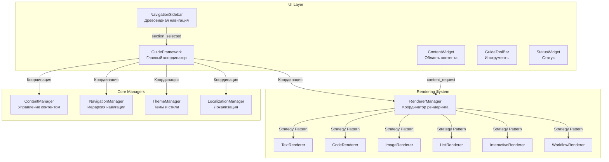

# Архитектура User Guide Framework для анализа кинетики твердофазных реакций

## Архитектурные принципы

### Основополагающие принципы (USER GUIDE АРХИТЕКТУРНЫЙ МАНИФЕСТ)
- **Модульная система рендеринга**: Специализированные рендереры для каждого типа контента с единым API
- **Иерархическая система навигации**: Древовидная структура с поддержкой многоуровневой навигации
- **Централизованное управление контентом**: Единая точка загрузки и кэширования JSON контента
- **Многоязычная локализация**: Поддержка переключения языков с сохранением контекста
- **Тематизация и стилизация**: Гибкая система тем с fallback механизмами
- **Отслеживание состояния**: Комплексное логирование операций с агрегацией ошибок

---

## Общая архитектура User Guide Framework

User Guide Framework построен на **модульной управляемой контентом архитектуре** с PyQt6, реализующей паттерны **Strategy для рендеринга** и **Observer для навигации**.

### Центральная система управления

**GuideFramework** (`src/gui/user_guide_tab/user_guide_framework/ui/guide_framework.py:25-70`) - главный координатор системы:
- Инициализация всех менеджеров (Content, Navigation, Theme, Localization, Renderer)
- Настройка UI компонентов (Sidebar, Content, Toolbar, Status)
- Маршрутизация сигналов между компонентами
- Управление жизненным циклом фреймворка

**StateLogger** интеграция для комплексного отслеживания операций:
- Логирование инициализации менеджеров
- Отслеживание операций рендеринга с агрегацией
- Дебаунсинг избыточных сообщений

### Архитектура модульной коммуникации



### Паттерны коммуникации

**Observer Pattern для навигации**:
1. Пользователь выбирает секцию в `NavigationSidebar`
2. Излучается сигнал `section_selected(section_id)`
3. `GuideFramework` обрабатывает сигнал и запрашивает контент
4. `ContentManager` загружает и кэширует секцию
5. `RendererManager` рендерит контент через подходящие рендереры

**Strategy Pattern для рендеринга**:
- Каждый тип контента имеет специализированный рендерер
- `RendererManager` автоматически выбирает рендерер по типу контента
- Унифицированный API `render(content)` для всех рендереров

---

## Архитектура системы контента

### Иерархическая структура данных

**1. Table of Contents (TOC)** - `ContentManager.load_toc()`:
- JSON структура с иерархией секций
- Метаданные для каждой секции (title, icon, content_file)
- Подсчет общего количества секций через `_count_sections_in_structure()`

**Структура TOC**:
```json
{
  "structure": {
    "getting_started": {
      "title": {"en": "Getting Started", "ru": "Начало работы"},
      "icon": "play-circle",
      "children": {
        "installation": {
          "title": {"en": "Installation", "ru": "Установка"},
          "content_file": "installation.json"
        },
        "first_steps": {
          "title": {"en": "First Steps", "ru": "Первые шаги"},
          "content_file": "first_steps.json"
        }
      }
    },
    "analysis_methods": {
      "title": {"en": "Analysis Methods", "ru": "Методы анализа"},
      "children": {
        "model_fit": {
          "content_file": "model_fit.json"
        },
        "model_free": {
          "content_file": "model_free.json"
        },
        "model_based": {
          "content_file": "model_based.json"
        }
      }
    }
  }
}
```

**2. Content Sections** - JSON файлы в `data/content/`:
- Многоязычный контент с поддержкой RU/EN
- Разнообразные типы блоков (text, code, image, list, interactive)
- Метаданные секций и связанные разделы

**Структура контента секции**:
```json
{
  "section_id": "model_fit",
  "metadata": {
    "title": {"en": "Model-Fit Methods", "ru": "Model-Fit методы"},
    "description": {"en": "Kinetic analysis methods", "ru": "Методы кинетического анализа"},
    "category": "analysis",
    "difficulty": "intermediate"
  },
  "content": {
    "en": [
      {
        "type": "heading",
        "level": 1,
        "text": "Model-Fit Analysis"
      },
      {
        "type": "paragraph",
        "text": "Model-fit methods determine kinetic parameters..."
      },
      {
        "type": "code",
        "language": "python",
        "code": "# Example calculation\nfrom src.core.calculations import ModelFitCalculation"
      },
      {
        "type": "image",
        "src": "model_fit_example.png",
        "alt": "Model-fit example",
        "caption": "Example of model-fit analysis"
      }
    ],
    "ru": [
      {
        "type": "heading",
        "level": 1,
        "text": "Model-Fit анализ"
      }
    ]
  },
  "related_sections": ["model_free", "kinetic_parameters"],
  "attachments": []
}
```

**3. Navigation Hierarchy** - `NavigationManager`:
- Построение древовидной структуры из TOC
- Навигационные узлы с parent/child связями
- Поиск и обход по дереву навигации

### Система кэширования контента

**ContentManager кэширование** (`src/gui/user_guide_tab/user_guide_framework/core/content_manager.py:92-150`):
- `content_cache: Dict[str, ContentSection]` - кэш загруженных секций
- `_metadata_cache: Dict[str, Any]` - кэш метаданных
- Lazy loading: секции загружаются по требованию
- Валидация данных через `_validate_content_data()`

**Жизненный цикл контента**:
1. **Инициализация**: Загрузка TOC из `toc.json`
2. **Запрос секции**: Проверка кэша, если нет - загрузка из JSON файла
3. **Валидация**: Проверка структуры данных и типов
4. **Кэширование**: Сохранение секции в `content_cache`
5. **Возврат**: Предоставление `ContentSection` объекта

---

## Архитектура системы рендеринга

### Модульная система рендереров

**RendererManager** (`src/gui/user_guide_tab/user_guide_framework/rendering/renderer_manager.py:25-70`) - координатор рендеринга:
- Инициализация 6 специализированных рендереров
- Построение карты соответствий `content_type → renderer`
- Автоматический выбор рендерера через Strategy Pattern
- Агрегированное логирование операций рендеринга

**Специализированные рендереры**:

**1. TextRenderer** - текстовые блоки:
- Поддерживаемые типы: `heading`, `paragraph`, `emphasis`, `strong`
- Автоматическое применение тем через `ThemeManager`
- Уровни заголовков (H1-H6) с соответствующими стилями

**2. CodeRenderer** - блоки кода:
- Поддерживаемые типы: `code`, `code_block`
- Подсветка синтаксиса для Python, JSON, bash
- Безопасные цвета тем с fallback механизмами
- Моноширинные шрифты с правильным отступом

**3. ImageRenderer** - изображения:
- Поддерживаемые типы: `image`, `figure`
- Автоматическое масштабирование изображений
- Поддержка подписей и alt-текста
- Обработка ошибок загрузки изображений

**4. ListRenderer** - списки:
- Поддерживаемые типы: `list`, `ordered_list`, `unordered_list`
- Вложенные списки с правильными отступами
- Нумерованные и маркированные списки

**5. InteractiveRenderer** - интерактивные элементы:
- Поддерживаемые типы: `button`, `link`, `interactive`
- Кликабельные элементы с обработчиками событий
- Интеграция с основным приложением

**6. WorkflowRenderer** - диаграммы рабочих процессов:
- Поддерживаемые типы: `workflow`, `diagram`, `flowchart`
- Пошаговые инструкции с визуальными элементами
- Интерактивные элементы процесса

### Система рендеринга

**BaseRenderer** (`src/gui/user_guide_tab/user_guide_framework/rendering/renderers/base_renderer.py`) - базовый класс:
```python
class BaseRenderer(ABC):
    @abstractmethod
    def render(self, content: Dict[str, Any]) -> QWidget:
        pass

    @abstractmethod
    def get_supported_types(self) -> List[str]:
        pass

    def can_render(self, content_type: str) -> bool:
        return content_type in self.get_supported_types()

    def apply_theme(self, widget: QWidget, style_key: str = None) -> None:
        # Применение темы к виджету

    def get_theme_color(self, color_key: str) -> str:
        # Получение цвета из темы с fallback
```

**Алгоритм рендеринга блока**:
1. `RendererManager.render_block()` получает content dict
2. Извлекается `content_type` из словаря
3. Поиск рендерера в `renderer_map`
4. Вызов `renderer.render(content)` для создания QWidget
5. Применение темы через `apply_theme()`
6. Логирование результата операции

---

## Архитектура навигационной системы

### Иерархическое представление контента

**NavigationManager** (`src/gui/user_guide_tab/user_guide_framework/core/navigation_manager.py:70-120`) - управление навигацией:
- Построение дерева из TOC структуры
- Создание `NavigationNode` объектов с parent/child связями
- Поиск узлов по section_id через `find_descendant()`
- Обход дерева для построения UI компонентов

**NavigationNode** - узел навигации:
```python
@dataclass
class NavigationNode:
    section_id: str
    title: Dict[str, str]  # Многоязычные заголовки
    icon: Optional[str] = None
    children: Optional[List["NavigationNode"]] = None
    parent: Optional["NavigationNode"] = None
    content_file: Optional[str] = None

    def get_depth(self) -> int:
        # Определение глубины узла в дереве

    def find_descendant(self, section_id: str) -> Optional["NavigationNode"]:
        # Рекурсивный поиск потомков
```

**NavigationSidebar** (`src/gui/user_guide_tab/user_guide_framework/ui/navigation_sidebar.py`) - UI навигации:
- QTreeWidget для отображения иерархии
- Автоматическое построение дерева из NavigationManager
- Обработка кликов пользователя
- Переключение языков с сохранением выбранной секции

### Система поиска и фильтрации

**ContentManager поиск**:
- `search_content(query)` - поиск по загруженному контенту
- `_search_in_section()` - поиск внутри секции
- Поиск по заголовкам, тексту и метаданным
- Возврат релевантных секций с контекстом

**Навигационные операции**:
- Expand/collapse узлов дерева
- Переход к следующей/предыдущей секции
- Навигация по breadcrumbs
- История посещенных секций

---

## Архитектура системы тем

### ThemeManager - управление темами

**ThemeManager** (`src/gui/user_guide_tab/user_guide_framework/core/theme_manager.py:25-80`) - система тематизации:
- Загрузка тем из JSON файлов
- Встроенные темы: `default`, `high_contrast`
- Управление цветами, шрифтами и стилями
- Генерация CSS стилей для Qt виджетов

**Структура темы**:
```json
{
  "name": "default",
  "description": "Default user guide theme",
  "colors": {
    "primary": "#2196F3",
    "secondary": "#FFC107",
    "background": "#FFFFFF",
    "text": "#212121",
    "code_background": "#F5F5F5",
    "code_text": "#D32F2F"
  },
  "fonts": {
    "body": {
      "family": "Segoe UI",
      "size": 11
    },
    "heading": {
      "family": "Segoe UI",
      "size": 14,
      "weight": "bold"
    },
    "code": {
      "family": "Consolas",
      "size": 10
    }
  },
  "styles": {
    "QLabel": {
      "heading": "font-weight: bold; color: {text};",
      "paragraph": "color: {text}; line-height: 1.4;"
    }
  }
}
```

**Применение тем**:
- Автоматическое применение через `BaseRenderer.apply_theme()`
- Fallback цвета для безопасности рендеринга
- Динамическое переключение тем с сигналом `theme_changed`
- Поддержка пользовательских тем

### Система стилизации

**CSS генерация**:
- `generate_stylesheet(widget_class, style_key)` - создание CSS
- Подстановка цветов из темы в CSS шаблоны
- Кэширование сгенерированных стилей
- Валидация CSS перед применением

---

## Архитектура локализации

### LocalizationManager - многоязычность

**LocalizationManager** (`src/gui/user_guide_tab/user_guide_framework/core/localization_manager.py`) - система локализации:
- Поддержка языков: Русский (RU), Английский (EN)
- Загрузка переводов из JSON файлов
- Автоматическое переключение языка интерфейса
- Fallback на английский язык при отсутствии переводов

**Структура локализации**:
```json
{
  "language": "ru",
  "translations": {
    "ui": {
      "search_placeholder": "Поиск по руководству...",
      "loading": "Загрузка...",
      "error": "Ошибка загрузки контента",
      "not_found": "Секция не найдена"
    },
    "navigation": {
      "getting_started": "Начало работы",
      "analysis_methods": "Методы анализа",
      "troubleshooting": "Устранение неполадок"
    },
    "content": {
      "see_also": "См. также",
      "note": "Примечание",
      "warning": "Предупреждение"
    }
  }
}
```

**Многоязычный контент**:
- Контент хранится с ключами языков: `{"en": [...], "ru": [...]}`
- Автоматический выбор языка для рендеринга
- Переключение языка с сохранением текущей позиции

---

## Архитектура UI компонентов

### Главные UI компоненты

**GuideFramework** - основной контейнер:
- QSplitter layout с изменяемыми панелями
- Минимальные размеры: 1200×700px
- Координация между всеми UI компонентами

**NavigationSidebar** - боковая панель навигации:
- QTreeWidget для иерархической навигации
- ComboBox для переключения языков
- Поиск по контенту с фильтрацией дерева
- Контекстное меню для быстрых действий

**ContentWidget** - область отображения контента:
- QScrollArea с динамическим контентом
- Автоматическое обновление при смене секции
- Отложенное обновление через `_update_content_delayed()`
- Обработка ошибок рендеринга с graceful fallback

**GuideToolBar** - панель инструментов:
- Кнопки навигации (назад/вперед)
- Переключатель языков
- Поиск по контенту
- Настройки отображения

**StatusWidget** - строка состояния:
- Отображение текущей секции
- Индикатор загрузки контента
- Информация о языке и теме
- Счетчик секций и прогресс

### Адаптивная компоновка

**Пропорциональные размеры**:
```python
# Минимальные ширины компонентов
MIN_SIDEBAR_WIDTH = 300      # Навигационная панель
MIN_CONTENT_WIDTH = 600      # Область контента
MIN_TOOLBAR_HEIGHT = 40      # Панель инструментов
MIN_STATUS_HEIGHT = 25       # Строка состояния
```

**Отзывчивое изменение размеров**:
- Автоматическое распределение пространства через QSplitter
- Сохранение пропорций при изменении размера окна
- Минимальные ограничения для удобства чтения

---

## Система обработки ошибок

### Graceful Fallbacks

**Обработка ошибок рендеринга**:
- Fallback рендерер для неизвестных типов контента
- Безопасные цвета тем при отсутствии ThemeManager
- Заглушки для несуществующих изображений
- Уведомления пользователя об ошибках

**Обработка ошибок загрузки**:
- Валидация JSON структуры с детальными сообщениями
- Восстановление после ошибок парсинга
- Автоматические повторные попытки загрузки
- Кэширование успешно загруженных данных

### StateLogger интеграция

**Комплексное логирование**:
- Отслеживание инициализации всех менеджеров
- Агрегированное логирование операций рендеринга
- Дебаунсинг повторяющихся ошибок
- Метрики производительности и успешности операций

**Категории логирования**:
- `initialization` - запуск менеджеров
- `content_loading` - загрузка секций контента
- `rendering_operations` - операции рендеринга с агрегацией
- `navigation_events` - события навигации пользователя
- `theme_operations` - операции с темами и стилями

---

## Ключевые архитектурные преимущества

### Модульность и расширяемость
1. **Plugin-based рендеринг**: Легкое добавление новых типов контента
2. **Тематическая система**: Простое создание и применение тем
3. **Многоязычность**: Встроенная поддержка локализации
4. **Навигационная гибкость**: Поддержка любой иерархии контента

### Производительность и надежность
1. **Эффективное кэширование**: Минимизация повторных загрузок
2. **Lazy loading**: Загрузка контента по требованию
3. **Graceful degradation**: Работоспособность при частичных ошибках
4. **State tracking**: Комплексное отслеживание состояния системы

### Пользовательский опыт
1. **Интуитивная навигация**: Древовидная структура с поиском
2. **Мгновенная отзывчивость**: Кэшированный контент и быстрый рендеринг
3. **Настраиваемость**: Темы, языки и размеры интерфейса
4. **Обратная связь**: Индикаторы состояния и прогресса

### Научное применение
1. **Специализированный контент**: Поддержка кода, формул, диаграмм
2. **Рабочие процессы**: Пошаговые инструкции для анализа
3. **Интерактивность**: Связь с основным приложением
4. **Документация**: Комплексное руководство по кинетическому анализу

User Guide Framework обеспечивает профессиональную, масштабируемую систему документации для сложного научного приложения с поддержкой современных стандартов пользовательского интерфейса и многоязычности.
