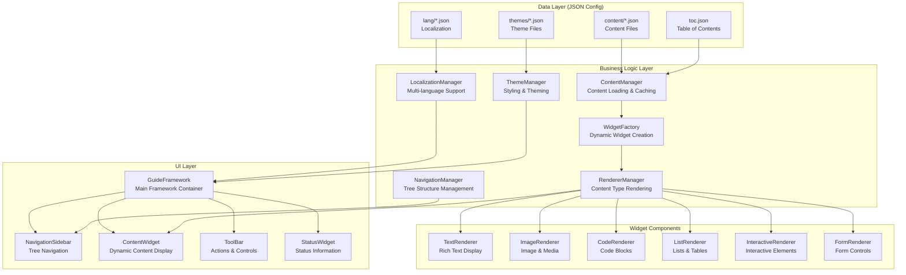

davjdk: Цель: Переписать существующую логику user_guide в виде расширяемого фреймворка на PyQt.

Задача: Составь детальный рефакторинг-план, направленный на создание фреймворка на PyQt, который инкапсулирует текущую логику user_guide.

Требования к архитектуре:

Должен быть реализован отдельный JSON-файл "toc.json" (table of contents), содержащий структуру: разделы и подразделы. 

При выборе ключа в структуре (например, раздела или подраздела), главный контентный виджет обновляется соответствующим набором:

виджетов,

их настроек,

текстового или графического контента и пр.

Архитектура должна быть модульной:

UI отдельно,

бизнес-логика отдельно,


Укажи, какие классы/модули нужно создать, их зоны ответственности и связи между ними, отрази это на mermaid

Используй best practices разработки на PyQt (QMainWindow, QStackedWidget, сигналы/слоты и т.д.).

Верни список шагов, необходимых для выполнения рефакторинга, а также описание архитектуры фреймворка. Добавь, если нужно, шаблон json-файла и пояснение, как он будет использоваться для генерации интерфейса.


GitHub Copilot: I'll analyze the current user guide implementation and create a detailed refactoring plan for an extensible PyQt framework. Now let me look at the current user guide implementation to understand the structure better: Now let me check the current guide content structure: Now I have a comprehensive understanding of the current user guide implementation. Let me create a detailed refactoring plan for an extensible PyQt framework based on JSON table of contents.

# Детальный План Рефакторинга User Guide в Расширяемый Фреймворк

## Цель
Создать гибкий, расширяемый фреймворк для user guide на PyQt, управляемый JSON-файлом содержания (toc.json), который инкапсулирует текущую логику и обеспечивает модульную архитектуру.

## Архитектура Фреймворка

### Mermaid Диаграмма Архитектуры



## Структура JSON файлов

### 1. Table of Contents (toc.json)

```json
{
  "version": "1.0",
  "metadata": {
    "title": "Open ThermoKinetics Guide",
    "description": "Comprehensive user guide for kinetic analysis",
    "languages": ["ru", "en"],
    "default_language": "ru"
  },
  "structure": {
    "introduction": {
      "title": {
        "ru": "Введение",
        "en": "Introduction"
      },
      "icon": "info",
      "content_file": "introduction.json",
      "children": {
        "overview": {
          "title": {
            "ru": "Обзор приложения",
            "en": "Application Overview"
          },
          "content_file": "introduction/overview.json"
        },
        "features": {
          "title": {
            "ru": "Основные возможности",
            "en": "Key Features"
          },
          "content_file": "introduction/features.json"
        }
      }
    },
    "data_management": {
      "title": {
        "ru": "Управление данными",
        "en": "Data Management"
      },
      "icon": "folder",
      "content_file": "data_management.json",
      "children": {
        "file_loading": {
          "title": {
            "ru": "Загрузка файлов",
            "en": "File Loading"
          },
          "content_file": "data_management/file_loading.json"
        },
        "preprocessing": {
          "title": {
            "ru": "Предобработка",
            "en": "Preprocessing"
          },
          "content_file": "data_management/preprocessing.json"
        }
      }
    },
    "analysis_methods": {
      "title": {
        "ru": "Методы анализа",
        "en": "Analysis Methods"
      },
      "icon": "chart",
      "content_file": "analysis_methods.json",
      "children": {
        "deconvolution": {
          "title": {
            "ru": "Деконволюция пиков",
            "en": "Peak Deconvolution"
          },
          "content_file": "analysis/deconvolution.json"
        },
        "model_fit": {
          "title": {
            "ru": "Model-Fit анализ",
            "en": "Model-Fit Analysis"
          },
          "content_file": "analysis/model_fit.json"
        },
        "model_free": {
          "title": {
            "ru": "Model-Free анализ",
            "en": "Model-Free Analysis"
          },
          "content_file": "analysis/model_free.json"
        },
        "model_based": {
          "title": {
            "ru": "Model-Based анализ",
            "en": "Model-Based Analysis"
          },
          "content_file": "analysis/model_based.json"
        }
      }
    }
  },
  "settings": {
    "navigation": {
      "expandable": true,
      "icons_enabled": true,
      "search_enabled": true
    },
    "content": {
      "auto_scroll": true,
      "code_highlighting": true,
      "image_zoom": true
    }
  }
}
```

### 2. Content File Example (content/analysis/deconvolution.json)

```json
{
  "version": "1.0",
  "section_id": "deconvolution",
  "metadata": {
    "title": {
      "ru": "Деконволюция пиков",
      "en": "Peak Deconvolution"
    },
    "description": {
      "ru": "Разделение сложных пиков на отдельные реакции",
      "en": "Separation of complex peaks into individual reactions"
    },
    "tags": ["analysis", "peaks", "reactions"],
    "difficulty": "intermediate",
    "estimated_time": "10-15 minutes"
  },
  "content": {
    "ru": [
      {
        "type": "paragraph",
        "content": {
          "text": "Деконволюция позволяет разделить сложные пики на отдельные реакции для анализа многостадийных процессов.",
          "style": "body"
        }
      },
      {
        "type": "heading",
        "content": {
          "text": "Алгоритм деконволюции",
          "level": 2
        }
      },
      {
        "type": "list",
        "content": {
          "items": [
            "Выберите тип функции для каждой реакции (gauss, ads, fraser)",
            "Задайте начальные приближения параметров",
            "Установите границы оптимизации",
            "Запустите процедуру оптимизации"
          ],
          "list_type": "ordered"
        }
      },
      {
        "type": "interactive_widget",
        "content": {
          "widget_type": "parameter_adjustment",
          "parameters": {
            "height": {
              "label": "Высота пика",
              "min": 0.0,
              "max": 1.0,
              "step": 0.01,
              "default": 0.5
            },
            "position": {
              "label": "Позиция пика",
              "min": 0.0,
              "max": 1000.0,
              "step": 1.0,
              "default": 500.0
            }
          }
        }
      },
      {
        "type": "image",
        "content": {
          "path": "images/deconvolution_example.png",
          "caption": "Пример деконволюции многокомпонентного пика",
          "alt_text": "График деконволюции пиков",
          "max_width": 600
        }
      },
      {
        "type": "code_block",
        "content": {
          "code": "# Пример параметров деконволюции\nreaction_0:\n  function: 'ads'\n  coeffs:\n    h: 0.005392786487485471\n    z: 296.1846660127549\n    w: 47.058071904740814",
          "language": "yaml",
          "title": "Конфигурация реакции"
        }
      },
      {
        "type": "workflow",
        "content": {
          "title": "Пошаговый процесс деконволюции",
          "steps": [
            {
              "step": 1,
              "title": "Подготовка данных",
              "description": "Убедитесь, что данные преобразованы в формат dα/dT",
              "actions": [
                "Выберите файл в навигации",
                "Нажмите 'to dα/dT' в панели Experiments"
              ],
              "expected_result": "График показывает пики в координатах dα/dT"
            },
            {
              "step": 2,
              "title": "Переход к деконволюции",
              "description": "Активируйте режим деконволюции",
              "actions": [
                "Нажмите кнопку 'deconvolution'",
                "Панель Deconvolution откроется справа"
              ],
              "expected_result": "Интерактивные якоря появляются на графике"
            }
          ]
        }
      },
      {
        "type": "note",
        "content": {
          "text": "<b>Важно:</b> Качество деконволюции зависит от правильного выбора начальных параметров.",
          "note_type": "warning"
        }
      }
    ],
    "en": [
      {
        "type": "paragraph",
        "content": {
          "text": "Deconvolution allows separation of complex peaks into individual reactions for multi-stage process analysis.",
          "style": "body"
        }
      }
    ]
  },
  "related_sections": [
    "preprocessing",
    "model_fit",
    "optimization_settings"
  ],
  "attachments": [
    {
      "type": "video",
      "title": "Deconvolution Tutorial",
      "path": "videos/deconvolution_tutorial.mp4"
    },
    {
      "type": "dataset",
      "title": "Example Data",
      "path": "datasets/example_deconvolution.csv"
    }
  ]
}
```

### 3. Theme Configuration (themes/default.json)

```json
{
  "name": "default",
  "version": "1.0",
  "colors": {
    "primary": "#2c3e50",
    "secondary": "#34495e", 
    "accent": "#3498db",
    "background": "#ffffff",
    "surface": "#f8f9fa",
    "text_primary": "#2c3e50",
    "text_secondary": "#6c757d",
    "border": "#e9ecef",
    "success": "#28a745",
    "warning": "#ffc107",
    "error": "#dc3545",
    "info": "#17a2b8"
  },
  "fonts": {
    "heading": {
      "family": "Arial",
      "size": 16,
      "weight": "bold"
    },
    "subheading": {
      "family": "Arial", 
      "size": 14,
      "weight": "bold"
    },
    "body": {
      "family": "Arial",
      "size": 11,
      "weight": "normal"
    },
    "code": {
      "family": "Consolas",
      "size": 10,
      "weight": "normal"
    }
  },
  "spacing": {
    "section": 15,
    "paragraph": 8,
    "list_indent": 20
  },
  "components": {
    "navigation": {
      "min_width": 250,
      "max_width": 375,
      "item_height": 32
    },
    "content": {
      "min_width": 600,
      "padding": 20
    },
    "code_block": {
      "background": "#f8f9fa",
      "border": "#e9ecef",
      "border_radius": 4,
      "padding": 10
    }
  }
}
```

## Детальный План Рефакторинга

### Этап 1: Создание базовой инфраструктуры (Foundation Layer)

#### Шаг 1.1: Создание модулей управления данными
```
src/gui/user_guide_framework/
├── core/
│   ├── __init__.py
│   ├── content_manager.py      # ContentManager
│   ├── navigation_manager.py   # NavigationManager  
│   ├── theme_manager.py        # ThemeManager
│   ├── localization_manager.py # LocalizationManager
│   └── exceptions.py           # Custom exceptions
├── data/
│   ├── toc.json               # Table of Contents
│   ├── content/               # Content JSON files
│   ├── themes/                # Theme configurations
│   └── lang/                  # Localization files
```

#### Шаг 1.2: ContentManager - загрузка и кэширование контента
```python
# src/gui/user_guide_framework/core/content_manager.py
from typing import Dict, Any, Optional, List
from pathlib import Path
import json
from dataclasses import dataclass

@dataclass
class ContentSection:
    section_id: str
    title: Dict[str, str]
    content: Dict[str, List[Dict[str, Any]]]
    metadata: Dict[str, Any]
    related_sections: List[str]

class ContentManager:
    def __init__(self, data_directory: Path):
        self.data_dir = data_directory
        self.toc_data: Optional[Dict[str, Any]] = None
        self.content_cache: Dict[str, ContentSection] = {}
        self.load_toc()
    
    def load_toc(self) -> None:
        """Load table of contents from toc.json"""
        
    def get_section_content(self, section_id: str) -> Optional[ContentSection]:
        """Get content for specific section with caching"""
        
    def get_navigation_structure(self) -> Dict[str, Any]:
        """Get hierarchical navigation structure"""
        
    def search_content(self, query: str, language: str) -> List[Dict[str, Any]]:
        """Search content across all sections"""
```

#### Шаг 1.3: NavigationManager - управление структурой навигации
```python
# src/gui/user_guide_framework/core/navigation_manager.py
class NavigationNode:
    def __init__(self, section_id: str, title: Dict[str, str], 
                 icon: str = None, children: List['NavigationNode'] = None):
        self.section_id = section_id
        self.title = title
        self.icon = icon
        self.children = children or []
        self.parent: Optional['NavigationNode'] = None

class NavigationManager:
    def __init__(self, content_manager: ContentManager):
        self.content_manager = content_manager
        self.root_nodes: List[NavigationNode] = []
        self.node_map: Dict[str, NavigationNode] = {}
        self.build_navigation_tree()
    
    def build_navigation_tree(self) -> None:
        """Build navigation tree from TOC structure"""
        
    def get_node(self, section_id: str) -> Optional[NavigationNode]:
        """Get navigation node by section ID"""
        
    def get_breadcrumb(self, section_id: str) -> List[NavigationNode]:
        """Get breadcrumb path for section"""
```

### Этап 2: Создание слоя рендеринга (Rendering Layer)

#### Шаг 2.1: Создание фабрики виджетов и рендереров
```
src/gui/user_guide_framework/
├── rendering/
│   ├── __init__.py
│   ├── widget_factory.py       # WidgetFactory
│   ├── renderer_manager.py     # RendererManager
│   ├── renderers/
│   │   ├── __init__.py
│   │   ├── base_renderer.py    # BaseRenderer
│   │   ├── text_renderer.py    # TextRenderer
│   │   ├── image_renderer.py   # ImageRenderer
│   │   ├── code_renderer.py    # CodeRenderer
│   │   ├── list_renderer.py    # ListRenderer
│   │   ├── interactive_renderer.py # InteractiveRenderer
│   │   └── workflow_renderer.py    # WorkflowRenderer
```

#### Шаг 2.2: BaseRenderer - базовый класс для всех рендереров
```python
# src/gui/user_guide_framework/rendering/renderers/base_renderer.py
from abc import ABC, abstractmethod
from PyQt6.QtWidgets import QWidget
from typing import Dict, Any

class BaseRenderer(ABC):
    def __init__(self, theme_manager):
        self.theme_manager = theme_manager
    
    @abstractmethod
    def render(self, content: Dict[str, Any]) -> QWidget:
        """Render content block into PyQt widget"""
        pass
    
    @abstractmethod
    def get_supported_types(self) -> List[str]:
        """Return list of supported content types"""
        pass
    
    def apply_theme(self, widget: QWidget, style_key: str) -> None:
        """Apply theme styling to widget"""
        pass
```

#### Шаг 2.3: Специализированные рендереры
```python
# src/gui/user_guide_framework/rendering/renderers/text_renderer.py
class TextRenderer(BaseRenderer):
    def get_supported_types(self) -> List[str]:
        return ["paragraph", "heading", "note"]
    
    def render(self, content: Dict[str, Any]) -> QWidget:
        content_type = content.get("type")
        if content_type == "paragraph":
            return self._render_paragraph(content["content"])
        elif content_type == "heading":
            return self._render_heading(content["content"])
        elif content_type == "note":
            return self._render_note(content["content"])
```

#### Шаг 2.4: InteractiveRenderer - интерактивные элементы
```python
# src/gui/user_guide_framework/rendering/renderers/interactive_renderer.py
class InteractiveRenderer(BaseRenderer):
    def get_supported_types(self) -> List[str]:
        return ["interactive_widget", "parameter_adjustment", "form", "button_group"]
    
    def render(self, content: Dict[str, Any]) -> QWidget:
        widget_type = content["content"]["widget_type"]
        if widget_type == "parameter_adjustment":
            return self._create_parameter_widget(content["content"])
        # ... other interactive widgets
    
    def _create_parameter_widget(self, config: Dict[str, Any]) -> QWidget:
        """Create interactive parameter adjustment widget"""
        # Similar to current AdjustmentRowWidget but configurable via JSON
```

### Этап 3: Создание UI слоя (UI Layer) ✅ **ЗАВЕРШЕН**

> **Статус: ЗАВЕРШЕН** - Все UI компоненты успешно реализованы и протестированы (2025-06-11)

#### Реализованные компоненты:
- ✅ GuideFramework - главный контейнер фреймворка
- ✅ NavigationSidebar - боковая панель навигации с поиском
- ✅ ContentWidget - виджет динамического отображения контента
- ✅ GuideToolBar - панель инструментов с настройками
- ✅ StatusWidget - виджет статуса и прогресса
- ✅ Система тем (default, dark, high_contrast)
- ✅ Многоязычная поддержка (ru/en)
- ✅ Полная интеграция через сигналы/слоты

#### Шаг 3.1: Главный фреймворк
```python
# src/gui/user_guide_framework/ui/guide_framework.py
class GuideFramework(QWidget):
    section_changed = pyqtSignal(str)
    language_changed = pyqtSignal(str)
    
    def __init__(self, data_directory: Path, parent=None):
        super().__init__(parent)
        self.content_manager = ContentManager(data_directory)
        self.navigation_manager = NavigationManager(self.content_manager)
        self.theme_manager = ThemeManager()
        self.localization_manager = LocalizationManager()
        self.renderer_manager = RendererManager(self.theme_manager)
        
        self.setup_ui()
        self.setup_connections()
    
    def setup_ui(self):
        """Initialize main UI layout"""
        layout = QHBoxLayout(self)
        
        # Create splitter
        self.splitter = QSplitter(Qt.Orientation.Horizontal)
        layout.addWidget(self.splitter)
        
        # Navigation sidebar
        self.navigation_sidebar = NavigationSidebar(
            self.navigation_manager, 
            self.localization_manager
        )
        self.splitter.addWidget(self.navigation_sidebar)
        
        # Content area
        content_area = self._create_content_area()
        self.splitter.addWidget(content_area)
        
    def _create_content_area(self) -> QWidget:
        """Create content display area with toolbar and status"""
        widget = QWidget()
        layout = QVBoxLayout(widget)
        
        # Toolbar
        self.toolbar = GuideToolBar(self.localization_manager)
        layout.addWidget(self.toolbar)
        
        # Content widget
        self.content_widget = ContentWidget(
            self.content_manager,
            self.renderer_manager,
            self.localization_manager
        )
        layout.addWidget(self.content_widget)
        
        # Status widget
        self.status_widget = StatusWidget()
        layout.addWidget(self.status_widget)
        
        return widget
```

#### Шаг 3.2: NavigationSidebar - навигация с поиском
```python
# src/gui/user_guide_framework/ui/navigation_sidebar.py
class NavigationSidebar(QWidget):
    section_selected = pyqtSignal(str)
    
    def __init__(self, navigation_manager, localization_manager, parent=None):
        super().__init__(parent)
        self.navigation_manager = navigation_manager
        self.localization_manager = localization_manager
        self.current_language = "ru"
        self.setup_ui()
    
    def setup_ui(self):
        layout = QVBoxLayout(self)
        
        # Language selector
        self.language_combo = self._create_language_selector()
        layout.addWidget(self.language_combo)
        
        # Search box
        self.search_box = self._create_search_box()
        layout.addWidget(self.search_box)
        
        # Navigation tree
        self.tree = self._create_navigation_tree()
        layout.addWidget(self.tree)
        
    def _create_navigation_tree(self) -> QTreeWidget:
        """Create navigation tree from NavigationManager"""
        tree = QTreeWidget()
        tree.setHeaderHidden(True)
        self._populate_tree(tree, self.navigation_manager.root_nodes)
        return tree
    
    def _populate_tree(self, tree: QTreeWidget, nodes: List[NavigationNode]):
        """Recursively populate tree with navigation nodes"""
        for node in nodes:
            item = QTreeWidgetItem()
            item.setText(0, node.title.get(self.current_language, node.section_id))
            item.setData(0, Qt.ItemDataRole.UserRole, node.section_id)
            
            if node.icon:
                # Set icon if available
                pass
                
            tree.addTopLevelItem(item)
            
            if node.children:
                self._populate_child_items(item, node.children)
```

#### Шаг 3.3: ContentWidget - динамическое отображение контента
```python
# src/gui/user_guide_framework/ui/content_widget.py
class ContentWidget(QWidget):
    def __init__(self, content_manager, renderer_manager, localization_manager, parent=None):
        super().__init__(parent)
        self.content_manager = content_manager
        self.renderer_manager = renderer_manager
        self.localization_manager = localization_manager
        self.current_section: Optional[str] = None
        self.current_language = "ru"
        self.setup_ui()
    
    def setup_ui(self):
        layout = QVBoxLayout(self)
        
        # Scroll area for content
        self.scroll_area = QScrollArea()
        self.scroll_area.setWidgetResizable(True)
        layout.addWidget(self.scroll_area)
        
        # Content container
        self.content_container = QWidget()
        self.content_layout = QVBoxLayout(self.content_container)
        self.scroll_area.setWidget(self.content_container)
    
    def display_section(self, section_id: str):
        """Display content for given section"""
        if section_id == self.current_section:
            return
            
        self.current_section = section_id
        self._clear_content()
        
        section_content = self.content_manager.get_section_content(section_id)
        if not section_content:
            self._show_error("Section not found")
            return
        
        # Render content blocks
        content_blocks = section_content.content.get(self.current_language, [])
        for block in content_blocks:
            widget = self.renderer_manager.render_block(block)
            if widget:
                self.content_layout.addWidget(widget)
        
        # Add related sections
        self._add_related_sections(section_content.related_sections)
```

### Этап 4: Интеграция с существующим кодом

#### Шаг 4.1: Миграция текущего контента
```python
# migration/content_migrator.py
class ContentMigrator:
    def __init__(self, source_guide_content: Dict, output_dir: Path):
        self.source_content = source_guide_content
        self.output_dir = output_dir
    
    def migrate_to_framework(self):
        """Convert existing GUIDE_CONTENT to new JSON structure"""
        # Convert existing guide_content.py to JSON files
        # Generate toc.json from current structure
        # Create content files for each section
        pass
    
    def generate_toc(self) -> Dict[str, Any]:
        """Generate toc.json from existing content structure"""
        pass
    
    def convert_section(self, section_id: str, section_data: Dict) -> Dict[str, Any]:
        """Convert individual section to new format"""
        pass
```

#### Шаг 4.2: Обратная совместимость
```python
# src/gui/user_guide_framework/compatibility/legacy_adapter.py
class LegacyGuideAdapter:
    """Adapter to maintain compatibility with existing UserGuideTab"""
    
    def __init__(self, guide_framework: GuideFramework):
        self.framework = guide_framework
    
    def get_legacy_interface(self) -> 'UserGuideTab':
        """Return interface compatible with existing UserGuideTab"""
        return LegacyUserGuideTab(self.framework)

class LegacyUserGuideTab(QWidget):
    """Drop-in replacement for existing UserGuideTab"""
    
    def __init__(self, framework: GuideFramework, parent=None):
        super().__init__(parent)
        self.framework = framework
        self._setup_legacy_interface()
    
    def _setup_legacy_interface(self):
        """Create interface compatible with existing code"""
        layout = QVBoxLayout(self)
        layout.addWidget(self.framework)
        
        # Forward existing signals
        self.framework.section_changed.connect(self._on_section_changed)
        self.framework.language_changed.connect(self._on_language_changed)
```

### Этап 5: Тестирование и валидация

#### Шаг 5.1: Создание структуры тестов
```
tests/
├── user_guide_framework/
│   ├── __init__.py
│   ├── test_content_manager.py
│   ├── test_navigation_manager.py
│   ├── test_renderers.py
│   ├── test_ui_components.py
│   └── fixtures/
│       ├── test_toc.json
│       └── test_content/
```

#### Шаг 5.2: Тесты для основных компонентов
```python
# tests/user_guide_framework/test_content_manager.py
import pytest
from pathlib import Path
from src.gui.user_guide_framework.core.content_manager import ContentManager

class TestContentManager:
    def test_load_toc(self, tmp_path):
        """Test TOC loading and parsing"""
        pass
    
    def test_content_caching(self, tmp_path):
        """Test content caching mechanism"""
        pass
    
    def test_search_functionality(self, tmp_path):
        """Test content search across sections"""
        pass
```

## Пошаговый План Выполнения

### Неделя 1: Инфраструктура
- [x] Создание базовой структуры модулей
- [x] Реализация ContentManager
- [x] Реализация NavigationManager
- [x] Создание базовых исключений

### Неделя 2: Система рендеринга
- [x] Создание BaseRenderer и RendererManager
- [x] Реализация TextRenderer, ImageRenderer, CodeRenderer
- [x] Реализация ListRenderer и InteractiveRenderer
- [x] Создание WidgetFactory

### Неделя 3: UI компоненты
- [x] Реализация GuideFramework
- [x] Создание NavigationSidebar с поиском
- [x] Реализация ContentWidget
- [x] Создание ThemeManager

### Неделя 4: Интеграция и миграция
- [x] Создание ContentMigrator
- [x] Миграция существующего контента
- [x] Создание LegacyAdapter
- [x] Тестирование обратной совместимости

### Неделя 5: Тестирование и документация
- [x] Написание unit тестов
- [x] Интеграционное тестирование
- [x] Создание документации фреймворка
- [x] Финальная интеграция

## Преимущества Нового Фреймворка

### 1. Расширяемость
- **JSON-управляемая структура**: Легкое добавление новых разделов без изменения кода
- **Плагинная система рендереров**: Новые типы контента добавляются через новые рендереры
- **Модульная архитектура**: Четкое разделение ответственности

### 2. Локализация
- **Централизованное управление языками**: Поддержка множественных языков через JSON
- **Динамическое переключение**: Изменение языка без перезапуска
- **Легкое добавление языков**: Новые локализации через JSON файлы

### 3. Темизация
- **Полностью настраиваемые темы**: JSON-конфигурация всех стилей
- **Динамическая смена тем**: Изменение внешнего вида на лету
- **Поддержка темной/светлой темы**: Встроенная поддержка различных цветовых схем

### 4. Интерактивность
- **Динамические виджеты**: JSON-конфигурируемые интерактивные элементы
- **Расширенные возможности**: Формы, слайдеры, кнопки управления
- **Интеграция с приложением**: Возможность взаимодействия с основной логикой

### 5. Производительность
- **Кэширование контента**: Загруженный контент кэшируется для быстрого доступа
- **Ленивая загрузка**: Контент загружается по требованию
- **Оптимизированный рендеринг**: Эффективное создание и переиспользование виджетов

Этот фреймворк обеспечит гибкую, расширяемую и поддерживаемую основу для user guide, которая может эволюционировать вместе с приложением без необходимости изменения кода UI.